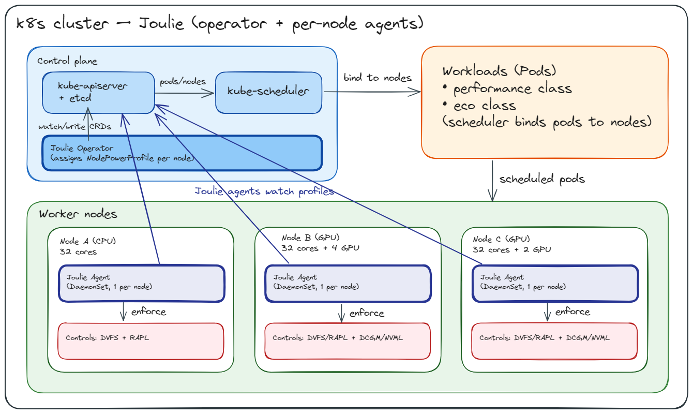

[](https://github.com/joulie-k8s/Joulie/actions/workflows/ci.yml)
[](https://github.com/joulie-k8s/Joulie/actions/workflows/release.yml)
[](https://goreportcard.com/report/github.com/joulie-k8s/Joulie)

# Joulie

**A Kubernetes-native digital twin for energy-efficient data centers.**

Visit the docs at [joulie-k8s.github.io/Joulie](https://joulie-k8s.github.io/Joulie/)

## What it is

Joulie builds a real-time digital twin of your Kubernetes cluster's energy state.
It continuously ingests telemetry (CPU/GPU power draw via RAPL and NVML/DCGM,
per-pod resource utilization via cAdvisor, and optional energy counters from
[Kepler](https://github.com/sustainable-computing-io/kepler)) to maintain an
up-to-date model of every node's thermal and power state.

That model drives two things:

1. **Energy control**: the operator writes desired power state into `NodeTwin` CRs
   (CPU and GPU power caps). The node agent reads `NodeTwin.spec` and enforces them.

2. **Scheduling decisions**: a scheduler extender reads the twin's computed
   `NodeTwin.status` (power headroom, predicted cooling stress, PSU load) to steer
   new pods toward nodes with the best energy-efficiency / performance trade-off.
   Performance workloads are kept on uncapped nodes; standard workloads
   can run on any node, with adaptive scoring that steers toward eco nodes
   when performance nodes are congested.

The feedback loop: telemetry → twin update → cap decisions → new pod placement →
updated telemetry. This keeps the cluster's power envelope stable and prevents
cooling or PSU spikes without sacrificing critical workload performance.

<p align="center">
  
</p>

## Why it matters

As AI and scientific workloads scale, clusters face:
- **Cooling bottlenecks**: GPU-dense racks exceed cooling capacity during training bursts
- **PSU/PDU overcommit**: peak power draw exceeds rack power budgets
- **Carbon cost**: flat power profiles waste energy during low-demand periods

Joulie addresses these by making the scheduler and operator aware of the physical
energy state of the cluster in real time, and by providing a digital twin that
can predict the impact of scheduling decisions before they are made.

## Architecture

Joulie has five components:

| Component | What it does |
|-----------|-------------|
| **Agent** (`cmd/agent`) | Runs on every node. Discovers hardware (CPU/GPU caps, slicing modes). Enforces RAPL/NVML power caps. Publishes `NodeHardware` CR. Reads `NodeTwin.spec` for desired state. Writes control feedback to `NodeTwin.status.controlStatus`. |
| **Operator** (`cmd/operator`) | Cluster-wide control loop. Reads `NodeHardware` + Prometheus metrics. Runs the digital twin model. Writes `NodeTwin` (spec = desired power state, status = twin output). Classifies workloads into `WorkloadProfile` CRs. Triggers pod migration under thermal/PSU pressure. |
| **Scheduler extender** (`cmd/scheduler`) | HTTP extender for kube-scheduler. Reads `NodeTwin.status` (30s TTL cache). Rejects eco nodes for performance pods. Scores nodes by power headroom and stress. |
| **kubectl plugin** (`cmd/kubectl-joulie`) | `kubectl joulie status` for cluster energy overview. `kubectl joulie recommend` for GPU slicing and reschedule suggestions. |
| **Digital twin** (`pkg/operator/twin`) | O(1) parametric model. Computes power headroom, cooling stress (% of cooling capacity), PSU stress (% of PDU capacity), and GPU slicing recommendations. CoolingModel is pluggable (default: linear proxy; future: openModelica thermal simulation). |

## CRDs

| CRD | Owner | Purpose |
|-----|-------|---------|
| `NodeHardware` | Agent | Hardware facts: CPU/GPU model, cap ranges, frequency landmarks, GPU slicing modes |
| `NodeTwin` | Operator | Desired state (spec: power cap %) + twin output (status: headroom, cooling stress, PSU stress, migration and GPU slicing recommendations, control feedback) |

The operator also manages `WorkloadProfile` CRs internally for workload classification (created automatically).

## Workload classes

Joulie uses a single `joulie.io/workload-class` pod annotation to drive placement:

| Class | Scheduler behavior |
|-------|--------------------|
| `performance` | Hard-rejects eco (capped) nodes. Must run on full-power nodes. |
| `standard` | Default. Can run on any node. Adaptive scoring steers toward eco when performance nodes are congested. |

The scheduler extender is always deployed as part of Joulie (lightweight HTTP server).
Without it, pods run anywhere and get standard Kubernetes scheduling.

## Key labels

| Label / Annotation | Where | Purpose |
|--------------------|-------|---------|
| `joulie.io/power-profile` | Node label | `eco` or `performance`. Set by operator. |
| `joulie.io/workload-class` | Pod annotation | `performance`, `standard`. |
| `joulie.io/reschedulable` | Pod annotation | `true` if pod can be restarted on another node. |
| `joulie.io/cpu-sensitivity` | Pod annotation | `high`/`medium`/`low`. Overrides classifier output. |
| `joulie.io/gpu-sensitivity` | Pod annotation | `high`/`medium`/`low`. Overrides classifier output. |

## Repository layout

```
cmd/agent/          Node agent: orchestration, reconcile loop
cmd/operator/       Cluster operator: twin computation, NodeTwin, migration
cmd/scheduler/      HTTP scheduler extender: filter + score via NodeTwin.status
cmd/kubectl-joulie/ kubectl plugin: `kubectl joulie status [--explain]`, `kubectl joulie recommend`
pkg/agent/dvfs/     DVFS controller (EMA smoothing, hysteresis, frequency capping)
pkg/agent/control/  HTTP control and telemetry clients
pkg/agent/hardware/ Hardware discovery (CPU/GPU caps, freq landmarks, slicing)
pkg/api/            Shared Go types (NodeHardware, NodeTwin, WorkloadProfile)
pkg/operator/policy/  Policy algorithms (static_partition, queue_aware_v1, rule_swap_v1)
pkg/operator/fsm/   Node state machine (downgrade guards, pod classification, NodeOps interface)
pkg/operator/twin/  Digital twin model (CoolingModel interface)
pkg/operator/migration/  Migration recommendation engine
pkg/workloadprofile/classifier/  Workload classifier (util % primary, Kepler optional)
simulator/          Workload and power simulator for offline experiments
charts/joulie/      Helm chart (includes Grafana dashboard)
config/crd/         CRD manifests
experiments/        Benchmark experiments
  01-cpu-only-benchmark/
  02-heterogeneous-benchmark/
  03-homogeneous-h100-benchmark/
examples/           Runnable examples
website/            Documentation site
```

## Quick start

```bash
# Install CRDs
kubectl apply -f config/crd/bases/

# Install via Helm
helm install joulie charts/joulie \
  --set agent.enabled=true \
  --set operator.enabled=true

# Annotate a performance pod
kubectl annotate pod my-gpu-job joulie.io/workload-class=performance
kubectl annotate pod my-batch-job joulie.io/workload-class=standard joulie.io/reschedulable=true
```

See the [docs](https://joulie-k8s.github.io/Joulie/) for full setup instructions.

## Run the experiments

```bash
# CPU-only benchmark (KWOK cluster)
experiments/01-cpu-only-benchmark/scripts/05_sweep.py --config experiments/01-cpu-only-benchmark/configs/benchmark-debug.yaml

# Heterogeneous benchmark (KWOK cluster)
experiments/02-heterogeneous-benchmark/scripts/05_sweep.py --config experiments/02-heterogeneous-benchmark/configs/benchmark-debug.yaml

# Homogeneous H100 benchmark (KWOK cluster)
experiments/03-homogeneous-h100-benchmark/scripts/05_sweep.py --config experiments/03-homogeneous-h100-benchmark/configs/benchmark-debug.yaml
```
