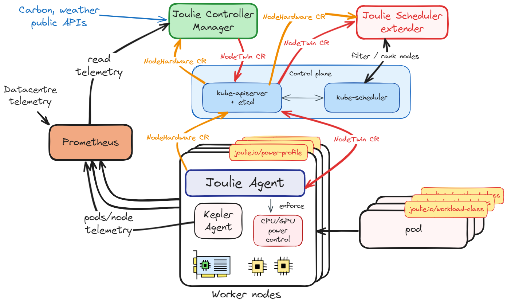

[](https://github.com/joulie-k8s/Joulie/actions/workflows/ci.yml)
[](https://github.com/joulie-k8s/Joulie/actions/workflows/release.yml)

# Joulie

**Kubernetes-native energy management for data centers, powered by digital twins.**

Visit the docs at [joulie-k8s.github.io/Joulie](https://joulie-k8s.github.io/Joulie/)

## What it is

Joulie uses per-node digital twins to model your Kubernetes cluster's energy state in real time.
It continuously ingests telemetry (CPU/GPU power draw via RAPL and NVML/DCGM,
per-pod resource utilization via cAdvisor, and optional energy counters from
[Kepler](https://github.com/sustainable-computing-io/kepler)) to maintain an
up-to-date model of every node's thermal and power state.

These per-node digital twins drive two things:

1. **Energy control**: the controller manager writes desired power state into `NodeTwin` CRs
   (CPU and GPU power caps). The node agent reads `NodeTwin.spec` and enforces them.

2. **Scheduling decisions**: a scheduler extender reads the twin's computed
   `NodeTwin.status` (power headroom, predicted cooling stress, power trend) to steer
   new pods toward nodes with the best energy-efficiency / performance trade-off.
   Performance workloads are kept on uncapped nodes; standard workloads
   can run on any node, with adaptive scoring that steers toward eco nodes
   when performance nodes are congested.

The feedback loop: telemetry → twin update → cap decisions → new pod placement →
updated telemetry. This keeps the cluster's power envelope stable and prevents
cooling or PSU spikes without sacrificing critical workload performance.

<p align="center">
  
</p>

## Why it matters

As AI and scientific workloads scale, clusters face:
- **Cooling bottlenecks**: GPU-dense racks exceed cooling capacity during training bursts
- **PSU/PDU overcommit**: peak power draw exceeds rack power budgets
- **Carbon cost**: flat power profiles waste energy during low-demand periods

Joulie addresses these by making the scheduler and controller manager aware of the physical
energy state of the cluster in real time, using per-node digital twins that
predict the impact of scheduling decisions before they are made.

## Architecture

Joulie has five components:

| Component | What it does |
|-----------|-------------|
| **Agent** (`cmd/agent`) | Runs on every node. Discovers hardware (CPU/GPU caps, slicing modes). Enforces RAPL/NVML power caps. Publishes `NodeHardware` CR. Reads `NodeTwin.spec` for desired state. Writes control feedback to `NodeTwin.status.controlStatus`. |
| **Controller manager** (`cmd/controller-manager`) | Cluster-wide control loop. Reads `NodeHardware` + Prometheus metrics. Runs the digital twin model. Writes `NodeTwin` (spec = desired power state, status = twin output). |
| **Scheduler extender** (`cmd/scheduler`) | HTTP extender for kube-scheduler. Reads `NodeTwin.status` (30s TTL cache). Rejects eco nodes for performance pods. Scores nodes by projected power headroom, cooling stress and power trend. |
| **kubectl plugin** (`cmd/kubectl-joulie`) | `kubectl joulie status` for cluster energy overview. |
| **Digital twin** (`pkg/controller/twin`) | O(1) parametric model. From a measured node power reading it computes power headroom (% of the capped budget still unused), cooling stress (% of node TDP in use, scaled by ambient temperature), PSU stress (% of rack PDU capacity), and estimated PUE. The last two are published for observability; the scheduler does not read them. |

## CRDs

| CRD | Owner | Purpose |
|-----|-------|---------|
| `NodeHardware` | Agent | Hardware facts: CPU/GPU model, cap ranges, frequency landmarks, GPU slicing modes |
| `NodeTwin` | Controller manager | Desired state (spec: power cap %) + twin output (status: headroom, cooling stress, PSU stress, estimated PUE, control feedback) |

## Workload classes

Joulie uses a single `joulie.io/workload-class` pod annotation to drive placement:

| Class | Scheduler behavior |
|-------|--------------------|
| `performance` | Hard-rejects eco (capped) nodes. Must run on full-power nodes. |
| `standard` | Default. Can run on any node. Adaptive scoring steers toward eco when performance nodes are congested. |

The scheduler extender is always deployed as part of Joulie (lightweight HTTP server).
Without it, pods run anywhere and get standard Kubernetes scheduling.

## Key labels

| Label / Annotation | Where | Purpose |
|--------------------|-------|---------|
| `joulie.io/power-profile` | Node label | `eco` or `performance`. Set by the controller manager. |
| `joulie.io/workload-class` | Pod annotation | `performance`, `standard`. |

## Repository layout

```
api/v1alpha1/           CRD types: the source of truth for NodeHardware and NodeTwin
cmd/agent/              Node agent: hardware discovery, reconcile loop, RAPL/NVML enforcement
cmd/controller-manager/ Cluster control loop: policy, twin computation, NodeTwin writes
cmd/scheduler/          HTTP scheduler extender: filter + score via NodeTwin.status
cmd/kubectl-joulie/     kubectl plugin: `kubectl joulie status`
pkg/agent/dvfs/         RAPL powercap zones and DVFS (EMA smoothing, hysteresis, frequency capping)
pkg/agent/control/      HTTP control and telemetry clients
pkg/api/                In-memory structs and shared constants (field managers, object names)
pkg/controller/policy/  Policy algorithms (static_partition, queue_aware_v1, rule_swap_v1)
pkg/controller/fsm/     Node state machine (downgrade guards, pod classification, NodeOps interface)
pkg/controller/twin/    Digital twin model (power headroom, cooling stress, PSU stress)
pkg/hwinv/              Hardware catalog: fills the facts a node cannot report about itself
pkg/kube/               Scheme, caches and manager wiring shared by the components
pkg/scheduler/          Marginal power estimation for a pod on a node
simulator/              Workload and power simulator for offline experiments
charts/joulie/          Helm chart (includes Grafana dashboard)
config/crd/             Generated CRD manifests
scripts/                Helper scripts: fixture capture, chart render matrix, KWOK scale run
tests/                  Contract, envtest and integration suites
ci/                     Dagger pipeline that runs the integration suite
values/                 Helm values files used by the docs and the experiments
experiments/            Benchmark experiments
  01-cpu-only-benchmark/
  02-heterogeneous-benchmark/
  03-homogeneous-h100-benchmark/
  04-scoring-formula-validation/
examples/               Runnable examples
website/                Documentation site
```

The agent's live discovery path is `discoverHardware` in `cmd/agent/main.go`. `pkg/agent/hardware/` is an
earlier implementation that nothing imports; do not change it expecting a node to notice.

## Quick start

```bash
# Install the released chart (it carries the CRDs)
helm upgrade --install joulie oci://registry.cern.ch/mbunino/joulie/joulie \
  -n joulie-system --create-namespace -f values/joulie.yaml

# From a checkout instead
helm upgrade --install joulie charts/joulie \
  -n joulie-system --create-namespace -f values/joulie.yaml

# Joulie only touches nodes that opt in, so label them
kubectl label node <node> joulie.io/managed=true

# Annotate a performance pod
kubectl annotate pod my-gpu-job joulie.io/workload-class=performance
kubectl annotate pod my-batch-job joulie.io/workload-class=standard
```

See the [docs](https://joulie-k8s.github.io/Joulie/) for full setup instructions.

## Run the experiments

```bash
# CPU-only benchmark (KWOK cluster)
experiments/01-cpu-only-benchmark/scripts/05_sweep.py --config experiments/01-cpu-only-benchmark/configs/benchmark-debug.yaml

# Heterogeneous benchmark (KWOK cluster)
experiments/02-heterogeneous-benchmark/scripts/05_sweep.py --config experiments/02-heterogeneous-benchmark/configs/benchmark-debug.yaml

# Homogeneous H100 benchmark (KWOK cluster)
experiments/03-homogeneous-h100-benchmark/scripts/05_sweep.py --config experiments/03-homogeneous-h100-benchmark/configs/benchmark-debug.yaml
```
