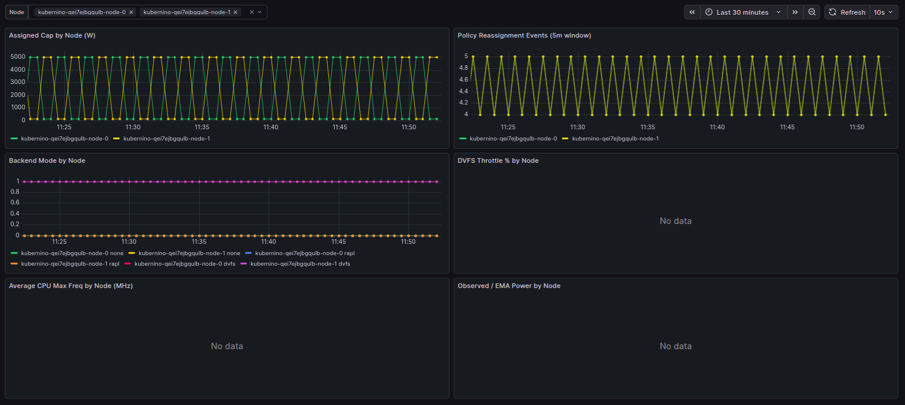

# Example: Operator Configuration

This example shows how to configure the central operator policy loop without changing code.

## What can be configured

Operator reads these env vars:

- `RECONCILE_INTERVAL` (default `1m`)
- `NODE_SELECTOR` (default in manifest: `joulie.io/managed=true`)
- `RESERVED_LABEL_KEY` (default `joulie.io/reserved`)
- `POLICY_TYPE` (default `static_partition`)
- `STATIC_HP_FRAC` (default `0.50`)
- `QUEUE_HP_BASE_FRAC` (default `0.60`)
- `QUEUE_HP_MIN` (default `1`)
- `QUEUE_HP_MAX` (default `1000000`)
- `QUEUE_PERF_PER_HP_NODE` (default `10`)
- `PERFORMANCE_CAP_WATTS` (default `5000`)
- `ECO_CAP_WATTS` (default `120`)

Policy notes:

- `static_partition`: production-safe baseline split.
- `queue_aware_v1`: adjusts HP node count based on performance-intent pressure.
- `rule_swap_v1`: debug-only policy for control-loop validation.
- unknown `POLICY_TYPE` falls back to `static_partition`.

## 1) Label managed and reserved nodes

```bash
kubectl label node <node-a> joulie.io/managed=true --overwrite
kubectl label node <node-b> joulie.io/managed=true --overwrite

# optional: exclude a node from optimization
kubectl label node <node-c> joulie.io/reserved=true --overwrite
```

## 2) Apply a custom operator config

Use the provided patch file:

```bash
kubectl -n joulie-system patch deployment joulie-operator --type merge \
  --patch-file examples/04-operator-configuration/operator-env-patch.yaml
kubectl -n joulie-system rollout status deployment/joulie-operator
```

## 3) Verify behavior

```bash
kubectl -n joulie-system logs deploy/joulie-operator --tail=200
kubectl get nodetwins -o wide
```

You should see periodic assignment logs and one `NodeTwin` per eligible (managed, non-reserved) node.

## 4) Visualize in Grafana

Prerequisite: Prometheus/Grafana wiring from [Prometheus + Grafana example](../02-prometheus-grafana/README.md).

Make sure to deploy the service monitor for Joulie as shown [in this page](../02-prometheus-grafana/servicemonitor.yaml).

Import dashboard JSON in Grafana:

- [dashboard-operator-policy.json](./dashboard-operator-policy.json)

After import, use the `Node` dashboard variable (top bar) to focus on one node or keep `All`.

Quick toolbox to validate wiring before opening Grafana:

```bash
# service and endpoint exposed by joulie agent
kubectl -n joulie-system get svc joulie-agent-metrics
kubectl -n joulie-system get endpointslice -l kubernetes.io/service-name=joulie-agent-metrics

# if using Prometheus Operator, confirm ServiceMonitor exists
kubectl -n default get servicemonitor joulie-agent
```

Optional local checks:

```bash
# sample metrics from Joulie directly
kubectl -n joulie-system port-forward svc/joulie-agent-metrics 18080:8080
curl -s localhost:18080/metrics | grep '^joulie_' | head -n 30
```

```bash
# open Prometheus and Grafana locally (adjust service names if needed)
kubectl port-forward svc/telemetry-kube-prometheus-prometheus 9090:9090 1>/dev/null &
kubectl port-forward svc/telemetry-grafana 5000:80 1>/dev/null &
# Get Grafana 'admin' user password by running:
kubectl --namespace default get secrets telemetry-grafana -o jsonpath="{.data.admin-password}" | base64 -d ; echo
# then browse:
# http://localhost:9090/targets
# http://localhost:9090/graph
# http://localhost:5000
```

Recommended panels/queries in this dashboard:

- assigned cap by node: `joulie_policy_cap_watts`
- reassignment event density: `changes(joulie_policy_cap_watts[5m])`
- backend mode none: `joulie_backend_mode{mode="none"}`
- backend mode rapl: `joulie_backend_mode{mode="rapl"}`
- backend mode dvfs: `joulie_backend_mode{mode="dvfs"}`
- dvfs throttle percent: `joulie_dvfs_throttle_pct`
- avg cpu max freq by node (MHz): `avg by (node) (joulie_dvfs_cpu_max_freq_khz) / 1000`
- observed power by node: `joulie_dvfs_observed_power_watts`
- ema power by node: `joulie_dvfs_ema_power_watts`

Grafana interpretation:

- `Assigned Cap by Node`: shows `ActivePerformance`/`ActiveEco` switch decisions over time.
- `Policy Reassignment Events`: shows how often operator is changing node profile.
- `DVFS Throttle %` and `Average CPU Max Freq`: shows whether fallback is actively throttling.
- `Observed vs EMA Power`: raw power estimate vs smoothed control signal.

Sample dashboard on virtualized nodes:



## 5) Quick inline override (alternative)

```bash
kubectl -n joulie-system set env deploy/joulie-operator \
  RECONCILE_INTERVAL=30s \
  NODE_SELECTOR='joulie.io/managed=true' \
  RESERVED_LABEL_KEY='joulie.io/reserved' \
  PERFORMANCE_CAP_WATTS=4500 \
  ECO_CAP_WATTS=180
```

## Notes

- `NODE_SELECTOR` controls which nodes the operator manages. It does **not** control DaemonSet placement.
- Agent placement is configured in the Helm DaemonSet template (`charts/joulie/templates/agent-daemonset.yaml`).
