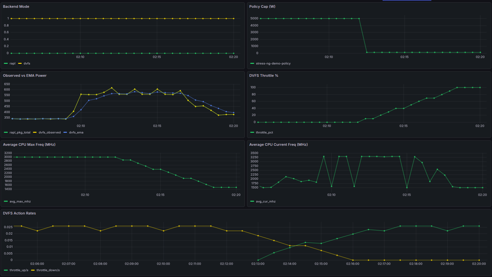

# Example: Prometheus + Grafana observability for Joulie

This example shows how to visualize Joulie behavior, especially when RAPL limits are unavailable and DVFS fallback is active.

It includes:

- `ServiceMonitor` for Prometheus Operator users.
- Grafana dashboard JSON for manual import, focused on DVFS fallback impact (power/EMA/throttle/frequency).
- Prometheus metrics reference: [docs/metrics.md](../../docs/metrics.md)

## Prerequisites

- Joulie deployed with metrics enabled in `deploy/joulie.yaml`.
- Prometheus scraping from `joulie-system/joulie-agent-metrics:8080/metrics`.
- Grafana running.

## 1) Verify metrics endpoint

```bash
kubectl -n joulie-system get svc joulie-agent-metrics
kubectl -n joulie-system get endpoints joulie-agent-metrics
```

Quick sample metric check:

```bash
kubectl -n joulie-system port-forward svc/joulie-agent-metrics 18080:8080
curl -s localhost:18080/metrics | grep '^joulie_' | head
```

## 2) Prometheus scrape configuration

### Option A: Prometheus Operator (ServiceMonitor)

```bash
kubectl apply -f examples/prometheus-grafana/servicemonitor.yaml
```

The provided manifest is set for a Prometheus installation named `telemetry`:

- `metadata.namespace: default`
- `metadata.labels.release: telemetry`

If your Prometheus release name or operator namespace differs, adjust those fields accordingly.

### Option B: plain Prometheus

Use service annotations already in `deploy/joulie.yaml` or add static scrape config.

## 3) Grafana dashboard import

Import this file directly in Grafana:

- [dashboard-joulie-dvfs.json](dashboard-joulie-dvfs.json)
- [dashboard-sample.png](dashboard-sample.png)

Sample dashboard:



## 4) What to look at during the stress-ng demo

- `joulie_backend_mode{mode="dvfs"}` should be `1` when RAPL is not writable.
- `joulie_rapl_package_total_power_watts` and `joulie_dvfs_ema_power_watts` should follow load.
- `joulie_dvfs_throttle_pct` should rise under low cap and drop after high cap is reapplied.
- `joulie_dvfs_cpu_max_freq_khz` should decrease/increase with DVFS actions.

This provides graphical evidence that DVFS fallback still impacts power/frequency behavior when RAPL capping is unavailable.
