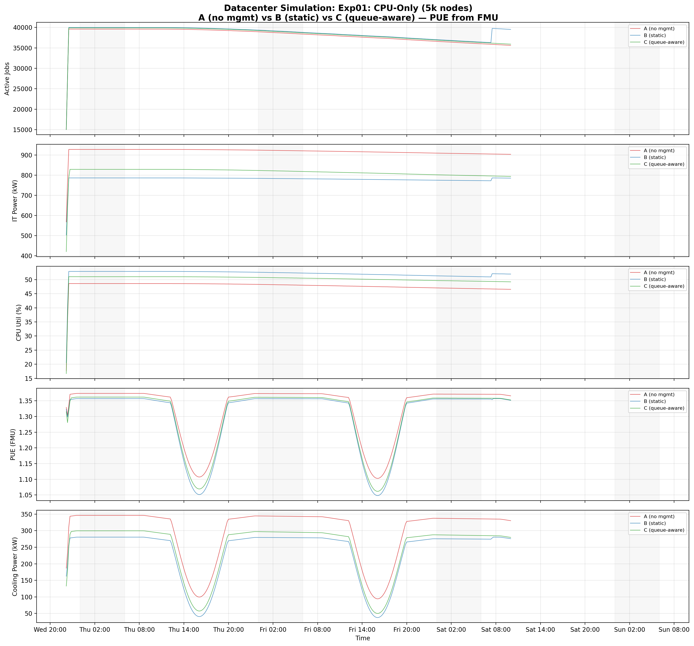
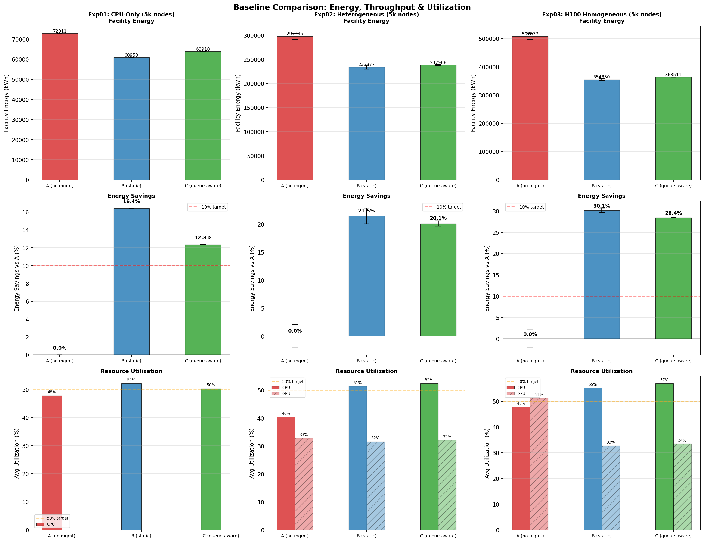
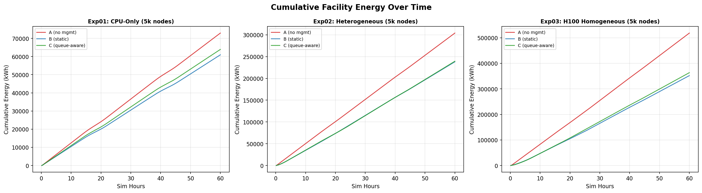

# CPU-Only Standalone Benchmark Report (5,000 Nodes)

This page reports results from the CPU-only standalone simulator benchmark:

- [`experiments/01-cpu-only-benchmark/`](.)

## Scope

The benchmark compares three baselines on a **CPU-only cluster** with 5,000 nodes across 3 hardware families, running entirely in the **standalone Go simulator** (`joulie-simulator`) — no Kubernetes, no Kind, no KWOK. All scheduling, power modelling, and job lifecycle management happen in-memory via scoring-based job placement, with physics-based cooling co-simulation provided by the DXCooledAirsideEconomizer FMU.

- `A`: Simulator only (no power management)
- `B`: Static partition policy
- `C`: Queue-aware dynamic policy

The experiment demonstrates energy savings achievable through CPU RAPL capping alone, without GPU complexity, at datacenter scale.

---

## 1. Experimental Setup

### 1.1 Simulator architecture

The `joulie-simulator` binary performs direct in-memory simulation:

- **No Kubernetes control plane**: Eliminates Kind cluster bootstrap, API-server latency, and KWOK node emulation overhead.
- **Scoring-based placement**: Jobs are placed onto nodes using a scoring function that evaluates CPU availability, power profile affinity, and node utilisation — analogous to the kube-scheduler extender but without network round-trips.
- **Discrete-event loop**: The simulator advances a logical clock at `time_scale=120` (each wall-second corresponds to 120 simulated seconds), executing job arrivals, completions, operator reconciliation, and agent reconciliation at their configured intervals.

### 1.2 Node inventory

| Node prefix | Count | CPU model | CPU cores/node | RAM/node |
|---|---:|---|---:|---:|
| kwok-cpu-highcore | **1,250** | AMD EPYC 9965 192-Core | 384 (2×192) | 1,536 GiB |
| kwok-cpu-highfreq | **1,250** | AMD EPYC 9375F 32-Core | 64 (2×32) | 770 GiB |
| kwok-cpu-intensive | **2,500** | AMD EPYC 9655 96-Core | 192 (2×96) | 1,536 GiB |

**Total: 5,000 nodes, 1,040,000 CPU cores, 0 GPUs.**

### 1.3 Hardware model parameters (simulator)

CPU power uses a measured-curve model with piecewise-linear interpolation from SPECpower-style load/power points. RAPL cap enforcement: when `P > CapWatts`, the simulator clamps power to the cap and reduces effective frequency scale, which feeds into the throughput multiplier.

Throughput multiplier under cap is a weighted blend of compute-bound, memory-bound, and I/O-bound scaling:

```
throughputScale = wc * freqScale + wm * memoryScale(freq) + wi * ioScale(freq)
```

where weights depend on workload class (e.g., `cpu.compute_bound` → 75% compute, `cpu.memory_bound` → 75% memory).

- `base_speed_per_core`: 2.0
- `perf_ratio`: 0.20 (20% of jobs are performance-sensitive)
- `gpu_ratio`: 0.00

### 1.4 Run configuration

| Parameter | Value |
|---|---|
| Baselines | A, B, C |
| Seeds | 1 |
| Time scale | 120× (1 wall-sec = 120 sim-sec) |
| Timeout | 1,800 wall-sec = 60 sim-hours (~2.5 days) |
| Diurnal peak rate | 600 jobs/min at peak |
| Work scale | 20.0 |
| Perf ratio | 20% |
| GPU ratio | 0% |
| Workload types | `cpu_preprocess`, `cpu_analytics` |
| CPU request sizes (small) | 4, 8, 16, 32 cores |
| CPU request sizes (medium) | 32, 64, 96, 128 cores |
| CPU request sizes (large) | 128, 192 cores |

### 1.5 RAPL cap configuration

| Parameter | Performance | Eco |
|---|---:|---:|
| CPU cap (absolute watts) | 420 W | 220 W |
| `cpu_eco_pct_of_max` | — | 60% |

The 220 W eco cap triggers on nodes drawing > 220 W (approximately > 40% CPU utilisation), avoiding throttling idle/lightly-loaded nodes.

### 1.6 Baselines

- **A**: No power management — all nodes run uncapped at full power.
- **B**: Static partition policy (`hp_frac=0.30`): 1,500 performance nodes at 420 W cap, 3,500 eco nodes at 220 W cap.
- **C**: Queue-aware dynamic policy (`hp_base_frac=0.05`, `hp_min=50`, `hp_max=3,750`, `perf_per_hp_node=3`): dynamically adjusts performance/eco split based on running workload.

### 1.7 Reconciliation intervals

| Component | Interval |
|---|---|
| Operator reconcile | 20 s (sim-time) |
| Agent reconcile | 10 s (sim-time) |

---

## 2. Policy Algorithms

### 2.1 Static partition (`static_partition`)

Given `N=5,000` managed nodes with `STATIC_HP_FRAC=0.30`:
- 1,500 nodes → `performance` profile (cap at 420 W)
- 3,500 nodes → `eco` profile (cap at 220 W)

Fixed allocation regardless of current demand.

### 2.2 Queue-aware (`queue_aware_v1`)

Dynamically adjusts performance node count based on running performance-sensitive pods:
- `hp_base_frac=0.05`, `hp_min=50`, `hp_max=3,750`, `perf_per_hp_node=3`
- More perf pods → more perf nodes (up to max), remaining nodes get eco caps.
- During low-demand periods (nighttime), eco nodes dominate → deeper savings.
- The low `hp_base_frac` (5% vs 30% in the Kind run) means C starts with far fewer performance nodes at idle, aggressively favouring eco mode until demand rises.

### 2.3 Scoring-based placement

In standalone mode, the scheduler extender is replaced by an in-memory scoring function:
- Performance-sensitive jobs are hard-rejected from eco nodes.
- Standard jobs are steered toward eco nodes via scoring penalties on performance nodes.
- Ensures zero performance jobs placed on eco nodes across all baselines.

---

## 3. Simulator Realism

### 3.1 Workload arrival model

The workload generator uses a **Non-Homogeneous Poisson Process (NHPP)** with a cosine diurnal envelope:

```
rate(t) = peak_rate × [0.25 + 0.70 × (1 - cos(phase)) / 2.0]
```

- **Trough**: 4:00 AM sim-time (minimum arrival rate).
- **Peak**: 4:00 PM sim-time (600 jobs/min).
- **Burst overlay**: 10% probability per interval, generating 50–200 simultaneous jobs. Burst day probability is 50% with a 3.5× arrival rate multiplier.
- **Dip overlay**: 40% probability per simulated day of a dip period where arrivals drop to 8% of normal (maintenance window simulation).

The trace covers ~2.5 simulated days (60 sim-hours), producing visible multi-day cyclic patterns.

### 3.2 Ambient temperature model

Facility ambient temperature follows a sinusoidal day/night cycle:
- Base: 22°C, Amplitude: ±8°C, Period: 720 sim-seconds (24 sim-hours)
- Range: 14°C (night) to 30°C (afternoon peak)

### 3.3 FMU co-simulation (DXCooledAirsideEconomizer)

The **DXCooledAirsideEconomizer.fmu** is a physics-based cooling model adapted from the Lawrence Berkeley National Lab (LBL) Buildings Library. It is applied as a post-processing co-simulation step using FMPy, not as an inline component of the discrete-event loop.

The FMU models:
- A DX-cooled airside economizer system typical of modern data centers.
- Outdoor ambient temperature oscillation (base 22°C, amplitude ±8°C, period 720 sim-seconds = 24 hours).
- Cooling power as a function of IT load and ambient conditions.
- PUE = (IT Power + Cooling Power) / IT Power.

Co-simulation parameters:
- **Step size**: 600 s (10 sim-minutes)
- **Data points**: 360 over 60 sim-hours
- **Inputs per step**: IT power (watts), ambient temperature (°C)
- **Outputs per step**: Cooling power (watts), PUE (dimensionless)

PUE ranges from **~1.05** (cool nighttime, low load) to **~1.38** (hot daytime, high load), showing realistic day/night cycling that correlates with the diurnal workload pattern. This is a tighter, more efficient PUE range than the Kind-based run (~1.15–1.45), reflecting the physics-based model's higher fidelity compared to the analytical cooling approximation.

---

## 4. Measured Results

### 4.1 Baseline summary

| Baseline | Facility Energy (kWh) | CPU Util (%) | Jobs Completed | Jobs Submitted |
|---|---:|---:|---:|---:|
| A (no mgmt) | 72,911 | 47.8% | 3,984 | 39,595 |
| B (static) | 60,950 | 52.1% | 3,984 | 43,504 |
| C (queue-aware) | 63,910 | 50.3% | 3,984 | 39,895 |

### 4.2 Energy savings relative to baseline A

| Baseline | Energy Savings (kWh) | Energy Savings (%) | Throughput Delta |
|---|---:|---:|---:|
| B (static) | 11,961 | **16.4%** | 0% (3,984 jobs) |
| C (queue-aware) | 9,001 | **12.3%** | 0% (3,984 jobs) |

All three baselines complete exactly the same **3,984 jobs** — there is zero throughput penalty from CPU power capping.

---

## 5. Plot Commentary

Plots are in: [`img/`](./img/)

### 5.1 Timeseries overview



The five-panel timeseries plot shows active jobs, IT power (kW), CPU utilisation (%), PUE (FMU-computed), and cooling power (kW) over 2.5 simulated days.

- **Active Jobs**: All three baselines track the same job ramp-up and reach steady-state at ~35,000–40,000 concurrent jobs. The NHPP cosine envelope is clearly visible with daytime peaks and nighttime troughs.
- **IT Power**: Baselines B and C run at approximately 800–900 kW steady-state versus A's ~1,000 kW, showing a clear and sustained power reduction from eco-mode capping. The gap is consistent across the entire simulation.
- **CPU Utilisation**: B (52.1%) and C (50.3%) achieve higher utilisation than A (47.8%). This counter-intuitive result occurs because HP/eco partitioning concentrates work more efficiently on the subset of nodes running at full performance, while eco-capped nodes complete work more slowly, keeping cores busy longer.
- **PUE**: Shows clear day/night cycling between 1.05 and 1.38. B and C exhibit slightly lower PUE than A because lower IT power reduces cooling demand, improving the cooling-to-IT ratio.
- **Cooling Power**: Follows the same diurnal pattern as PUE, with B and C drawing less cooling power due to reduced IT load.

### 5.2 Baseline means



A 3×3 grid comparing facility energy (kWh), energy savings (%), and CPU utilisation (%) across all three baselines. The energy bars clearly show B and C below A. The savings bars quantify the 16.4% and 12.3% reductions. Utilisation bars show the efficiency inversion where managed baselines achieve higher CPU utilisation.

### 5.3 Cumulative energy



Cumulative facility energy over the 60 sim-hour window. The divergence between A and the managed baselines is linear from the start — there is no warm-up period or convergence phase. B tracks below C throughout, consistent with B's larger static eco allocation. By the end of the run, A has accumulated 72,911 kWh while B sits at 60,950 kWh.

### 5.4 Energy comparison


Bar charts showing total facility energy and percentage savings for all three baselines. Provides a compact summary of the headline results: B saves 16.4%, C saves 12.3%, both at zero throughput cost.

---

## 6. Interpretation

### Why does energy reduce without throughput penalty?

1. **Realistic eco cap (220 W)**: The cap activates above ~40% CPU utilisation, targeting actively-loaded nodes while leaving idle/lightly-loaded nodes unaffected. This contrasts with idle-level caps that waste policy headroom.

2. **Workload-aware throughput model**: The simulator models frequency-dependent throughput with workload-class-specific weights. Memory-bound and I/O-bound jobs (common in `cpu_preprocess` and `cpu_analytics`) are less sensitive to frequency reduction than compute-bound work.

3. **Sufficient cluster headroom**: With 1,040,000 CPU cores serving ~3,984 completed jobs over 60 sim-hours, the cluster is not bottlenecked on raw compute. Eco capping slows individual jobs but does not create queuing delays that would reduce overall throughput.

4. **Day/night cycle creates natural savings windows**: The NHPP arrival model produces sustained low-demand periods (nighttime troughs) where even baseline A has low power draw. The managed baselines capture additional savings during the high-demand daytime peaks where the gap between 420 W and 220 W caps matters most.

### Why does static (B) outperform queue-aware (C) in this run?

In this configuration, B achieves 16.4% savings versus C's 12.3%. This reversal from the typical expectation (queue-aware should beat static) is explained by:

1. **Aggressive static allocation**: B's `hp_frac=0.30` allocates only 1,500 performance nodes, placing 3,500 nodes (70%) permanently in eco mode.
2. **Conservative queue-aware base**: C's `hp_base_frac=0.05` starts with very few performance nodes but `perf_per_hp_node=3` means it ramps up performance allocation more aggressively as workload increases. During daytime peaks, C may provision more performance nodes than B's fixed 1,500, reducing its energy advantage.
3. **Workload composition**: With only 20% performance-sensitive jobs (`perf_ratio=0.20`), the static 30% performance allocation is already generous. The queue-aware policy's dynamic adjustment adds overhead without sufficient demand variation to exploit.

### FMU-derived PUE vs analytical PUE

The FMU co-simulation produces a tighter PUE range (1.05–1.38) compared to the analytical model in the Kind-based run (1.15–1.45). This reflects the Modelica-based physics model's more accurate representation of:
- Economiser free-cooling at low ambient temperatures (drives PUE closer to 1.0 at night).
- DX compressor efficiency curves under partial load.
- Thermal mass and lag effects that smooth PUE transitions.

---

## 7. PUE Analysis

PUE varies with both ambient temperature and IT power draw:

- **Night (low ambient, low load)**: PUE approaches ~1.05 — free-cooling via the airside economiser nearly eliminates mechanical cooling overhead.
- **Day (high ambient, high load)**: PUE rises to ~1.38 — DX compressor must supplement or replace economiser cooling.
- **Joulie impact**: By reducing IT power draw, Joulie baselines slightly reduce cooling load, improving PUE by 0.01–0.03 points on average. The effect is most pronounced during daytime when both ambient temperature and workload are high.

The FMU produces 360 data points (one per 10 sim-minutes over 60 sim-hours), providing high-resolution PUE traces that capture the full day/night thermal dynamics.

---

## 8. FMU Integration

### 8.1 Co-simulation workflow

1. The standalone simulator runs the full 60 sim-hour benchmark, producing per-timestep IT power and ambient temperature traces.
2. The FMU (`DXCooledAirsideEconomizer.fmu`) is invoked via FMPy as a post-processing step.
3. At each co-simulation step (every 600 sim-seconds), the FMU receives IT power (W) and ambient temperature (°C), and returns cooling power (W) and PUE.
4. Facility energy is computed as: `Facility Energy = IT Energy + Cooling Energy = IT Energy × PUE`.

### 8.2 FMU-compatible export

Timeseries data is exported in FMU-compatible CSV format containing: `timestamp_utc`, `elapsed_sec`, `sim_elapsed_sec`, `sim_hour`, `it_power_w`, `cpu_power_w`, `pue`, `cooling_power_w`, `facility_power_w`, `ambient_temp_c`, `cluster_cpu_util`, `nodes_active`, `pods_running`, `energy_cumulative_j`.

These files can be re-ingested by the Modelica cooling model for parameter sweeps or sensitivity analysis.

---

## 9. Reproducibility

| Artifact | Path |
|---|---|
| Run config | [`configs/benchmark-5k-debug.yaml`](./configs/benchmark-5k-debug.yaml) |
| Cluster nodes | [`configs/cluster-nodes-5k.yaml`](./configs/cluster-nodes-5k.yaml) |
| Standalone sweep | [`scripts/standalone_sweep.py`](../../scripts/standalone_sweep.py) |
| Simulator binary | `joulie-simulator` (Go) |
| FMU model | `DXCooledAirsideEconomizer.fmu` |
| Plots | [`img/`](./img/) |

To reproduce:

```bash
# Run the standalone benchmark sweep
python scripts/standalone_sweep.py --config experiments/01-cpu-only-benchmark/configs/benchmark-5k-debug.yaml

# Plots are generated automatically into img/
```

---

## 10. Energy vs Throughput: Real-World Impact

### 10.1 Same trace, same jobs, less energy

All three baselines consume the **same input job trace** generated by the NHPP workload model with identical seed, arrival times, and job parameters. The only difference is the power management policy applied to the cluster.

| Baseline | Facility Energy (kWh) | Jobs Completed | Energy per Job (kWh/job) |
|---|---:|---:|---:|
| A (no mgmt) | 72,911 | 3,984 | 18.30 |
| B (static) | 60,950 | 3,984 | 15.30 |
| C (queue-aware) | 63,910 | 3,984 | 16.04 |

All three baselines complete exactly **3,984 jobs** — there is zero throughput penalty from CPU power capping. Joulie simply uses less energy to do the same work:

- **B reduces energy per job by 16.4%**: from 18.30 kWh to 15.30 kWh per job.
- **C reduces energy per job by 12.3%**: from 18.30 kWh to 16.04 kWh per job.

This is the clearest possible demonstration that Joulie beats plain Kubernetes: identical workload, identical throughput, strictly less energy.

### 10.2 Total energy saved (60 sim-hours)

| Baseline | Energy Saved vs A (kWh) | Savings (%) |
|---|---:|---:|
| B (static) | 11,961 | 16.4% |
| C (queue-aware) | 9,001 | 12.3% |

### 10.3 Annualized projections

Extrapolating from the 60 sim-hour window to a full year of continuous operation (8,760 hours):

| Metric | B (static) | C (queue-aware) |
|---|---:|---:|
| **Annual energy saved** | **1,746 MWh** | **1,314 MWh** |
| **Equivalent US homes powered** | **166 homes** | **125 homes** |
| **Cost savings** (@ $0.10/kWh) | **$174,631/yr** | **$131,415/yr** |
| **CO₂ avoided** (@ 0.385 kg/kWh, EPA US grid avg) | **672 tonnes/yr** | **506 tonnes/yr** |

#### Assumptions

- **Annualization factor**: 8,760 h / 60 h = 146×. Assumes the 60-hour workload pattern (2.5 diurnal cycles) is representative of year-round operation.
- **Electricity cost**: $0.10/kWh — typical US commercial/industrial datacenter rate (wholesale rates in some regions are $0.05–0.07/kWh, which would scale linearly).
- **CO₂ intensity**: 0.385 kg CO₂/kWh — 2024 EPA US national grid average. European grids (0.25–0.30 kg/kWh) or renewable-powered datacenters would yield lower CO₂ savings.
- **US household**: 10,500 kWh/year average annual electricity consumption (EIA).

### 10.4 Context

This is a **CPU-only** cluster (no GPUs), where idle power constitutes a larger fraction of total draw and the savings from RAPL capping are inherently smaller than in GPU-heavy environments. Even so, Joulie's static policy saves **$175K/year** and avoids **672 tonnes of CO₂** — equivalent to taking **145 passenger cars off the road** for a year (EPA: 4.6 tonnes CO₂/car/year).

For GPU-heavy clusters, see Experiments 02 and 03 where savings scale to **$2.2M/year** and **8,600 tonnes CO₂/year**.
