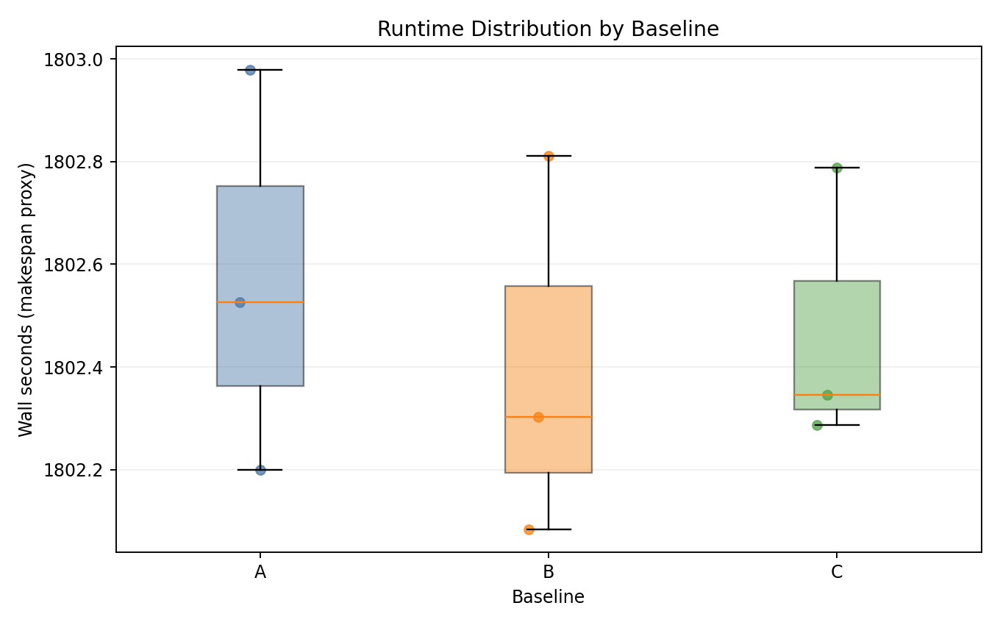
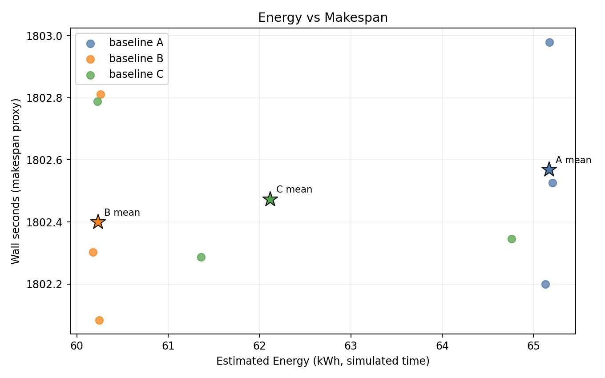
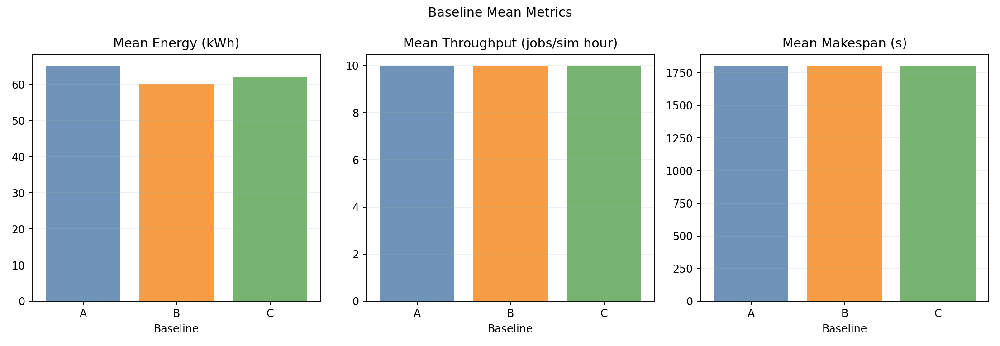

# KWOK Benchmark Report

## Scope

This report documents the current benchmark run from the compact report snapshot in [`assets/`](./assets), including:

- experimental setup (cluster, nodes, workload, baselines),
- controller policy algorithms,
- simulator hardware/energy and slowdown models,
- measured outcomes from `assets/data/summary.csv`,
- interpretation of generated plots (excluding `throughput_vs_energy.png`).

---

## 1. Experimental Setup

### 1.1 Cluster and node topology

- Kind control-plane + worker (real Kubernetes control path).
- 5 fake KWOK worker nodes (`kwok-node-0..4`) labeled with `joulie.io/managed=true`.
- KWOK nodes are tainted `kwok.x-k8s.io/node=fake:NoSchedule`.
- Workload pods use:
  - `nodeSelector: type=kwok`
  - matching toleration for the KWOK taint.

Node template source: [`manifests/kwok_nodes.yaml.tpl`](./manifests/kwok_nodes.yaml.tpl)

### 1.2 Hardware model classes used by simulator

Loaded from simulator manifest configmap:
[`../../examples/06-simulator-kwok/manifests/10-simulator.yaml`](../../examples/06-simulator-kwok/manifests/10-simulator.yaml)

- `intel-kwok`: `BaseIdleW=65`, `PMaxW=420`, `AlphaUtil=1.1`, `BetaFreq=1.25`, `FMin/FMax=1200/3200`, `DefaultCapW=500`.
- `amd-kwok`: `BaseIdleW=75`, `PMaxW=460`, `AlphaUtil=1.2`, `BetaFreq=1.35`, `FMin/FMax=1200/3400`, `DefaultCapW=550`.

Variable meaning:

- `BaseIdleW`: modeled CPU package idle power floor (Watts).
- `PMaxW`: modeled package power at full dynamic load before capping (Watts).
- `AlphaUtil`: exponent controlling how strongly power grows with utilization.
- `BetaFreq`: exponent controlling how strongly power grows with frequency scale.
- `FMin/FMax`: min/max CPU frequency bounds used to derive feasible frequency scale.
- `DefaultCapW`: default initial package power cap for a node class.

Power-model details are documented in:

- https://joulie-k8s.github.io/Joulie/docs/simulator/simulator-algorithms/

Nodes are assigned classes by label `feature.node.kubernetes.io/cpu-model.vendor_id`.

### 1.3 Run configuration used

From [`configs/benchmark.yaml`](./configs/benchmark.yaml):

- Baselines: `A,B,C`
- Seeds: `3`
- Jobs per seed: `300`
- Mean inter-arrival: `0.20s`
- Timeout per run: `1800s`
- Time scale: `60`
- Workload mix:
  - performance-affinity: `20%`
  - eco-affinity: `30%`
  - no affinity (implicit flexible/general): `50%`
- CPU work units per job: `[800, 4000]`

### 1.4 Workload distribution observed in canonical traces

Per-seed canonical traces (counts recorded from run artifacts):

- Seed 1: `performance=63`, `eco=94`, `general=143`
- Seed 2: `performance=72`, `eco=72`, `general=156`
- Seed 3: `performance=55`, `eco=93`, `general=152`

Baseline A uses the same canonical traces with only power-profile affinity stripped (`baseline_a_strip_affinity=true`).

### 1.5 Baselines

- **A**: simulator only (Joulie-free: no operator, no agent).
- **B**: Joulie static partition policy.
- **C**: Joulie queue-aware policy.

All aggregated run metrics used in this report are present in [`assets/data/summary.csv`](./assets/data/summary.csv) (`9` runs total).

---

## 2. Policy Algorithms (Controller Side)

Implementation: [`../../cmd/operator/main.go`](../../cmd/operator/main.go)

### 2.1 Pod classification source of truth

Classification is derived from pod scheduling constraints on `joulie.io/power-profile`:

- only `performance` allowed -> performance-sensitive,
- only `eco` allowed -> eco-only,
- both allowed / unconstrained -> general,
- unknown/unsupported constraints -> treated as performance-sensitive for safety.

### 2.2 Static partition (`static_partition`)

Given `N` eligible nodes:

- `hpCount = round(N * STATIC_HP_FRAC)`
- first `hpCount` nodes -> `performance` profile
- remaining -> `eco` profile

In this run: `STATIC_HP_FRAC=0.75`, so on 5 nodes: 4 performance, 1 eco.

### 2.3 Queue-aware (`queue_aware_v1`)

Let:

- `baseCount = round(N * QUEUE_HP_BASE_FRAC)`
- `perfIntentPods = count(running performance-sensitive pods cluster-wide)`
- `queueNeed = ceil(perfIntentPods / QUEUE_PERF_PER_HP_NODE)`

Then:

- `hpCount = max(baseCount, queueNeed)`
- clamp with `QUEUE_HP_MIN`, `QUEUE_HP_MAX`, and `[0, N]`.
- assign first `hpCount` nodes as performance, rest eco.

In this run:

- `QUEUE_HP_BASE_FRAC=0.70`, `QUEUE_HP_MIN=2`, `QUEUE_HP_MAX=5`, `QUEUE_PERF_PER_HP_NODE=15`.

### 2.4 Downgrade guard / draining

When a node should go `performance -> eco`, operator sets `joulie.io/power-profile=eco` and marks `joulie.io/draining=true` while performance-sensitive pods are still running there.

---

## 3. Simulator Algorithms

Implementation: [`../../simulator/cmd/simulator/main.go`](../../simulator/cmd/simulator/main.go), profile types in [`../../simulator/pkg/hw/profile.go`](../../simulator/pkg/hw/profile.go)

### 3.1 Node power model (idle and non-idle)

For node utilization `u in [0,1]` and frequency scale `f in [0,1]`:

- `P(u,f) = BaseIdleW + (PMaxW - BaseIdleW) * u^AlphaUtil * f^BetaFreq`

Interpretation:

- **Idle** (`u=0`): `P = BaseIdleW` (plus cap/headroom effects).
- **Non-idle** (`u>0`): dynamic term increases with utilization and frequency.

### 3.2 Throttling and cap enforcement

Controls:

- `rapl.set_power_cap_watts` updates `CapWatts` (clamped to class min/max cap).
- `dvfs.set_throttle_pct` sets target throttle.

DVFS dynamics per tick:

- `targetFreqScale = 1 - throttlePct/100`
- first-order ramp with `DvfsRampMS` toward target.

If modeled power exceeds cap:

- solve target frequency from cap:
  - `targetFreq = solveFreqScaleForCap(model, u, cap)`
- clamp with min feasible frequency (`FMinMHz/FMaxMHz`).
- if even min frequency cannot satisfy cap, mark `CapSaturated=true`.

Final power is limited by `cap + RaplHeadW`.

### 3.3 Energy integration (cluster and per-node)

At each workload loop tick (`dt` seconds):

- compute current per-node power from model,
- integrate `E += P * dt` (Joules),
- store:
  - cluster `totalJoules`,
  - per-node `byNodeJoules`.

Benchmark collection (`06_collect.py`) reads `/debug/energy` and scales by `time_scale` to report simulated-time energy:

- `energy_sim_joules_est = totalJoules * time_scale`
- `energy_sim_kwh_est = energy_sim_joules_est / 3_600_000`

### 3.4 Job progress and slowdown after throttling

For job `j` on node with current `freqScale`:

- `speed_j = requestedCPUCores_j * baseSpeedPerCore * (1 - (1-freqScale)*sensitivityCPU_j)`
- progress update:
  - `cpuUnitsRemaining_j -= speed_j * dt / max(1, jobsRunningOnSameNode)`

Slowdown mechanism:

- Lower `freqScale` from throttling reduces the multiplicative speed term.
- High `sensitivityCPU` amplifies slowdown.
- Node sharing adds additional slowdown via division by concurrent jobs on node.

Equivalent single-job slowdown factor (ignoring sharing):

- `slowdown = 1 / (1 - (1-freqScale)*sensitivityCPU)`

---

## 4. Measured Results (Current Dataset)

Source: [`assets/data/summary.csv`](./assets/data/summary.csv), 3 seeds per baseline.

### 4.1 Baseline means

| Baseline | Mean wall time (s) | Mean throughput (jobs/sim-hour) | Mean energy (kWh sim) | Mean cluster power (W) |
|---|---:|---:|---:|---:|
| A | 1802.57 | 9.9858 | 65.1705 | 2169.25 |
| B | 1802.40 | 9.9867 | 60.2284 | 2004.94 |
| C | 1802.47 | 9.9863 | 62.1140 | 2067.63 |

Relative to A:

- B: energy `-7.58%`, wall time `-0.009%` (negligible), throughput `+0.009%`.
- C: energy `-4.69%`, wall time `-0.005%` (negligible), throughput `+0.005%`.

### 4.2 Important run-state observation

At artifact collection time, many workload pods are still `Pending/Running` in all baselines (runs end at timeout window near 1800s). This means metrics compare equal-time windows, not fully drained workloads.

---

## 5. Plot Commentary

### 5.1 Runtime distribution

Comment:

- Distributions overlap almost perfectly.
- Wall-time differences across baselines are tiny compared to run-to-run jitter.

### 5.2 Energy vs makespan

Comment:

- B is clearly shifted to lower energy at essentially unchanged makespan.
- C has higher variance; one run is close to A energy (visible outlier), two runs are near B.
- Means show a stable ordering: `B < C < A` in energy.

### 5.3 Baseline mean metrics

Comment:

- Makespan/throughput bars are nearly identical.
- Energy differences are the primary effect in this dataset.

---

## 6. Interpretation and limits

1. The simulator model and controls are active: non-trivial energy separation exists (`A` vs `B/C`).
2. Throughput impact is near zero in this specific setup due to:
   - fast simulated execution (`base_speed_per_core=8.0`),
   - ample capacity and high fraction of unconstrained jobs,
   - timeout-limited runs rather than full completion.
3. Queue-aware (`C`) did not consistently beat static (`B`) in this run; one seed stayed close to all-performance behavior, increasing C variance.

---

## 7. Best-Fit Use Case Indicated By The Data

From the collected results, the strongest observed Joulie benefit is:

- **energy reduction with negligible throughput impact** under mixed workload demand.

In this dataset:

- baseline `B` (`static_partition`) reduces energy by about `7.6%` vs `A`,
- while makespan/throughput differences are effectively zero (sub-`0.01%` level).

This suggests the most suitable near-term use case is:

- clusters where operators want to lower power/energy cost during normal operation,
- without changing scheduler behavior or accepting a visible throughput penalty,
- and with a predictable policy (static HP/LP partition) that is easy to reason about.

Practically, this maps well to:

- production-like mixed queues with many unconstrained jobs,
- environments where a conservative, stable control policy is preferred over aggressive adaptive switching,
- energy-optimization objectives where latency SLOs must remain close to baseline.

Given current evidence, `static_partition` appears to be the most robust first-choice policy for this workload regime; `queue_aware_v1` needs further tuning/longer runs to show consistent additional gains over static.

---

## 8. Reproducibility references

- Benchmark README: [`README.md`](./README.md)
- Config: [`configs/benchmark.yaml`](./configs/benchmark.yaml)
- Sweep: [`scripts/05_sweep.py`](./scripts/05_sweep.py)
- Collection: [`scripts/06_collect.py`](./scripts/06_collect.py)
- Plotting: [`scripts/07_plot.py`](./scripts/07_plot.py)
