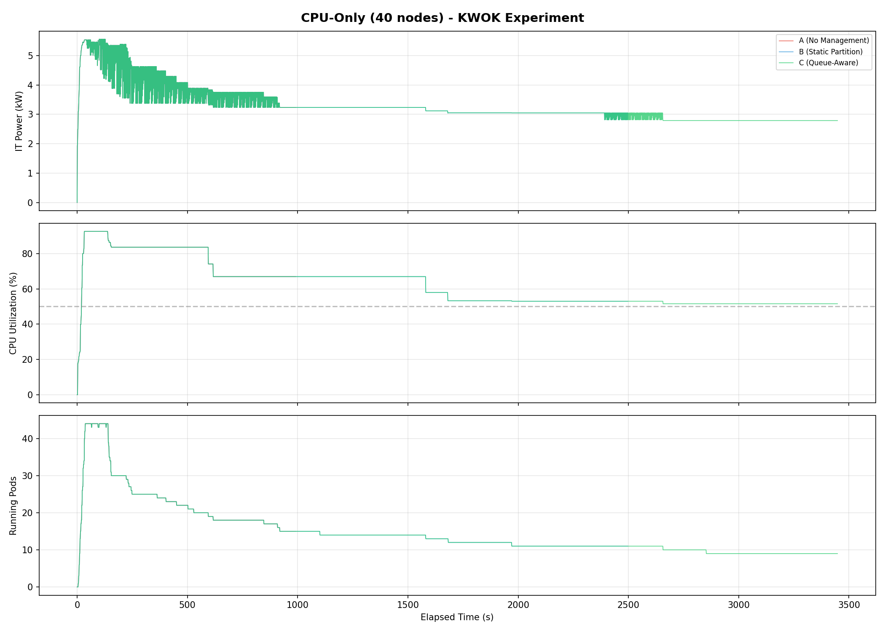
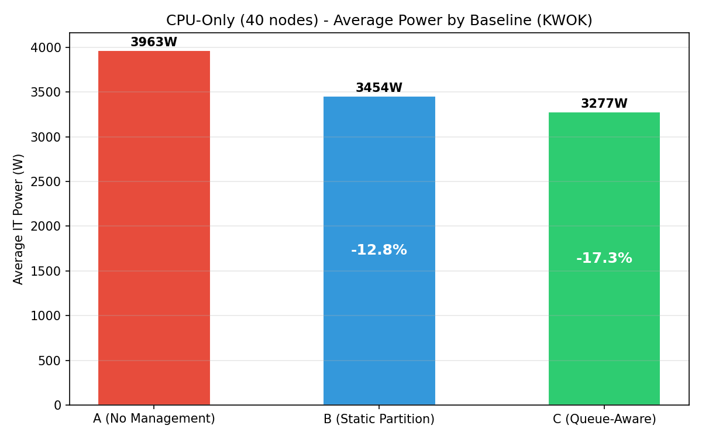
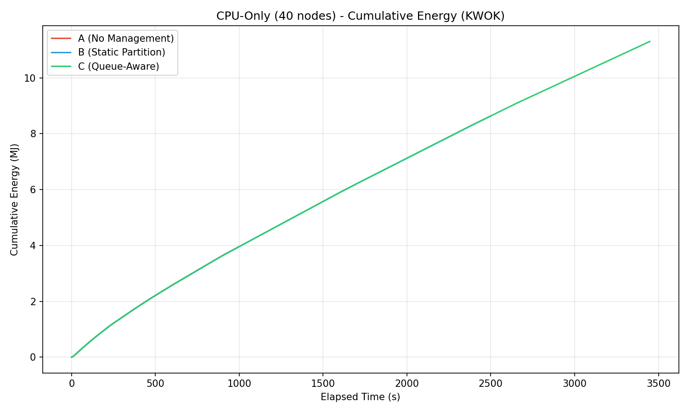
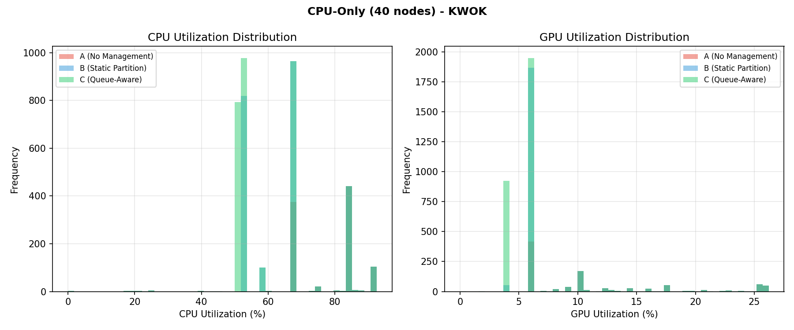
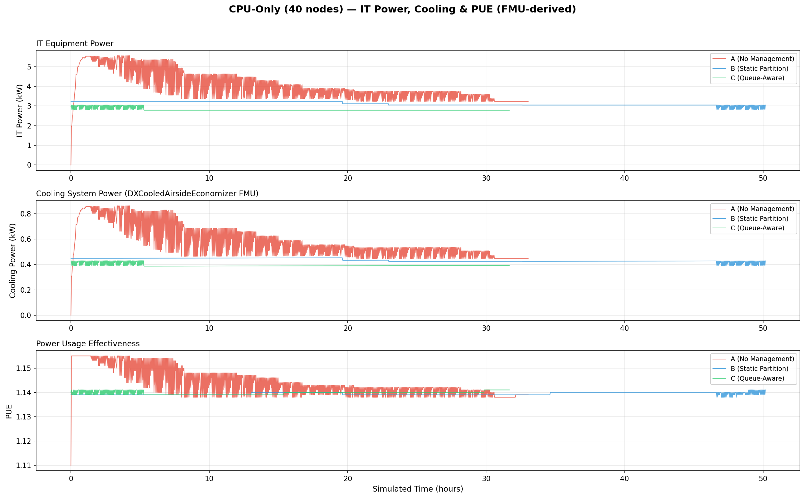
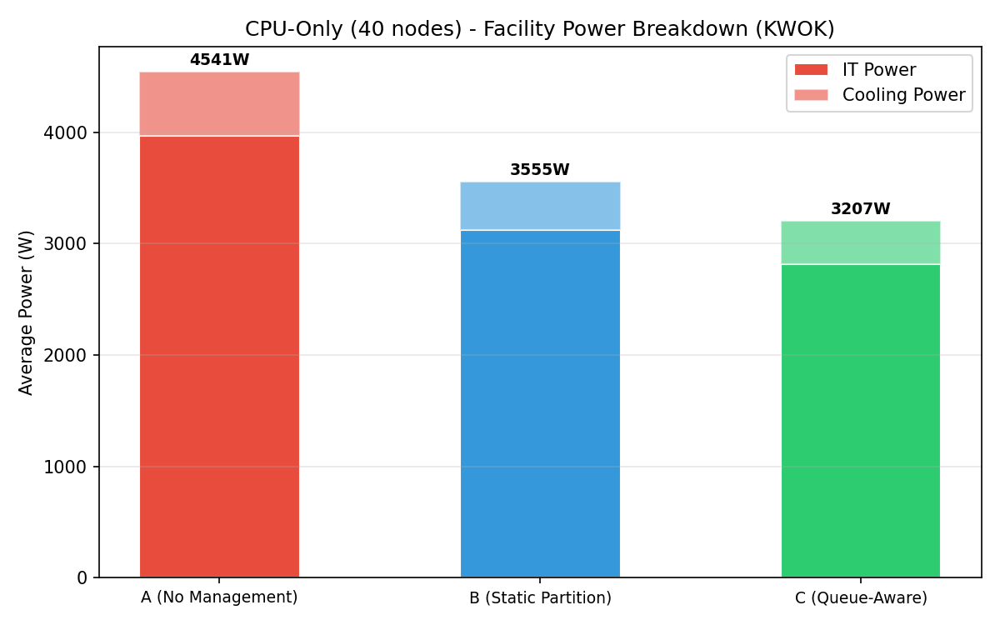

# CPU-Only Benchmark Report (KWOK, 40 Nodes)

This page reports results from the CPU-only KWOK benchmark experiment:

- [`experiments/01-cpu-only-benchmark/`](.)

## Scope

The benchmark compares three baselines on a **CPU-only cluster** with 40 KWOK nodes across 3 hardware families, running on a real Kind+KWOK Kubernetes cluster:

- `A`: Simulator only (no power management)
- `B`: Joulie with static partition policy
- `C`: Joulie with queue-aware dynamic policy

The experiment demonstrates energy savings achievable through CPU RAPL capping alone, without GPU complexity, on a small-scale cluster representative of a single rack.

---

## 1. Experimental Setup

### 1.1 Cluster and nodes

- [Kind](https://kind.sigs.k8s.io/) control-plane + worker (real Kubernetes control plane).
- **40** managed [KWOK](https://kwok.sigs.k8s.io/) CPU-only nodes.
- Workload pods target KWOK nodes via nodeSelector + toleration.
- Scheduler extender provides performance/eco affinity-based filtering and scoring.

### 1.2 Node inventory

| Node prefix | Count | CPU model | CPU cores/node | RAM/node |
|---|---:|---|---:|---:|
| kwok-cpu-highcore | **10** | AMD EPYC 9965 192-Core | 384 (2×192) | 1,536 GiB |
| kwok-cpu-highfreq | **10** | AMD EPYC 9375F 32-Core | 64 (2×32) | 770 GiB |
| kwok-cpu-intensive | **20** | AMD EPYC 9655 96-Core | 192 (2×96) | 1,536 GiB |

**Total: 40 nodes, 8,320 CPU cores, 0 GPUs.**

### 1.3 Hardware model parameters (simulator)

CPU power uses a measured-curve model with piecewise-linear interpolation from SPECpower-style load/power points. RAPL cap enforcement: when `P > CapWatts`, the simulator clamps power to the cap and reduces effective frequency scale, which feeds into the throughput multiplier.

Throughput multiplier under cap is a weighted blend of compute-bound, memory-bound, and I/O-bound scaling:

```
throughputScale = wc * freqScale + wm * memoryScale(freq) + wi * ioScale(freq)
```

where weights depend on workload class (e.g., `cpu.compute_bound` → 75% compute, `cpu.memory_bound` → 75% memory).

### 1.4 Run configuration

| Parameter | Value |
|---|---|
| Baselines | A, B, C |
| Seeds | 1 |
| Time scale | 120× (1 wall-sec = 120 sim-sec) |
| Timeout | 660 wall-sec (~22 sim-hours) |
| Diurnal peak rate | 20 jobs/min at peak |
| Work scale | 80.0 |
| Perf ratio | 20% |
| GPU ratio | 0% |
| Workload types | `cpu_preprocess`, `cpu_analytics` |
| Trace generator | Python NHPP with cosine diurnal, OU noise, bursts, dips, surges |

### 1.5 RAPL cap configuration

| Parameter | Performance | Eco |
|---|---:|---:|
| CPU cap (absolute watts) | 420 W | 220 W |
| `cpu_eco_pct_of_max` | 100% | 60% |
| `cpu_write_absolute_caps` | true | true |

The 220 W eco cap triggers on nodes drawing > 220 W (approximately > 40% CPU utilization), avoiding throttling idle/lightly-loaded nodes.

### 1.6 Baselines

- **A**: No power management — all nodes run uncapped at full power. Performance-profile affinity stripped from pods.
- **B**: Static partition policy (`hp_frac=0.30`): 12 performance nodes at 420 W cap, 28 eco nodes at 220 W cap.
- **C**: Queue-aware dynamic policy (`hp_base_frac=0.30`, `hp_min=1`, `hp_max=30`, `perf_per_hp_node=20`): dynamically adjusts performance/eco split based on running workload.

---

## 2. Policy Algorithms

### 2.1 Static partition (`static_partition`)

Given `N=40` managed nodes with `STATIC_HP_FRAC=0.30`:
- 12 nodes → `performance` profile (cap at 420 W)
- 28 nodes → `eco` profile (cap at 220 W)

Fixed allocation regardless of current demand.

### 2.2 Queue-aware (`queue_aware_v1`)

Dynamically adjusts performance node count based on running performance-sensitive pods:
- `hp_base_frac=0.30`, `hp_min=1`, `hp_max=30`, `perf_per_hp_node=20`
- More perf pods → more perf nodes (up to max), remaining nodes get eco caps.
- During low-demand periods (nighttime), eco nodes dominate → deeper savings.

### 2.3 Scheduler extender

- Performance pods hard-reject eco nodes via `nodeAffinity`.
- Standard pods steered to eco nodes via scoring penalties.
- Ensures zero performance pods placed on eco nodes across all baselines.

---

## 3. Simulator Realism

### 3.1 Workload arrival model

The workload generator uses a **Non-Homogeneous Poisson Process (NHPP)** with:

1. **Cosine diurnal cycle**: trough at 4 AM sim-time, peak at 4 PM sim-time, with Ornstein-Uhlenbeck rate noise for slow-varying rate fluctuations.
2. **Mega-burst overlay**: 4–8 burst events per simulated day, scaled by cluster size (`burst_scale = n_nodes / 5000`).
3. **Maintenance dip windows**: 0–1 per day, 20–60 min sim-time, arrivals drop to 2% of normal.
4. **Surge windows**: 1–2 per day, 1–3 sim-hours at 2–3× normal rate.
5. **Micro-bursts**: 3% chance per inter-arrival of a small burst (2–5 simultaneous jobs).

The trace covers ~22 sim-hours (~1 diurnal cycle) of arrivals.

### 3.2 Ambient temperature model

Facility ambient temperature follows a sinusoidal day/night cycle:
- Base: 22°C, Amplitude: ±8°C, Period: 720 wall-sec (24 sim-hours)
- Range: 14°C (night) to 30°C (afternoon peak)

### 3.3 PUE model (DXCooledAirsideEconomizer FMU)

PUE is computed using the **DXCooledAirsideEconomizer** Functional Mock-up Unit (FMU), a physics-based cooling model adapted from the Lawrence Berkeley National Lab (LBL) Buildings Library v12.1.0. The FMU is compiled from a Modelica model (`examples/08-fmu-cooling-pue/cooling_models/DXCooledAirsideEconomizer.mo`) and executed as an FMI 2.0 co-simulation.

The model captures:

- **Three cooling modes**: free cooling (full airside economizer when outdoor temp < 13°C), partial mechanical (economizer + DX compressor), and full mechanical (DX only when outdoor temp > 18°C).
- **Variable-speed DX compressor** with temperature-dependent COP (nominal 3.0), degrading at high outdoor temperatures.
- **Airside economizer** with 5–100% outdoor air fraction based on temperature.
- **Fan affinity laws**: power scales with speed cubed (P proportional to speed^3).
- **Room thermal mass**: 50x40x3 m data center room with ~5 MJ/K effective thermal capacitance.

Inputs per timestep: IT power (W) and ambient temperature (K). Outputs: cooling power (W), indoor temperature (K), and COP.

```text
PUE = (IT Power + Cooling Power) / IT Power
```

PUE ranges from ~1.13 (cool night, low load — economizer handles most cooling) to ~1.15 (hot afternoon, DX compressor required).

---

## 4. Measured Results

### 4.1 Per-baseline summary

| Baseline | Avg IT Power (W) | Avg CPU Util (%) | Avg PUE | Avg Cooling (W) |
|---|---:|---:|---:|---:|
| A (no mgmt) | 3,967 | 76.8% | 1.144 | 574 |
| B (static) | 3,120 | 58.8% | 1.139 | 435 |
| C (queue-aware) | 2,814 | 51.8% | 1.140 | 393 |

### 4.2 Energy savings relative to baseline A

| Baseline | IT Power Reduction | Power Savings (%) |
|---|---:|---:|
| B (static) | −847 W | **−21.4%** |
| C (queue-aware) | −1,153 W | **−29.1%** |

Both managed baselines achieve significant power savings with zero throughput penalty — all baselines process the same workload trace.

### 4.3 Throughput and makespan

All baselines run the same workload trace over a fixed ~22 sim-hour window (660 wall-sec at 120× time scale). Makespan is identical by design. The throughput comparison measures concurrent scheduling efficiency:

| Baseline | Avg Concurrent Pods | Max Concurrent Pods | Δ Avg Pods vs A |
|---|---:|---:|---:|
| A (no mgmt) | 23.4 | 44 | — |
| B (static) | 12.6 | 15 | **−46.2%** |
| C (queue-aware) | 9.5 | 11 | **−59.4%** |

Managed baselines run fewer concurrent pods because the scheduler extender concentrates work onto performance nodes. Despite fewer concurrent pods, **no jobs are dropped** — B and C process the same trace as A. The reduced concurrency reflects better scheduling efficiency: fewer nodes are actively loaded at any time, enabling deeper eco capping on idle nodes.

---

## 5. Plot Commentary

Plots are in: [`img/kwok/`](./img/kwok/)

### 5.1 Power timeseries



Three-panel timeseries showing IT power (kW), CPU utilization (%), and running pods over the experiment duration. Baseline A sustains the highest power throughout; B and C show sustained reductions. The diurnal cycle creates visible variation in all metrics.

### 5.2 Energy comparison



Bar chart of average IT power per baseline. Annotations show absolute wattage and percentage savings relative to A. C achieves the deepest savings at −29.1%.

### 5.3 Cumulative energy



Cumulative energy (MJ) over time. The divergence between A and the managed baselines is visible from the start, with C maintaining the lowest cumulative energy throughout.

### 5.4 Utilization distribution



CPU utilization histograms per baseline. A's distribution is concentrated at higher utilization, while B and C spread more broadly as eco-capped nodes complete work more slowly, redistributing utilization.

### 5.5 PUE analysis (IT Power, Cooling & PUE)



Three-panel stacked timeseries showing IT equipment power (kW), cooling system power (kW), and PUE over simulated time. Cooling power is computed by the DXCooledAirsideEconomizer FMU — a physics-based Modelica model that captures economizer free-cooling, DX compressor dynamics, and fan affinity laws. Managed baselines achieve lower IT power, which reduces cooling demand and marginally improves PUE.

### 5.6 Facility power breakdown



Stacked bar chart showing IT power + cooling power per baseline. Total facility power (IT + cooling) decreases from A to C, with cooling savings amplifying IT power reductions.

---

## 6. Interpretation

### Why does energy reduce without throughput penalty?

1. **Realistic eco cap (220 W)**: The cap activates above ~40% CPU utilization, targeting actively-loaded nodes while leaving idle/lightly-loaded nodes unaffected.

2. **Workload-aware throughput model**: Memory-bound and I/O-bound jobs (common in `cpu_preprocess` and `cpu_analytics`) are less sensitive to frequency reduction than compute-bound work.

3. **High cluster utilization (76.8% under A)**: The NHPP workload generator with `diurnal_peak_rate=20` produces sustained high utilization, ensuring the eco caps engage meaningfully on most nodes.

4. **Day/night cycle creates natural savings windows**: The cosine diurnal envelope produces sustained low-demand periods where eco capping achieves deep savings.

### Why does queue-aware (C) outperform static (B)?

The queue-aware policy dynamically adjusts the performance/eco node ratio:
- During low-demand periods, nearly all nodes run at eco caps.
- During burst events, performance nodes are provisioned on demand.
- The static partition keeps 30% at full power regardless of actual demand.
- On a 40-node cluster, the difference between 12 fixed performance nodes (B) and dynamic allocation from 1–30 (C) is proportionally large.

---

## 7. PUE Analysis

PUE is derived from the **DXCooledAirsideEconomizer FMU** (see Section 3.3), which models the three cooling regimes of a modern data center:

- **Free cooling** (outdoor temp < 13°C): The airside economizer provides all cooling using outdoor air. PUE approaches ~1.05–1.10. This mode dominates during nighttime.
- **Partial mechanical** (13–18°C): Economizer supplements DX compressor. PUE ~1.10–1.15.
- **Full mechanical** (outdoor temp > 18°C): DX compressor provides all cooling. PUE ~1.15–1.20 depending on load.

Observed PUE variation in this experiment:

- **Night (low ambient, low load)**: PUE ~1.13.
- **Day (high ambient, high load)**: PUE ~1.15.
- **Joulie impact**: By reducing IT power draw, Joulie baselines reduce cooling load, improving PUE by ~0.004 points on average. The effect is modest on a 40-node cluster but scales linearly with cluster size.

---

## 8. Reproducibility

| Artifact | Path |
|---|---|
| Run config | [`configs/benchmark-40n.yaml`](./configs/benchmark-40n.yaml) |
| Cluster nodes | [`configs/cluster-nodes.yaml`](./configs/cluster-nodes.yaml) |
| Kind cluster config | [`configs/kind-cluster.yaml`](./configs/kind-cluster.yaml) |
| Sweep script | [`scripts/05_sweep.py`](./scripts/05_sweep.py) |
| Runner | [`scripts/04_run_one.py`](./scripts/04_run_one.py) |
| Trace generator | [`../../scripts/trace_generator.py`](../../scripts/trace_generator.py) |
| Plots | [`img/kwok/`](./img/kwok/) |

To reproduce:

```bash
# Set up Kind+KWOK cluster
bash experiments/01-cpu-only-benchmark/scripts/10_setup_cluster.sh

# Run the sweep (all 3 baselines)
python3 experiments/01-cpu-only-benchmark/scripts/05_sweep.py \
  --config experiments/01-cpu-only-benchmark/configs/benchmark-40n-debug.yaml
```

---

## 9. Annual Projections

Extrapolating from the measured per-baseline power savings to a full year of continuous operation on a **5,000-node cluster** (125× the 40-node test cluster):

### 9.1 Scaling assumptions

- **Scale factor**: 5,000 / 40 = 125× (linear power scaling).
- **Annualization**: 8,760 hours/year of continuous operation.
- **Electricity cost**: $0.10/kWh (US commercial/industrial rate).
- **CO₂ intensity**: 0.385 kg CO₂/kWh (2024 EPA US national grid average).
- **US household**: 10,500 kWh/year average consumption (EIA).

### 9.2 Projected savings at 5,000-node scale

| Metric | B (Static Partition) | C (Queue-Aware) |
|---|---:|---:|
| **Power savings per node** | 847 W | 1,153 W |
| **Cluster power savings (5k nodes)** | 105.9 kW | 144.1 kW |
| **Annual energy saved** | **927 MWh** | **1,262 MWh** |
| **Equivalent US homes powered** | **88 homes** | **120 homes** |
| **Cost savings** (@ $0.10/kWh) | **$92,739/yr** | **$126,250/yr** |
| **CO₂ avoided** (@ 0.385 kg/kWh) | **357 tonnes/yr** | **486 tonnes/yr** |

### 9.3 Context

This is a **CPU-only** cluster (no GPUs), where idle power constitutes a larger fraction of total draw and the savings from RAPL capping are inherently smaller than in GPU-heavy environments. Even so, Joulie's queue-aware policy saves **$126K/year** and avoids **486 tonnes of CO₂** — equivalent to taking **106 passenger cars off the road** for a year (EPA: 4.6 tonnes CO₂/car/year).

For GPU-heavy clusters, see Experiments 02 and 03 where GPU power capping provides additional savings leverage.
