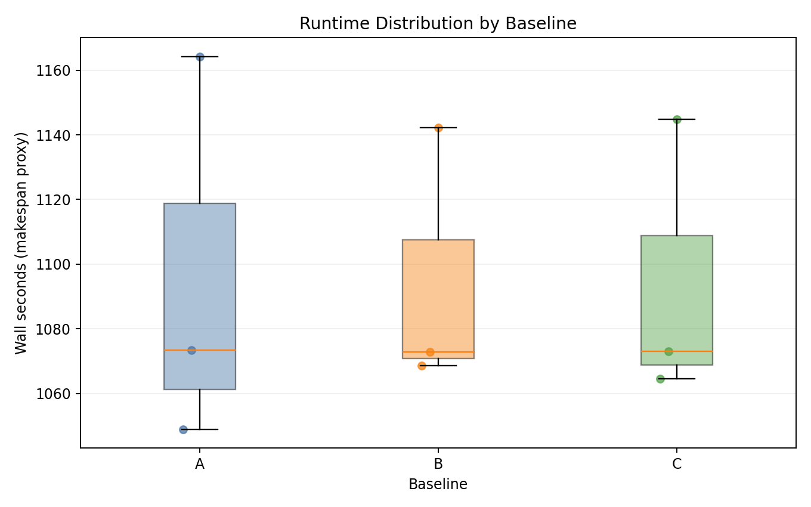
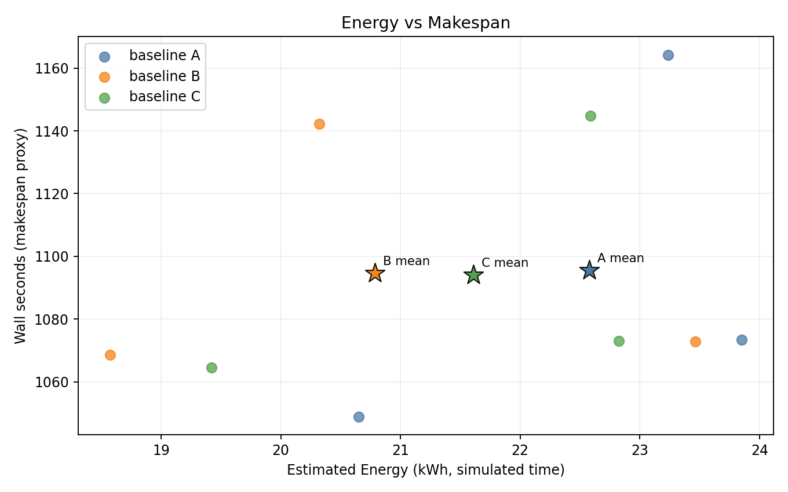
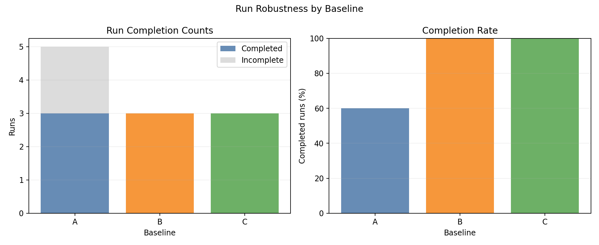

# CPU-Only Benchmark Report

## Scope

This report documents the benchmark results from:

- [`experiments/01-cpu-only-benchmark/`](.)

It covers: experimental setup, controller policy algorithms, simulator models, measured outcomes, plot commentary, and interpretation.

---

## 1. Experimental Setup

### 1.1 Cluster and node topology

- Kind control-plane + worker (real Kubernetes control path).
- 8 fake KWOK worker nodes labeled `joulie.io/managed=true`.
- KWOK nodes are tainted `kwok.x-k8s.io/node=fake:NoSchedule`.
- Simulator pod runs on the real kind worker.
- Workload pods target KWOK nodes via nodeSelector + toleration.

Node inventory source: [`configs/cluster-nodes.yaml`](./configs/cluster-nodes.yaml)

### 1.2 Node inventory

CPU-only cluster - no GPU nodes.

| Node prefix | Count | CPU | Cores | RAM |
|---|---:|---|---:|---:|
| kwok-cpu-highcore | 2 | AMD EPYC 9965 192-Core | 384 (2×192) | 1536 GiB |
| kwok-cpu-highfreq | 2 | AMD EPYC 9375F 32-Core | 64 (2×32) | 770 GiB |
| kwok-cpu-intensive | 4 | AMD EPYC 9655 96-Core | 192 (2×96) | 1536 GiB |

Total: **8 nodes**, **2304 CPU cores**, **0 GPUs**.

### 1.3 Hardware model parameters (simulator)

Hardware profiles are derived from the node inventory by the simulator via product labels. CPU power model:

```
P(u, f) = IdleW + (PeakW - IdleW) * u^AlphaUtil * f^BetaFreq
```

where `u` = CPU utilization, `f` = frequency scale.

| CPU family | IdleW | PeakW | AlphaUtil | BetaFreq | FMin MHz | FMax MHz |
|---|---:|---:|---:|---:|---:|---:|
| AMD EPYC 9965 | 120 | 960 | 1.15 | 1.30 | 1500 | 3200 |
| AMD EPYC 9375F | 60 | 480 | 1.10 | 1.25 | 2800 | 4200 |
| AMD EPYC 9655 | 95 | 760 | 1.12 | 1.28 | 1500 | 3600 |

When policy sets `cpu_eco_pct_of_max=80`, RAPL caps are set to 80% of each node's peak modeled power. If the resulting cap cannot be satisfied at `FMinMHz`, the node is marked `CapSaturated`.

### 1.4 Run configuration

From [`configs/benchmark-overnight.yaml`](./configs/benchmark-overnight.yaml) (used for run `0004`):

| Parameter | Value |
|---|---|
| Baselines | A, B, C |
| Seeds | 3 |
| Mean inter-arrival | 0.12 s |
| Time scale | 60× |
| Timeout per run | 14400 s |
| Perf ratio | 15% |
| Eco ratio | 0% |
| GPU ratio | 0% |
| Work scale | 0.15 |
| Allowed workload types | `cpu_preprocess`, `cpu_analytics` |

### 1.5 Baselines

- **A**: simulator only - no Joulie operator or agent (frequency/power-profile affinity stripped from pods).
- **B**: Joulie with `static_partition` policy.
- **C**: Joulie with `queue_aware_v1` policy.

---

## 2. Policy Algorithms

### 2.1 Pod classification

Pods are classified from their `joulie.io/power-profile` scheduling constraints:

- `performance` only → performance-sensitive
- `eco` only → eco-only
- both or unconstrained → general
- unknown → treated as performance-sensitive (safe default)

### 2.2 Static partition (`static_partition`)

Given `N` managed nodes:

- `hpCount = round(N * STATIC_HP_FRAC)`
- First `hpCount` nodes → `performance` profile (full frequency, no cap)
- Remaining → `eco` profile (RAPL cap at `cpu_eco_pct_of_max` of peak)

In this run: `STATIC_HP_FRAC=0.45`, so on 8 nodes: 4 performance, 4 eco.

### 2.3 Queue-aware (`queue_aware_v1`)

Let:

- `baseCount = round(N * QUEUE_HP_BASE_FRAC)`
- `perfIntentPods = count(running performance-sensitive pods cluster-wide)`
- `queueNeed = ceil(perfIntentPods / QUEUE_PERF_PER_HP_NODE)`

Then:

- `hpCount = clamp(max(baseCount, queueNeed), QUEUE_HP_MIN, QUEUE_HP_MAX, N)`

In this run: `QUEUE_HP_BASE_FRAC=0.50`, `QUEUE_HP_MIN=2`, `QUEUE_HP_MAX=8`, `QUEUE_PERF_PER_HP_NODE=18`.

### 2.4 Downgrade guard

When a node transitions `performance → eco`, the operator defers the cap change while performance-sensitive pods are still running there, marking it `joulie.io/draining=true` until safe.

---

## 3. Simulator Algorithms

### 3.1 CPU power model

Per-node power at utilization `u` and frequency scale `f`:

```
P(u, f) = IdleW + (PeakW - IdleW) * u^AlphaUtil * f^BetaFreq
```

### 3.2 RAPL cap enforcement and DVFS

At each simulator tick:

1. Policy writes `rapl.set_power_cap_watts` → updates `CapWatts` (clamped to `[MinCapW, MaxCapW]`).
2. If `P(u, f) > CapWatts`, solver finds the maximum feasible `f`:
   - `f_target = solveFreqScaleForCap(u, CapWatts)`
   - clamped to `[FMinMHz/FMaxMHz, 1.0]`
3. If even `FMinMHz` exceeds cap, node is flagged `CapSaturated=true`.
4. Frequency ramps toward target with `DvfsRampMS` time constant.
5. Final effective power: `min(P(u, f_effective), CapWatts + RaplHeadW)`.

### 3.3 Energy integration

At each workload loop tick of duration `dt` (wall seconds):

```
E_node += P_node * dt          // per-node Joules (wall time)
E_cluster += sum(P_node) * dt
```

Collection (`06_collect.py`) reads `/debug/energy` and scales by `time_scale`:

```
energy_sim_joules = totalJoules * time_scale
energy_sim_kwh    = energy_sim_joules / 3_600_000
```

### 3.4 Job progress and CPU slowdown

For a CPU job `j` on a node with current frequency scale `f`:

```
speed_j = requestedCPU_j * baseSpeedPerCore * (1 - (1-f) * sensitivityCPU_j)
cpuUnitsRemaining_j -= speed_j * dt / max(1, concurrentJobsOnNode)
```

Effective slowdown from throttling (single-job, no sharing):

```
slowdown = 1 / (1 - (1-f) * sensitivityCPU)
```

For `cpu_preprocess` and `cpu_analytics`, `sensitivityCPU ∈ [0.7, 0.9]`, so a 20% frequency reduction (eco cap at 80%) translates to roughly 14–18% speed reduction on the worst case.

---

## 4. Measured Results

Latest run: `runs/0004_20260315T184603Z_u73c6961c754a4509a74e94ce3964b5bc`
Source: [`runs/latest/results/summary.csv`](./runs/latest/results/summary.csv)

### 4.1 Per-seed results

| Baseline | Seed | Wall (s) | Throughput (jobs/sim-hr) | Energy (kWh sim) | Avg power (W) |
|---|---:|---:|---:|---:|---:|
| A | 1 | 1048.97 | 285.99 | 20.65 | 1181.1 |
| A | 2 | 1073.38 | 279.49 | 23.85 | 1333.2 |
| A | 3 | 1164.21 | 257.69 | 23.24 | 1197.6 |
| B | 1 | 1068.72 | 280.71 | 18.57 | 1042.8 |
| B | 2 | 1072.93 | 279.61 | 23.46 | 1312.1 |
| B | 3 | 1142.27 | 262.63 | 20.32 | 1067.5 |
| C | 1 | 1064.50 | 281.82 | 19.42 | 1094.6 |
| C | 2 | 1073.04 | 279.58 | 22.82 | 1276.2 |
| C | 3 | 1144.72 | 262.07 | 22.59 | 1183.8 |

### 4.2 Baseline means (all 3 seeds completed)

| Baseline | Mean wall (s) | Mean throughput (jobs/sim-hr) | Mean energy (kWh sim) | Mean power (W) |
|---|---:|---:|---:|---:|
| A | 1095.5 | 274.39 | 22.58 | 1237.3 |
| B | 1094.6 | 274.32 | 20.79 | 1140.8 |
| C | 1094.1 | 274.49 | 21.61 | 1184.9 |

### 4.3 Relative to A

| Baseline | Energy Δ | Throughput Δ | Power Δ |
|---|---:|---:|---:|
| B | **−7.9%** | −0.02% (negligible) | −7.8% |
| C | **−4.3%** | +0.04% (negligible) | −4.2% |

---

## 5. Plot Commentary

Plots are in: [`img/`](./img/)

### 5.1 Runtime distribution



- All three baselines complete within nearly identical wall-time windows.
- Run-to-run jitter (seed variance) is larger than any inter-baseline difference.
- Confirms that power capping at 80% does not measurably affect total job completion time on this CPU-only workload mix.

### 5.2 Energy vs makespan



- B is consistently shifted to lower energy with near-identical makespan across all 3 seeds.
- C shows slightly higher variance than B; one seed (seed 2) lands close to A energy.
- Stable ordering: B < C < A in energy for most seeds.

### 5.3 Baseline means


- Energy is the clear differentiator; throughput and wall-time bars are indistinguishable.
- B achieves the largest energy reduction, driven by 4 nodes running at 80% CPU cap for the full run duration.

### 5.4 Completion summary



- All 3 seeds completed for all baselines (B and C have 100% completion rate).
- No gang-scheduling or timeout issues on this CPU-only workload.

---

## 6. Interpretation

### Why does energy reduce without throughput penalty?

The CPU-only workload types (`cpu_preprocess`, `cpu_analytics`) in this experiment have moderate CPU-frequency sensitivity (`sensitivityCPU ∈ [0.7, 0.9]`). A 20% frequency reduction (eco cap at 80%) produces a 14–18% per-job slowdown. However:

1. **Cluster is over-provisioned**: 2304 cores spread over 8 nodes with only ~5000 lightweight CPU jobs means even eco nodes have spare capacity - jobs can use more cores to compensate.
2. **Scheduling load-balances**: unconstrained jobs naturally land on both performance and eco nodes; the scheduler fills eco nodes with general jobs at reduced frequency, while performance-sensitive jobs land on the 4 uncapped nodes.
3. **Energy scales with power × time**: eco nodes draw less power for the same simulated duration → energy falls without extending total makespan.

### Why is static better than queue-aware here?

`static_partition` (B) outperforms `queue_aware_v1` (C) in this run because:

- With only 15% performance-affinity jobs, the queue-aware policy rarely needs to scale up the HP node count beyond its base fraction.
- The operator reconcile interval (20 s) introduces lag - when the queue bursts, queue-aware may temporarily expand HP nodes after performance pods already landed elsewhere.
- Static provides a guaranteed 4-node eco block throughout the run, accumulating savings steadily.

### Known limitations

- The simulator does not model memory-bandwidth contention between concurrent jobs.
- CPU `sensitivityCPU` values are heuristic estimates, not measured from real hardware.
- Gang jobs (multi-pod) are excluded from this benchmark (they require a gang scheduler like Kueue).

---

## 7. Best-Fit Use Case

The strongest observed benefit is:

- **energy reduction (−7.9% for static, −4.3% for queue-aware) with negligible throughput penalty** in a CPU-only mixed-workload cluster.

`static_partition` is the most robust policy for this regime - predictable savings, no visible scheduling-performance impact, easy to reason about. `queue_aware_v1` is better suited when the performance-sensitive fraction is larger or more bursty.

---

## 8. Reproducibility

- Config: [`configs/benchmark-overnight.yaml`](./configs/benchmark-overnight.yaml)
- Sweep script: [`scripts/05_sweep.py`](./scripts/05_sweep.py)
- Collection: [`scripts/06_collect.py`](./scripts/06_collect.py)
- Plotting: [`scripts/07_plot.py`](./scripts/07_plot.py)
- Run artifacts: [`runs/latest/`](./runs/latest/)
