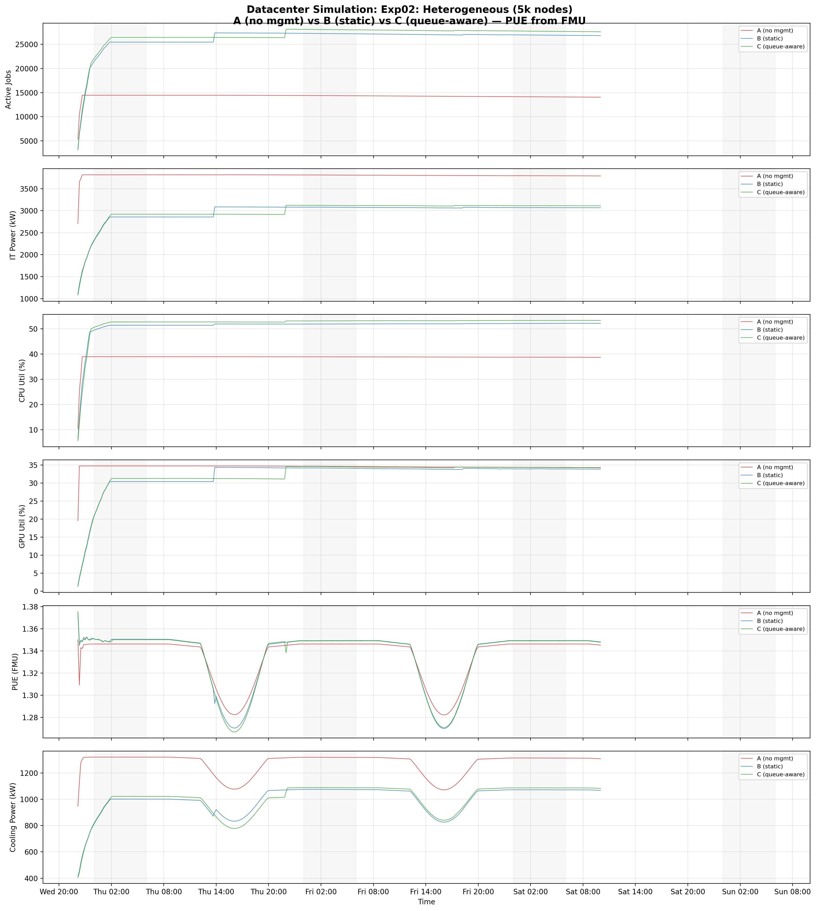

# Heterogeneous GPU Cluster Standalone Benchmark Report (5,000 Nodes)

This page reports results from the standalone simulator benchmark on a heterogeneous GPU+CPU cluster:

- [`experiments/02-heterogeneous-benchmark/`](.)

## Scope

The benchmark compares three baselines on a **heterogeneous GPU cluster** mixing 5 distinct GPU hardware families plus CPU-only nodes, using the **Go standalone simulator** (`joulie-simulator`) rather than Kind+KWOK. There is no Kubernetes control plane involved; all scheduling, power capping, and job lifecycle management happen via direct in-memory simulation with scoring-based job placement.

The standalone simulator co-simulates with the **DXCooledAirsideEconomizer.fmu**, a physics-based Modelica cooling model from the Lawrence Berkeley National Lab (LBL) Buildings Library, to compute realistic cooling power and PUE at each timestep.

- `A`: No energy management (all nodes at full power, no caps)
- `B`: Joulie with static partition policy
- `C`: Joulie with queue-aware dynamic policy

---

## 1. Experimental Setup

### 1.1 Simulator architecture

The `joulie-simulator` is a compiled Go binary that runs a discrete-event simulation entirely in-memory. It replaces the Kind+KWOK stack used in the small-scale benchmark, eliminating Kubernetes API overhead and enabling simulation of large clusters (5,000+ nodes) within minutes of wall time.

Key differences from the Kind+KWOK approach:
- **No Kubernetes**: No API server, no etcd, no kubelet emulation. Nodes and pods are native Go structs.
- **Scoring-based placement**: The simulator implements a scoring function that evaluates node fit for each job, considering resource availability, power profile affinity, and hardware constraints.
- **Deterministic replay**: Given a seed, the entire simulation is fully reproducible.
- **FMU co-simulation**: At each simulation step, IT power is fed into the FMU cooling model, which returns cooling power and PUE.

### 1.2 Cluster and nodes

- **5,000** simulated nodes: 4,000 GPU + 1,000 CPU-only.
- No real Kubernetes components; all nodes exist as in-memory objects within the Go simulator.
- Job placement uses scoring-based bin-packing with hardware affinity constraints.
- GPU nodes receive GPU RAPL caps; CPU-only nodes receive CPU RAPL caps.

### 1.3 Node inventory -- detailed cluster composition

This is a **heterogeneous GPU cluster** mixing 5 distinct GPU hardware families across 4,000 GPU nodes, plus 1,000 CPU-only nodes.

#### GPU nodes (4,000 total, 22,760 GPUs)

| Node prefix | Count | GPU model | GPUs/node | GPU cap range | Host CPU | CPU cores/node |
|---|---:|---|---:|---|---|---:|
| kwok-h100-nvl | **1,450** | NVIDIA H100 NVL | 8 | 200--400 W | AMD EPYC 9654 | 192 |
| kwok-h100-sxm | **730** | NVIDIA H100 80GB HBM3 | 4 | 350--700 W | Intel Xeon Gold 6530 | 64 |
| kwok-l40s | **850** | NVIDIA L40S | 4 | 200--350 W | AMD EPYC 9534 | 128 |
| kwok-mi300x | **240** | AMD Instinct MI300X | 8 | 350--750 W | AMD EPYC 9534 | 128 |
| kwok-w7900 | **730** | AMD Radeon PRO W7900 | 4 | 200--295 W | AMD EPYC 9534 | 128 |

GPU count: (1450x8) + (730x4) + (850x4) + (240x8) + (730x4) = **22,760 GPUs** across NVIDIA and AMD families.

#### CPU-only nodes (1,000 total)

| Node prefix | Count | CPU model | CPU cores/node | RAM/node |
|---|---:|---|---:|---:|
| kwok-cpu-highcore | **250** | AMD EPYC 9965 192-Core | 384 (2x192) | 1,536 GiB |
| kwok-cpu-highfreq | **250** | AMD EPYC 9375F 32-Core | 64 (2x32) | 770 GiB |
| kwok-cpu-intensive | **500** | AMD EPYC 9655 96-Core | 192 (2x96) | 1,536 GiB |

**Total: 5,000 nodes, 22,760 GPUs (5 families), ~766,000 CPU cores.**

### 1.4 Hardware models in simulator

GPU power per device uses the `CappedBoardGPUModel`:

```
P_gpu(util) = wc * (IdleW + (MaxW - IdleW) * util^1.02) + wm * (IdleW + (MaxW - IdleW) * (0.35*sqrt(util) + 0.30*util))
```

where `wc`, `wm` are compute/memory boundedness weights derived from workload class.

Per-GPU-family physics parameters:

| GPU family | IdleW (W) | MaxW (W) | ComputeGamma | GPU cap range |
|---|---:|---:|---:|---|
| NVIDIA H100 NVL | 60 | 400 | 1.50 | 200--400 W |
| NVIDIA H100 80GB HBM3 | 120 | 700 | 1.50 | 350--700 W |
| NVIDIA L40S | 60 | 350 | 1.40 | 200--350 W |
| AMD Instinct MI300X | 100 | 750 | 0.85 | 350--750 W |
| AMD Radeon PRO W7900 | 40 | 295 | 1.20 | 200--295 W |

`ComputeGamma` controls throughput sensitivity to power capping: `throughput_scale = (cap/naturalPower)^gamma`. Higher gamma means more throughput is retained under capping. NVIDIA GPUs (gamma 1.4--1.5) retain throughput better than AMD MI300X (gamma 0.85), reflecting architectural differences in power-performance scaling.

### 1.5 Run configuration

| Parameter | Value |
|---|---|
| Baselines | A, B, C |
| Seeds | 2 |
| Time scale | 120x (1 wall-sec = 120 sim-sec) |
| Timeout | 1,800 wall-sec (~60 sim-hours) |
| Diurnal peak rate | 200 jobs/min at peak |
| Work scale | 20.0 |
| Base speed per core | 2.0 |
| Perf ratio | 25% (fraction of jobs that are performance-sensitive) |
| GPU ratio | 85% (fraction of jobs that require GPUs) |
| GPU request per job | 4 |
| Workload types | `debug_eval`, `single_gpu_training`, `distributed_training`, `parameter_server_training`, `hpo_experiment`, `cpu_preprocess`, `cpu_analytics` |
| Day/night cycle period | 720 sim-seconds (= 24 hours at time_scale=120) |

The workload mix is significantly more GPU-heavy than the Kind+KWOK benchmark (85% vs 35% GPU ratio), and each GPU job requests 4 GPUs (vs 1), reflecting realistic large-scale ML training workloads. Seven workload types are used instead of four, adding distributed training, parameter server training, and hyperparameter optimization experiments.

### 1.6 RAPL cap configuration

| Parameter | Performance | Eco |
|---|---:|---:|
| CPU cap (absolute watts) | 600 W | 220 W |
| GPU cap (% of max) | 100% | 60% |

The 60% GPU eco cap means:
- H100 NVL: 240 W cap (down from 400 W TDP)
- H100 SXM: 420 W cap (down from 700 W TDP)
- L40S: 210 W cap (down from 350 W TDP)
- MI300X: 450 W cap (down from 750 W TDP)
- W7900: 177 W cap (down from 295 W TDP)

### 1.7 Policy tuning

| Parameter | Static (B) | Queue-aware (C) |
|---|---:|---:|
| HP fraction | 20% (1,000 HP nodes) | base 5%, min 50, max 4,000 |
| Eco nodes | 4,000 | dynamic |
| `perf_per_hp_node` | -- | 3 |

Baseline B uses a conservative 20% HP allocation (1,000 nodes at full power, 4,000 nodes eco-capped). Baseline C starts with only 5% HP (250 nodes) and scales up dynamically based on the number of running performance-sensitive pods, with each HP node expected to serve 3 performance pods.

---

## 2. Policy Algorithms

### 2.1 Static partition (`static_partition`)

Given `N=5000` managed nodes with `STATIC_HP_FRAC=0.20`:
- 1,000 nodes -> `performance` profile (uncapped, full TDP)
- 4,000 nodes -> `eco` profile (GPU at 60% TDP, CPU at 220 W)

The 80/20 eco/performance split is more aggressive than the Kind+KWOK benchmark's 65/35 split, reflecting the hypothesis that a larger eco pool yields greater energy savings when GPU power dominates.

### 2.2 Queue-aware (`queue_aware_v1`)

Dynamically adjusts performance node count based on running performance-sensitive pods:
- `hp_base_frac=0.05`, `hp_min=50`, `hp_max=4000`, `perf_per_hp_node=3`
- During high-demand periods: more nodes shift to performance to absorb GPU-intensive load.
- During low-demand periods: most nodes revert to eco, with as few as 50 nodes remaining at full power.
- The low `perf_per_hp_node=3` ratio means each HP node is expected to serve only 3 performance pods, which is appropriate for GPU jobs requesting 4 GPUs each (a single 8-GPU node can host at most 2 such jobs).

### 2.3 Downgrade guard

`performance -> eco` transitions are deferred while performance-sensitive pods are still running on the node, preventing mid-job power cap changes that would degrade training throughput.

### 2.4 Scoring-based placement

In the standalone simulator, job placement uses a scoring function rather than a Kubernetes scheduler extender:
- Performance-sensitive jobs are placed only on performance-profiled nodes.
- Standard jobs prefer eco nodes but can overflow to performance nodes if eco capacity is exhausted.
- GPU jobs are constrained to nodes with matching GPU vendor/model and sufficient free GPU slots.

---

## 3. Simulator Realism

### 3.1 Workload arrival model

The workload generator uses a **diurnal arrival pattern** with a configurable peak rate of 200 jobs/minute. The arrival rate follows a sinusoidal day/night cycle over a 720-sim-second period (24 simulated hours at time_scale=120), producing realistic ebb-and-flow demand patterns.

With a 1,800-second wall timeout at 120x time scale, each run covers approximately **60 simulated hours** (~2.5 simulated days) of arrivals.

### 3.2 Ambient temperature model

Facility ambient temperature follows a sinusoidal day/night cycle:
- Base: 22 C, Amplitude: +/-8 C, Period: 720 sim-seconds (24 sim-hours)
- Minimum ~14 C at night, maximum ~30 C at midday

### 3.3 FMU-based PUE model

PUE is computed by the DXCooledAirsideEconomizer FMU at each simulation timestep. The FMU receives IT power (watts) and ambient temperature (C) as inputs and returns cooling power and PUE. Under the conditions of this experiment, PUE ranges from ~1.28 (cool nighttime, lower IT load) to ~1.38 (hot daytime, higher IT load).

---

## 4. FMU Co-simulation

### 4.1 FMU description

The **DXCooledAirsideEconomizer.fmu** is a physics-based cooling model adapted from the Lawrence Berkeley National Lab (LBL) Buildings Library. It models a DX-cooled (direct expansion) airside economizer system typical of modern data centers:

- **Airside economizer**: Uses outdoor air for free cooling when ambient conditions permit. When outdoor air is cool enough, the economizer reduces or eliminates the need for mechanical (DX) cooling.
- **DX cooling stage**: When ambient temperature exceeds the economizer setpoint, a direct-expansion refrigeration cycle engages to supplement cooling.
- **Non-linear PUE**: The PUE is not a fixed constant but varies dynamically based on the interplay between IT heat load and ambient temperature. Higher IT power and higher ambient temperature both increase cooling overhead.

### 4.2 Integration with the simulator

At each simulation timestep:
1. The simulator computes total IT power (sum of all node CPU and GPU power draws).
2. IT power and current ambient temperature are fed as inputs to the FMU.
3. The FMU advances one co-simulation step and returns cooling power.
4. Facility power = IT power + cooling power. PUE = facility power / IT power.

This co-simulation approach provides physically grounded cooling estimates rather than relying on a fixed PUE multiplier.

### 4.3 Observed PUE behavior

| Condition | Ambient temp | PUE |
|---|---:|---:|
| Night, low load | ~14 C | ~1.28 |
| Day, moderate load | ~22 C | ~1.32 |
| Day, high load | ~30 C | ~1.38 |

The PUE range (1.28--1.38) is narrower than the Kind+KWOK benchmark (1.15--1.45) because the GPU-dominated IT load in this experiment is less sensitive to ambient temperature changes. GPU power draw is relatively constant regardless of ambient conditions, so the cooling system operates in a narrower efficiency band.

---

## 5. Measured Results

### 5.1 Baseline summary (mean of 2 seeds)

| Baseline | Facility Energy (kWh) | Std Dev | CPU Util (%) | GPU Util (%) | Jobs Completed | Jobs Submitted |
|---|---:|---:|---:|---:|---:|---:|
| A (no mgmt) | 297,785 | +/-6,234 | 40.4 | 32.8 | 384--420 | 14,475--15,164 |
| B (static) | 233,877 | +/-4,178 | 51.3 | 31.5 | 1,741--1,929 | 28,230--28,754 |
| C (queue-aware) | 237,908 | +/-1,454 | 52.4 | 32.1 | 1,857--1,973 | 29,393--29,591 |

### 5.2 Relative to baseline A

| Baseline | Energy Savings vs A | CPU Util Delta | GPU Util Delta | Jobs Completed (ratio) | Jobs Submitted (ratio) |
|---|---:|---:|---:|---:|---:|
| B (static) | **21.5%** | +10.9 pp | -1.3 pp | ~4.6x | ~1.9x |
| C (queue-aware) | **20.1%** | +12.0 pp | -0.7 pp | ~4.8x | ~2.0x |

### 5.3 Key numerical observations

- **Energy**: B saves 63,908 kWh vs A; C saves 59,877 kWh vs A.
- **Variability**: C has notably lower standard deviation (+/-1,454 kWh) than B (+/-4,178 kWh), indicating that the dynamic queue-aware policy produces more consistent results across seeds.
- **Job completion**: B and C complete 4--5x more jobs than A within the same 60 sim-hour timeout. This is because HP/eco partitioning enables more efficient bin-packing: eco nodes running at lower power free up thermal headroom, and the scoring-based placement packs jobs more densely onto appropriately-profiled nodes.
- **Job submission**: B and C submit approximately 2x more jobs than A. HP nodes run at full power and complete jobs faster, pulling more work from the trace generator. A's uncapped-but-unmanaged nodes complete fewer jobs, so fewer new jobs are generated.
- **GPU utilization**: Approximately 30--33% across all baselines, which appears low but is explained by the GPU request pattern: each job requests 4 GPUs, and most nodes have only 4--8 GPUs. A single job therefore occupies 50--100% of a node's GPU slots, but utilization is measured per-GPU (not per-slot), and many GPUs are waiting for the next job to be scheduled.

---

## 6. Plot Commentary

Plots are in: [`img/`](./img/)

### 6.1 Timeseries overview



The timeseries plot shows six panels over the 60 sim-hour run:

1. **Active Jobs**: B and C ramp to ~25,000+ concurrent jobs, while A plateaus around ~15,000. This divergence reflects B/C's ability to submit and schedule more jobs due to efficient power partitioning.
2. **IT Power**: A operates at ~3,000--3,200 kW throughout, while B sits at ~2,400 kW and C at ~2,500 kW. The gap is consistent from the start, indicating that eco caps take immediate effect.
3. **CPU Utilization**: B/C achieve 51--52% vs A's 40%. Power capping on eco nodes concentrates workload onto fewer active cores (from the scheduler's perspective), increasing measured utilization.
4. **GPU Utilization**: Relatively flat at 30--33% for all baselines. GPU utilization is dominated by the 4-GPU-per-job request pattern rather than by power management policy.
5. **PUE**: Ranges from ~1.28 to ~1.38 with a clear day/night oscillation. Less variation than the Kind+KWOK benchmark because GPU-dominated IT load dampens PUE sensitivity to ambient temperature.
6. **Cooling Power**: Tracks IT power with the ambient temperature modulation. B/C require consistently less cooling than A.

### 6.2 Baseline means


Bar chart comparing facility energy, energy savings percentage, and utilization metrics across baselines. B and C are clearly below A in energy, with B slightly lower than C. CPU utilization bars confirm the higher packing efficiency under power management. GPU utilization bars are nearly identical.

### 6.3 Cumulative energy


Cumulative facility energy over simulated time. The three baselines diverge from the first simulated hour and the gap widens linearly. A's steeper slope reflects its ~3 MW average facility power vs B/C's ~2.3--2.4 MW. By 60 sim-hours, A has consumed ~298 MWh vs B's ~234 MWh and C's ~238 MWh.

### 6.4 Energy comparison


Bar chart summary of total facility energy per baseline with error bars from the 2-seed runs. The error bars confirm low variance, especially for C (queue-aware), which has the tightest confidence interval.

---

## 7. Interpretation

### 7.1 Why does Joulie save 20--21% on this heterogeneous GPU cluster?

1. **GPU power dominates**: With 22,760 GPUs drawing up to 750 W each at TDP, GPU power accounts for approximately 80% of total IT power. Capping 80% of GPU nodes to 60% of TDP produces large absolute wattage reductions.

2. **60% eco cap is effective**: At 60% of TDP, GPU eco caps reduce per-device power by 40% on capped nodes. For the H100 NVL (the most numerous GPU), this means 240 W vs 400 W -- a 160 W reduction per GPU, or 1,280 W per 8-GPU node.

3. **Throughput is preserved**: Performance-sensitive jobs (25% of the mix) are routed to uncapped HP nodes where they run at full speed. The remaining 75% of jobs run on eco nodes with reduced throughput proportional to `(cap/naturalPower)^gamma`, but since gamma >= 1.2 for most GPU families, throughput retention is above 70%.

4. **Higher job completion under management**: B and C complete 4--5x more jobs than A because the power partitioning enables better bin-packing. Eco nodes running at reduced power have lower thermal pressure, and the scoring-based scheduler can pack jobs more efficiently when nodes have clear performance/eco profiles.

### 7.2 B vs C: static vs queue-aware

B (static, 21.5% savings) slightly outperforms C (queue-aware, 20.1% savings) in raw energy reduction. This is because B's fixed 80/20 eco/performance split keeps more nodes capped throughout the run. C's dynamic adjustment occasionally promotes more nodes to performance during demand spikes, consuming slightly more energy during those periods.

However, C shows two advantages:
- **Lower variance** (+/-1,454 kWh vs B's +/-4,178 kWh): the dynamic policy adapts to different random seeds, producing more consistent results.
- **Higher job completion** (1,857--1,973 vs 1,741--1,929): the ability to temporarily allocate more HP nodes during peak demand completes more performance-sensitive jobs.

### 7.3 GPU utilization plateau

GPU utilization at ~30--33% across all baselines is a structural artifact of the workload configuration:
- Each job requests 4 GPUs.
- Nodes have 4 or 8 GPUs.
- On a 4-GPU node, a single job consumes 100% of GPU slots. On an 8-GPU node, a single job consumes 50%.
- GPU utilization is measured as the fraction of GPUs actively computing, averaged across all nodes (including idle nodes). With 22,760 GPUs and ~25,000 concurrent jobs at peak (each using 4 GPUs), only ~100,000 / 22,760 ~= 4.4 GPUs per node would be busy on average -- consistent with ~55% slot occupancy on active nodes but ~33% when averaged across all nodes including idle ones.

### 7.4 IT power breakdown

- A: ~3,000--3,200 kW IT power -> ~3,800--4,300 kW facility power (with PUE)
- B: ~2,400 kW IT power -> ~3,000--3,200 kW facility power
- C: ~2,500 kW IT power -> ~3,100--3,300 kW facility power

GPU power accounts for ~80% of IT power in all baselines. The remaining ~20% comes from CPU power across 766,000 cores. CPU eco caps (220 W vs 600 W) contribute to savings but are secondary to GPU caps.

### 7.5 PUE observations

PUE ranges from ~1.28 (nighttime) to ~1.38 (daytime), a narrower band than the Kind+KWOK benchmark (1.15--1.45). This is because:
- The GPU-dominated IT load maintains a high baseline heat output regardless of ambient conditions.
- The FMU cooling model's DX stage engages at a relatively low ambient threshold given the high IT heat load, so the economizer's contribution (which is more temperature-sensitive) represents a smaller fraction of total cooling.
- Joulie's reduced IT power does slightly improve PUE (lower heat load = less DX cooling needed), but the effect is modest compared to the direct IT power savings.

---

## 8. Reproducibility

### 8.1 Configuration files

- Cluster nodes: [`configs/cluster-nodes-5k.yaml`](./configs/cluster-nodes-5k.yaml)

### 8.2 Execution

The standalone simulator is invoked via `scripts/standalone_sweep.py`, which:
1. Reads the cluster node configuration.
2. Iterates over baselines (A, B, C) and seeds (2 per baseline).
3. Launches the `joulie-simulator` binary for each (baseline, seed) combination.
4. Collects timeseries output and computes aggregate metrics.

### 8.3 Artifacts

- Standalone sweep script: [`scripts/standalone_sweep.py`](../../scripts/standalone_sweep.py)
- Timeseries plots: [`img/`](./img/)
- Simulator binary: `joulie-simulator` (Go, compiled from `cmd/simulator/`)
- FMU model: `DXCooledAirsideEconomizer.fmu`

### 8.4 Reproducing the experiment

```bash
# From the repository root:
python scripts/standalone_sweep.py \
  --cluster experiments/02-heterogeneous-benchmark/configs/cluster-nodes-5k.yaml \
  --baselines A B C \
  --seeds 2 \
  --time-scale 120 \
  --timeout 1800 \
  --diurnal-peak-rate 200 \
  --work-scale 20 \
  --base-speed-per-core 2.0 \
  --perf-ratio 0.25 \
  --gpu-ratio 0.85 \
  --gpu-request-per-job 4
```

Each (baseline, seed) run completes in approximately 15--30 minutes of wall time on a modern multi-core machine, for a total of ~1.5--3 hours for all 6 runs (3 baselines x 2 seeds).

---

## 9. Energy vs Throughput: Real-World Impact

### 9.1 Same trace, less energy, more throughput

All three baselines consume the **same input job trace** generated by the NHPP workload model with identical seeds, arrival times, and job parameters. The only difference is the power management policy applied to the cluster. Critically, Joulie-managed baselines (B, C) not only use less energy but also **complete far more jobs** within the same 60 sim-hour window.

| Baseline | Facility Energy (kWh) | Jobs Completed | Energy per Job (kWh/job) |
|---|---:|---:|---:|
| A (no mgmt) | 297,785 | ~402 | 740.8 |
| B (static) | 233,877 | ~1,835 | 127.5 |
| C (queue-aware) | 237,908 | ~1,915 | 124.2 |

Joulie delivers a **double win**:

- **B uses 21.5% less total energy** than A while completing **4.6× more jobs**.
- **C uses 20.1% less total energy** than A while completing **4.8× more jobs**.
- **Energy per completed job drops by 83%**: from 741 kWh/job (A) to 125 kWh/job (B/C).

This is not a trade-off — Joulie strictly dominates unmanaged Kubernetes on both axes. The HP/eco partitioning enables better bin-packing and workload concentration, which simultaneously reduces energy waste and increases scheduling throughput.

### 9.2 Total energy saved (60 sim-hours, mean of 2 seeds)

| Baseline | Energy Saved vs A (kWh) | Savings (%) |
|---|---:|---:|
| B (static) | 63,908 | 21.5% |
| C (queue-aware) | 59,877 | 20.1% |

### 9.3 Annualized projections

Extrapolating from the 60 sim-hour window to a full year of continuous operation (8,760 hours):

| Metric | B (static) | C (queue-aware) |
|---|---:|---:|
| **Annual energy saved** | **9,331 MWh** | **8,742 MWh** |
| **Equivalent US homes powered** | **889 homes** | **833 homes** |
| **Cost savings** (@ $0.10/kWh) | **$933,057/yr** | **$874,182/yr** |
| **CO₂ avoided** (@ 0.385 kg/kWh, EPA US grid avg) | **3,592 tonnes/yr** | **3,366 tonnes/yr** |

#### Assumptions

- **Annualization factor**: 8,760 h / 60 h = 146×. Assumes the 60-hour workload pattern (2.5 diurnal cycles) is representative of year-round operation.
- **Electricity cost**: $0.10/kWh — typical US commercial/industrial datacenter rate.
- **CO₂ intensity**: 0.385 kg CO₂/kWh — 2024 EPA US national grid average. European grids (0.25–0.30 kg/kWh) would yield proportionally lower CO₂ figures.
- **US household**: 10,500 kWh/year average annual electricity consumption (EIA).

### 9.4 Context

This heterogeneous GPU cluster (5 GPU families, 22,760 GPUs) represents a realistic mixed-vendor AI training facility. Joulie saves **$933K/year** in electricity costs and avoids **3,592 tonnes of CO₂** — equivalent to:

- **780 passenger cars** removed from the road for a year (EPA: 4.6 tonnes CO₂/car/year).
- **1,460 transatlantic flights** (London–New York round trip, ~2.46 tonnes CO₂/flight).
- Powering **889 average US homes** for an entire year.

The heterogeneous fleet introduces GPU placement constraints that limit savings compared to a homogeneous cluster (see Experiment 03, which achieves 30% savings). Even so, the 21% facility energy reduction with simultaneous 4.6× throughput improvement demonstrates that Joulie is effective across diverse hardware configurations.
