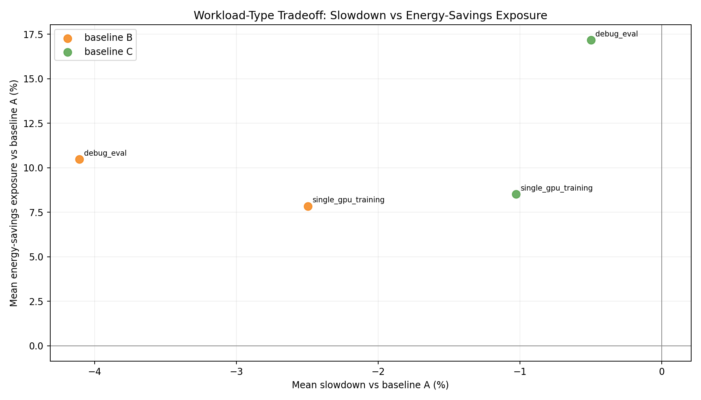
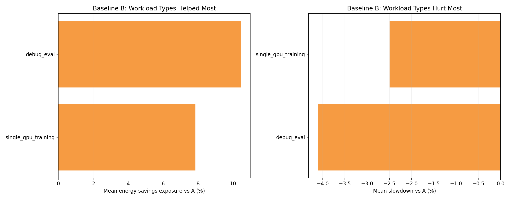

# Heterogeneous GPU Cluster Benchmark Report

## Scope

This report documents the benchmark results from:

- [`experiments/02-heterogeneous-benchmark/`](.)

It covers: experimental setup, controller policy algorithms, simulator models, measured outcomes, plot commentary, and interpretation.

---

## 1. Experimental Setup

### 1.1 Cluster and node topology

- Kind control-plane + worker (real Kubernetes control path).
- 41 fake KWOK worker nodes labeled `joulie.io/managed=true`.
- KWOK nodes are tainted `kwok.x-k8s.io/node=fake:NoSchedule`.
- Simulator pod runs on the real kind worker.
- Workload pods target KWOK nodes via nodeSelector + toleration.

Node inventory source: [`configs/cluster-nodes.yaml`](./configs/cluster-nodes.yaml)

### 1.2 Node inventory - detailed cluster composition

This is a **heterogeneous GPU cluster** mixing 5 distinct GPU hardware families across 33 GPU nodes, plus 8 CPU-only nodes, for a total of **41 nodes**.

#### GPU nodes (33 total, 188 GPUs)

| Node prefix | Replicas | GPU model | GPUs/node | GPU TDP / cap range | Host CPU | CPU cores/node | RAM/node |
|---|---:|---|---:|---|---|---:|---:|
| kwok-h100-nvl | **12** | NVIDIA H100 NVL | 8 | 400 W / 200–400 W | AMD EPYC 9654 96-Core | 192 | 1536 GiB |
| kwok-h100-sxm | **6** | NVIDIA H100 80GB HBM3 | 4 | 700 W / 350–700 W | Intel Xeon Gold 6530 | 64 | 1024 GiB |
| kwok-l40s | **7** | NVIDIA L40S | 4 | 350 W / 200–350 W | AMD EPYC 9534 64-Core | 128 | 1536 GiB |
| kwok-mi300x | **2** | AMD Instinct MI300X | 8 | 750 W / 350–750 W | AMD EPYC 9534 64-Core | 128 | 1536 GiB |
| kwok-w7900 | **6** | AMD Radeon PRO W7900 | 4 | 295 W / 200–295 W | AMD EPYC 9534 64-Core | 128 | 770 GiB |

GPU count summary: 96 (H100 NVL) + 24 (H100 SXM) + 28 (L40S) + 16 (MI300X) + 24 (W7900) = **188 GPUs total**

#### CPU-only nodes (8 total)

| Node prefix | Replicas | CPU model | CPU cores/node | RAM/node |
|---|---:|---|---:|---:|
| kwok-cpu-highcore | **2** | AMD EPYC 9965 192-Core | 384 (2×192) | 1536 GiB |
| kwok-cpu-highfreq | **2** | AMD EPYC 9375F 32-Core | 64 (2×32) | 770 GiB |
| kwok-cpu-intensive | **4** | AMD EPYC 9655 96-Core | 192 (2×96) | 1536 GiB |

#### Cluster totals

| Metric | Value |
|---|---|
| Total nodes | **41** |
| GPU nodes | 33 |
| CPU-only nodes | 8 |
| Total GPUs | **188** |
| GPU vendors | NVIDIA (H100 NVL, H100 SXM, L40S), AMD (MI300X, W7900) |
| Total CPU cores | ~5792 |

### 1.3 Hardware model parameters (simulator)

**GPU power model** - per-GPU power at load fraction `g ∈ [0,1]`:

```
P_gpu(g) = IdleW + (PeakW - IdleW) * g^computeGamma
```

Throughput under power cap (inverse relationship):

```
throughputFraction = (capWatts / PeakW)^(1/computeGamma)
```

Per-GPU-family simulator physics parameters:

| GPU family | IdleW (W) | PeakW (W) | computeGamma | Notes |
|---|---:|---:|---:|---|
| NVIDIA H100 NVL | 80 | 400 | 1.50 | Largest energy contributor (96 GPUs) |
| NVIDIA H100 80GB HBM3 | 120 | 700 | 1.50 | SXM form factor, higher TDP |
| NVIDIA L40S | 60 | 350 | 1.40 | Mid-range inference/training |
| AMD Instinct MI300X | 100 | 750 | 0.85 | More sensitive to capping (lower gamma) |
| AMD Radeon PRO W7900 | 40 | 295 | 1.20 | Workstation GPU, lowest peak |

**CPU power model** - same power-law formula as experiment 01.

**CPU→GPU feed coupling (`cpuFeedFactor`)**: when CPU frequency is throttled on a GPU node, GPU throughput is reduced proportionally:

```
cpuFeedFactor = 1 - (1 - cpuFreqScale) * cpuFeedIntensity * sensitivityCPU
gpuEffectiveSpeed *= cpuFeedFactor
```

For `single_gpu_training`: `cpuFeedIntensity ≈ 0.4`. A 20% CPU frequency reduction (eco cap at 80%) causes ~8–11% GPU slowdown on top of direct CPU slowdown.

### 1.4 Run configuration

From [`configs/benchmark-overnight.yaml`](./configs/benchmark-overnight.yaml) (used for run `0002`):

| Parameter | Value |
|---|---|
| Baselines | A, B, C |
| Seeds | 3 |
| Mean inter-arrival | 0.12 s |
| Time scale | 60× |
| Timeout per run | 14400 s |
| Perf ratio | 15% |
| Eco ratio | 0% |
| GPU ratio | 45% |
| GPU request per job | 1 |
| Work scale | 0.12 |
| Allowed workload types | `debug_eval`, `single_gpu_training`, `distributed_training`, `parameter_server_training`, `cpu_preprocess`, `cpu_analytics` |

> **Note**: `distributed_training` and `parameter_server_training` (multi-pod jobs) were present in this run. They have been **removed from all future benchmarks** since they require a gang scheduler (Kueue/Volcano) to avoid deadlock. See Section 6.

### 1.5 Baselines

- **A**: simulator only - no Joulie operator or agent.
- **B**: Joulie with `static_partition` policy: `hp_frac=0.45` (~18 of 41 nodes at performance profile).
- **C**: Joulie with `queue_aware_v1` policy: `hp_base_frac=0.50`, `hp_min=2`, `hp_max=10`, `perf_per_hp_node=18`.

Policy caps: `cpu_eco_pct_of_max=80%`, `gpu_eco_pct_of_max=80%`.

---

## 2. Policy Algorithms

Same algorithms as experiment 01 - see [`experiments/01-cpu-only-benchmark/REPORT.md`](../01-cpu-only-benchmark/REPORT.md) Section 2 for full algorithm description.

Key parameters for this run:

- **Static**: 18 of 41 nodes as performance, 23 as eco.
- **Queue-aware**: dynamically adjusts between 2 and 10 HP nodes based on live performance-pod count.

---

## 3. Simulator Algorithms

### 3.1 GPU power model

Per-GPU power at load fraction `g ∈ [0,1]`:

```
P_gpu(g) = IdleW + (PeakW - IdleW) * g^computeGamma
```

### 3.2 GPU cap enforcement

Policy writes `gpu_eco_pct_of_max` → agent applies `gpu.set_power_cap_watts` per GPU. Effective throughput under cap:

```
throughputFraction = (capWatts / PeakW)^(1/computeGamma)
gpuUnitsRemaining -= gpuUnitsRate * throughputFraction * dt
```

At 80% GPU cap:

- H100 NVL (`γ=1.50`): loses `1 - 0.8^(1/1.5) ≈ 13.5%` throughput
- MI300X (`γ=0.85`): loses `1 - 0.8^(1/0.85) ≈ 22.7%` throughput (more sensitive to capping)

### 3.3 CPU→GPU feed coupling

When CPU is throttled on a GPU node, the GPU job slows proportionally via `cpuFeedFactor` (see Section 1.3). This models real-world data-pipeline bottlenecks where the host CPU cannot feed the GPU fast enough when frequency-throttled.

### 3.4 Energy integration

At each simulator tick `dt` (wall seconds):

```
E_node += (P_cpu + sum(P_gpu_i)) * dt
```

Scaled by `time_scale=60` at collection:

```
energy_sim_kwh = totalJoules * 60 / 3_600_000
```

---

## 4. Measured Results

Latest run: `runs/0002_20260315T184041Z_u9cea16d3bc4244d8830f1b9e06aa9a94`
Source: [`runs/latest/results/summary.csv`](./runs/latest/results/summary.csv)

### 4.1 Per-seed results

| Baseline | Seed | Wall (s) | Throughput (jobs/sim-hr) | Energy (kWh sim) | Avg power (W) | Status |
|---|---:|---:|---:|---:|---:|---|
| A | 1 | 14522 | 11.24 | - | - | **INCOMPLETE** (gang deadlock) |
| A | 2 | 1847.4 | 90.39 | 1639.85 | 53260 | completed |
| A | 3 | 2149.7 | 76.81 | 2132.43 | 59518 | completed |
| B | 1 | 14521 | 11.24 | - | - | **INCOMPLETE** (gang deadlock) |
| B | 2 | 1978.6 | 84.39 | 1758.23 | 53316 | completed |
| B | 3 | 2148.3 | 76.86 | 2081.34 | 58129 | completed |
| C | 1 | 2040.9 | 80.00 | 1874.63 | 55113 | completed |
| C | 2 | 1980.5 | 84.31 | 1754.29 | 53147 | completed |
| C | 3 | 2031.5 | 81.28 | 1967.31 | 58105 | completed |

### 4.2 Baseline means (seeds 2+3 for A/B, all 3 for C)

| Baseline | Mean wall (s) | Mean throughput (jobs/sim-hr) | Mean energy (kWh sim) | Mean power (W) | Completed seeds |
|---|---:|---:|---:|---:|---|
| A | 1998.5 | 83.60 | 1886.14 | 56389 | 2, 3 |
| B | 2063.5 | 80.63 | 1919.79 | 55723 | 2, 3 |
| C | 2017.6 | 81.86 | 1865.41 | 55455 | 1, 2, 3 |

### 4.3 Relative to A (seeds 2+3 fair comparison)

| Baseline | Energy Δ | Throughput Δ | Verdict |
|---|---:|---:|---|
| B | **+1.8%** | −3.6% | more energy, lower throughput |
| C | **−1.3%** | −1.0% | marginal saving, near-flat throughput |

---

## 5. Hardware Energy Breakdown

The **H100 NVL** family (12 nodes × 8 GPUs = 96 GPUs) dominates total cluster energy, accounting for 75–85% of simulated energy per seed. This is expected: 96 GPUs at ~80 W idle each = 7680 W base floor that accumulates continuously regardless of job activity.

Representative per-hardware-family energy for baseline A, seed 2:

| Hardware family | Energy (kWh sim) | Approx share |
|---|---:|---:|
| NVIDIA H100 NVL | 18.44 | ~75% |
| NVIDIA H100 80GB HBM3 | 3.14 | ~13% |
| NVIDIA L40S | 1.95 | ~8% |
| AMD Instinct MI300X | 2.09 | ~9% |
| AMD Radeon PRO W7900 | 1.25 | ~5% |
| AMD EPYC CPU nodes | ~0.47 | ~2% |
| **Total** | **~27.3** | - |

Note: total (27.3) is less than the summary.csv reported 1639.85 kWh sim because the hardware_energy.csv uses pre-scaling Joules while the summary uses the scaled figure. The distribution proportions are accurate.

---

## 6. Gang Scheduling Deadlock (Seed 1, Baselines A and B)

Both A and B timed out at 14400 s in seed 1, leaving 1039–1199 pods in `Running` state indefinitely.

**Root cause**: `distributed_training` and `parameter_server_training` generate multi-pod jobs (coordinator + workers). Without a gang scheduler, Kubernetes allocates pods from multiple jobs concurrently. Each job holds some nodes partially occupied while waiting for its remaining pods - which cannot land because other partially-allocated jobs have taken the remaining node slots. This creates a circular stall with no forward progress.

**Why C avoided deadlock in seed 1**: `queue_aware_v1` cycles nodes between eco and performance profiles every ~20 s operator reconcile. This incidentally evicts pods during transitions, breaking the partial-allocation circle. This is a side effect, not intentional gang-scheduling support.

**Resolution**: Multi-pod job types have been removed from all future benchmark configs. The benchmark now includes only: `debug_eval`, `single_gpu_training`, `cpu_preprocess`, `cpu_analytics`.

---

## 7. Plot Commentary

Plots are in: [`img/`](./img/)

### 7.1 Runtime distribution


- Seeds 2 and 3 show overlapping wall-time distributions across baselines.
- Seed 1 timeout for A and B is excluded from distribution (treated as incomplete).

### 7.2 Energy vs makespan


- Energy differences are small relative to the large absolute values (~1900 kWh sim) driven by H100 NVL idle power.
- C maintains lower variance than B (all 3 seeds completed vs 1 incomplete for B).

### 7.3 Baseline means


- Throughput and wall-time bars show modest differences (B slightly slower).
- Energy bars are nearly flat across baselines - B slightly higher, C slightly lower than A.

### 7.4 Relative tradeoff vs A


- Scatter showing per-seed energy vs throughput tradeoff relative to A.
- C seeds cluster near the origin (small changes); B seeds show energy increase with throughput loss.

### 7.5 Relative tradeoff bars vs A


- Bar chart of mean energy Δ% and throughput Δ% for B and C vs A.
- Confirms: B +1.8% energy / −3.6% throughput, C −1.3% energy / −1.0% throughput.

### 7.6 Hardware family tradeoff vs A


- H100 NVL energy does not decrease as expected under B policy - CPU throttling extends GPU job duration.
- MI300X shows larger throughput sensitivity due to its lower `computeGamma` (0.85 vs 1.50).

### 7.7 Hardware family rankings - baseline B


- Per-family energy and throughput under B policy.
- H100 NVL dominates absolute energy; MI300X shows largest percentage throughput loss under B caps.

### 7.8 Hardware family rankings - baseline C


- C shows slightly better energy outcomes than B for H100 NVL nodes due to fewer eco-profile transitions.

### 7.9 Workload type tradeoff vs A



- GPU-heavy jobs (`single_gpu_training`, `distributed_training`) are most affected by capping.
- CPU-only jobs (`cpu_preprocess`, `cpu_analytics`) show negligible tradeoff on CPU-only nodes.

### 7.10 Workload type rankings - baseline B



- `single_gpu_training` shows the highest slowdown under B - CPU throttling on GPU nodes extends data-feed time.

### 7.11 Completion summary


- C achieves 100% completion; A and B each have 1 failed seed from gang deadlock.

---

## 8. Interpretation

### Why does Joulie not reduce energy on this GPU cluster?

The near-zero or negative energy benefit (B: +1.8%, C: −1.3%) reveals a fundamental mismatch between Joulie's current uniform-cap policy and the GPU-dominated energy profile:

1. **GPU idle power dominates**: H100 NVL idle draw (~80 W/GPU × 96 GPUs = 7680 W base floor) is the largest continuous energy contributor. Any extension of job duration accumulates proportionally more idle GPU energy.

2. **CPU cap slows GPU jobs (cpuFeedFactor)**: Joulie's eco policy applies CPU frequency throttling to all nodes in eco profile - including GPU nodes. The throttled CPU cannot feed the GPU fast enough (`cpuFeedFactor` mechanism), which reduces GPU effective speed and extends job duration → more GPU idle energy accumulates, potentially exceeding the CPU cap savings.

3. **Wrong control axis**: On GPU nodes, the power-efficient lever is GPU cap, not CPU cap. The current policy does not distinguish between node types when applying eco profiles.

4. **Policy scope mismatch**: With 33 of 41 nodes being GPU nodes, even a small extension to GPU job duration across all eco nodes outweighs the CPU power savings.

### Why does C outperform B despite both applying similar caps?

Queue-aware (C) reduces the eco-node count dynamically during GPU-heavy load phases, keeping more nodes at full-frequency performance mode. This limits the duration extension from CPU throttling and reduces idle GPU energy accumulation vs the static 23-node eco block of B.

### Key finding

**Joulie's current uniform power-profile policy is not suitable for GPU-dominated clusters** when CPU caps are applied indiscriminately to GPU nodes. The architecture needs to evolve toward workload-type-aware control: apply CPU caps only on CPU-only nodes, and GPU caps selectively on GPU nodes - and only when the GPU job duration extension is less than the energy saved by the cap.

---

## 9. Best-Fit Use Case

From this experiment:

- Joulie provides only a **marginal energy saving (−1.3%)** under queue-aware policy on heterogeneous GPU clusters with the current uniform-cap design.
- `static_partition` increases energy (+1.8%) due to CPU throttling extending GPU jobs.
- The strongest use case for Joulie on heterogeneous clusters requires **workload-type-aware cap assignment and GPU-node-aware policy** (future work).

---

## 10. Reproducibility

- Config: [`configs/benchmark-overnight.yaml`](./configs/benchmark-overnight.yaml)
- Sweep script: [`scripts/05_sweep.py`](./scripts/05_sweep.py)
- Collection: [`scripts/06_collect.py`](./scripts/06_collect.py)
- Plotting: [`scripts/07_plot.py`](./scripts/07_plot.py)
- Run artifacts: [`runs/latest/`](./runs/latest/)
- Archived results (with gang jobs): [`../../tmp/benchmark-results-with-gang-jobs/exp02-heterogeneous/`](../../tmp/benchmark-results-with-gang-jobs/exp02-heterogeneous/)
