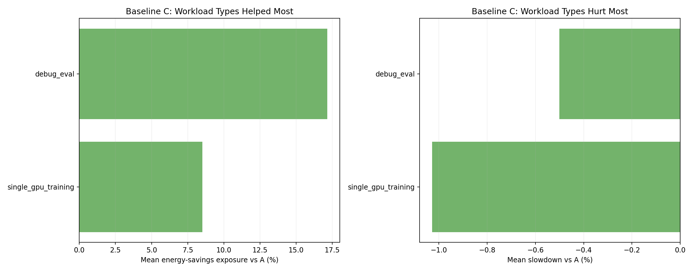

# Heterogeneous Benchmark Report

## Scope

This report documents the completed overnight run stored at:

- `runs/manual-overnight-2500-dev0015`

It covers:

- the experimental setup and benchmark configuration,
- the realism and current limitations of the simulator hardware/power/slowdown models,
- the observed results across baselines `A`, `B`, and `C`,
- interpretation of all generated plots except `throughput_vs_energy.png`,
- investigation of three key questions:
  - why AMD appears to behave better than H100 in the current outputs,
  - why one run of baseline `B` and one run of baseline `C` took dramatically longer,
  - whether cluster heterogeneity is currently a limiting factor for Joulie.

This report is intentionally more explicit than the quick benchmark README because the overnight run exposed both useful signal and important failure modes.

---

## 1. Experimental Setup

### 1.1 Cluster topology

The simulated heterogeneous cluster contains `41` fake KWOK worker nodes:

- `12` NVIDIA H100 NVL nodes, each advertising `8` GPUs
- `6` NVIDIA H100 80GB HBM3 nodes, each advertising `4` GPUs
- `7` NVIDIA L40S nodes, each advertising `4` GPUs
- `2` AMD Instinct MI300X nodes, each advertising `8` GPUs
- `6` AMD Radeon PRO W7900 nodes, each advertising `4` GPUs
- `8` CPU-only nodes across three CPU families

This is materially larger and more fragmented than experiment 01’s 5-node homogeneous-style setup.

### 1.2 Benchmark configuration used

From [benchmark-config.yaml](./runs/manual-overnight-2500-dev0015/benchmark-config.yaml):

- Baselines: `A`, `B`, `C`
- Seeds: `3`
- Requested jobs per seed: `2500`
- Mean inter-arrival: `0.12s`
- Time scale: `60`
- Timeout per run: `14400s`
- Cleanup timeout: `600s`
- Joulie / simulator image tag: `dev0.0.15`

Workload-generation knobs:

- `perf_ratio: 0.15`
- `eco_ratio: 0.00`
- `gpu_ratio: 0.45`
- `gpu_request_per_job: 1`
- `burst_day_probability: 0.25`
- `burst_mean_jobs: 8.0`
- `burst_multiplier: 2.0`
- `work_scale: 0.12`
- `allowed_workload_types:`
  - `debug_eval`
  - `single_gpu_training`
  - `cpu_preprocess`
  - `cpu_analytics`

Policy knobs:

- CPU and GPU profile intents are both percentage-based
- Performance profile: `100%`
- Eco profile: `80%`
- Static policy `hp_frac: 0.45`
- Queue-aware policy:
  - `hp_base_frac: 0.50`
  - `hp_min: 2`
  - `hp_max: 10`
  - `perf_per_hp_node: 18`

### 1.3 Baselines

- **A**: simulator only, no Joulie control loop
- **B**: Joulie static partition policy
- **C**: Joulie queue-aware policy

### 1.4 Observed runnable workload size

A notable detail from the finished traces is that the configured `2500` requested jobs per seed did **not** result in 2500 runnable pod jobs.

Observed runnable jobs/workloads per seed from [summary.csv](./runs/manual-overnight-2500-dev0015/results/summary.csv):

- seed 1: `2172`
- seed 2: `2172`
- seed 3: `2161`

This means the current benchmark config requests `2500` logical samples, but only about `2160-2170` runnable single-pod jobs are emitted after the current generator/filtering path. If intended, this should be documented more clearly; if unintended, it is a harness issue worth fixing.

### 1.5 Observed workload mix in the emitted targeted traces

Across seeds, the emitted job stream was dominated by CPU-side work:

- `cpu_preprocess`: about `1004-1020` jobs per seed
- `debug_eval`: about `489-517` jobs per seed
- `cpu_analytics`: about `337-390` jobs per seed
- `single_gpu_training`: about `274-310` jobs per seed

So the overnight benchmark is not “GPU-only”. It is a mixed CPU/GPU cluster stress test with a strong CPU-preprocess backbone and a GPU tail dominated by single-pod eval/training jobs.

For the GPU-targeted part of the trace, the per-family workload mix was surprisingly consistent:

- all major GPU families received roughly `63%` `debug_eval` and `37%` `single_gpu_training`

That matters for the AMD-vs-H100 interpretation later: the apparent AMD advantage is **not** primarily explained by AMD receiving a qualitatively easier workload type mix.

---

## 2. Simulator Realism Assessment

### 2.1 What is realistic enough to trust

There are several things in this experiment that are directionally realistic and useful:

- the cluster is genuinely heterogeneous in node count, vendor mix, GPU count per node, and CPU-only/GPU-backed composition,
- GPU resources are exposed as Kubernetes extended resources, so the scheduler is doing real vendor-specific GPU accounting,
- the workload mix is more plausible than the earlier toy benchmark:
  - many short/debug-style jobs,
  - many CPU-side preprocessing jobs,
  - mostly single-GPU jobs,
  - some burstiness,
- GPU caps are expressed as `% of max` and interpreted per hardware family rather than as one fixed global watt value.

These pieces are good enough for the benchmark to be informative.

### 2.2 Where the hardware realism is still weak

The simulator remains **synthetic**, especially on the CPU side.

#### CPU model limitations

From [hardware.generated.yaml](../../simulator/catalog/hardware.generated.yaml), the generated CPU inventory still assigns placeholder-like values across CPU families:

- `baseGHz: 2.0`
- `boostGHz: 3.0`
- `tdpW: 300`

for multiple distinct AMD EPYC models.

That means CPU family differentiation is currently much weaker than it should be. The benchmark can still compare policies, but CPU power and slowdown realism are only moderate.

#### GPU power model limitations

From [10-node-classes.yaml](../../examples/07%20-%20simulator-gpu-powercaps/manifests/10-node-classes.yaml), the GPU families do have different:

- GPU count per node
- `maxWattsPerGpu`
- `minCapWattsPerGpu`

which is good.

However, the actual GPU power model coefficients are still uniform and simple:

- `alphaUtil: 1.0`
- `betaCap: 1.0`

across all GPU families.

So the simulator distinguishes GPU families mostly by scale, not by detailed architecture-specific nonlinearity. That is enough to expose heterogeneity effects, but not enough to claim calibrated vendor-level physical accuracy.

#### CPU cap enforcement semantics

In this KWOK environment, CPU caps are expressed as percentages, but there is no real host RAPL interface backing the fake nodes. In practice the CPU side is therefore enforced through the simulator/agent DVFS-style fallback rather than exact, per-node package-power watt enforcement.

This is acceptable for relative benchmarking, but it is still weaker than simulated per-node RAPL cap ranges would be.

### 2.3 Workload realism limits

The workload generation is much more defensible than before, but still simplified:

- only four workload families are enabled,
- all emitted runnable jobs here are single-pod,
- network and storage are not modeled,
- there are no distributed multi-pod training jobs in this overnight profile,
- targeted traces pin jobs to specific node instances/families, which improves repeatability but reduces scheduling realism.

So the benchmark is realistic enough to study **heterogeneous placement and throttling tradeoffs**, but not yet realistic enough to be read as a faithful replay of a production AI cluster.

### 2.4 Bottom-line realism judgment

My judgment is:

- **workload realism**: moderate, useful, but still simplified
- **GPU power/cap realism**: moderate, better than CPU, but not calibrated
- **CPU power/cap realism**: weak-to-moderate because of placeholder inventory values and no simulated RAPL
- **scheduler realism**: high enough to expose real vendor/resource fragmentation effects

That means the run is useful for design insight, but the report should avoid overclaiming physical accuracy.

---

## 3. Main Results

### 3.1 Raw per-run outcomes

| Baseline | Seed | Wall seconds | Energy kWh (sim) | Throughput jobs/sim hour | Energy source |
|---|---:|---:|---:|---:|---|
| A | 1 | 1153.9 | 566.0224685913449 | 112.94 | debug_energy |
| A | 2 | 1552.5 | 829.8493131158773 | 83.94 | debug_energy |
| A | 3 | 1257.9 | 688.0593920605608 | 103.07 | debug_energy |
| B | 1 | 1173.1 | 592.6781517683451 | 111.09 | debug_energy |
| B | 2 | 14519.8 | timeout / missing | 8.98 | none |
| B | 3 | 1143.5 | 615.1808902138204 | 113.39 | debug_energy |
| C | 1 | 1157.0 | 567.4449355085776 | 112.63 | debug_energy |
| C | 2 | 1541.6 | 801.060822859708 | 84.54 | debug_energy |
| C | 3 | 14519.8 | timeout / missing | 8.93 | none |

Two important observations:

- `B_s2` and `C_s3` ran until the full `14400s` timeout
- both timeout runs ended with `energy_source=none`, so they are missing energy payloads entirely

This means the overnight benchmark contains **7 successful runs** and **2 timeout/failure runs**.

### 3.2 Naive baseline means from the generated CSVs

From [baseline_summary.csv](./runs/manual-overnight-2500-dev0015/results/baseline_summary.csv):

- `A`: mean wall `1321.44s`, mean energy `694.64 kWh`, mean throughput `99.99 jobs/sim hour`
- `B`: mean wall `5612.12s`, mean energy `603.93 kWh`, mean throughput `77.82 jobs/sim hour`
- `C`: mean wall `5739.47s`, mean energy `684.25 kWh`, mean throughput `68.70 jobs/sim hour`

These means are **not directly comparable** as policy-quality summaries because:

- wall-clock averages include the 4-hour timeouts,
- energy means ignore the missing-energy timeout runs,
- so the energy and makespan bars are computed from different subsets.

The plots that depend on energy therefore describe only the successful subset, while the runtime plots expose the reliability problem.

### 3.3 Completed-run-only comparison

To separate efficiency from reliability, it is more honest to compute a second table using only runs that both:

- finished before timeout, and
- produced energy data.

| Baseline | Successful runs | Mean wall seconds | Mean energy kWh | Mean throughput jobs/sim hour | Energy savings vs A (%) | Makespan change vs A (%) | Throughput change vs A (%) |
|---|---:|---:|---:|---:|---:|---:|---:|
| A | 3 | 1321.4 | 694.64 | 99.99 | - | - | - |
| B | 2 | 1158.3 | 603.93 | 112.24 | 13.06 | -12.35 | 12.26 |
| C | 2 | 1349.3 | 684.25 | 98.59 | 1.50 | 2.11 | -1.40 |

This is the most important high-level result of the whole experiment:

- **On successful runs only, baseline B looks strong**: about `13%` energy reduction together with about `12%` better throughput than baseline A.
- **Baseline C is much weaker**: only about `1.5%` energy reduction with slightly worse throughput/makespan than A.
- **But baseline B also fails reliability**: one of its three runs timed out catastrophically.

So the correct conclusion is not “B is clearly better than A” and not “B is clearly worse than A”. It is:

- `B` has the best efficiency when it works,
- but `B` is not robust under the current heterogeneous workload mix,
- and the overnight benchmark exposed that reliability gap clearly.

---

## 4. Plot-by-Plot Commentary

Plots copied for this report are under:

- [img](./img)

### 4.1 Baseline mean metrics

This plot is useful only as a first glance.

What it shows:

- `B` appears to have lower mean energy than `A`
- `C` appears close to `A` on energy
- `B` and `C` appear dramatically worse on makespan/throughput than `A`

What it hides:

- the energy bars for `B` and `C` exclude their failed runs,
- the makespan bars include the failed runs,
- so it mixes efficiency and reliability into one picture.

Interpretation:

- treat this plot as a reminder that `B` and `C` each had at least one severe failure,
- not as the main quantitative policy ranking.

### 4.2 Energy vs makespan

This is one of the most informative plots in the report.

Because timeout runs have no energy payload, this figure shows only the successful subset.

Interpretation:

- the two successful `B` points are both below and to the left of the `A` mean,
- so when `B` works, it dominates `A` on both energy and makespan,
- `C` is mixed: one point is close to `A`, one point is better on energy but not dramatically.

This is why the experiment needs to be read in two layers:

- **efficiency layer**: `B` can be very good
- **robustness layer**: `B` is not consistently safe on this workload/cluster

### 4.3 Runtime distribution

This plot makes the robustness problem obvious.

Interpretation:

- `A` has a tight distribution between about `1150s` and `1550s`
- `B` has two normal-looking runs and one extreme timeout outlier around `14520s`
- `C` has the same pattern

This is not ordinary jitter. It is a categorical “good run vs pathological run” behavior.

That makes the main benchmark lesson stronger:

- Joulie is not simply paying a smooth slowdown penalty,
- it is occasionally triggering a pathological queueing/fairness/stall mode.

### 4.4 Relative tradeoffs vs A (scatter)

This figure shows only successful runs with energy data.

Interpretation:

- baseline `B` has one clearly attractive successful run: large energy savings at large throughput improvement
- its other successful run is less impressive but still positive on energy
- baseline `C` has one modestly positive run and one nearly neutral/slightly negative run

This again supports the completed-run-only reading: `B` has upside, `C` is much less compelling.

### 4.5 Relative tradeoffs vs A (bars)

This plot summarizes successful-run means relative to A.

Interpretation:

- `B`: about `2.9%` mean energy savings across the naive plot subset, but this understates the completed-only comparison because of subset handling
- `B` also shows better throughput and lower makespan on the successful subset
- `C` is only modestly positive on energy and nearly flat on throughput/makespan

The main use of this plot is directional, not authoritative.

### 4.6 Workload-type tradeoff scatter

Interpretation:

- both `debug_eval` and `single_gpu_training` look compatible with throttling in the successful runs,
- `debug_eval` is the clear winner, especially under `C`,
- `single_gpu_training` also saves energy without obvious mean slowdown in the successful subset.

However, this plot must be read together with the timeout diagnosis:

- the catastrophic runs are not represented here because they lacked usable energy data,
- and the observed failures were concentrated in AMD GPU queues.

So this plot tells us which workload types look promising **when the system remains stable**, not which workload types are safe under every heterogeneous burst pattern.

### 4.7 Workload-type rankings for baseline B

Interpretation:

- `debug_eval` is the best fit for throttling under `B`
- `single_gpu_training` is still positive, just less strongly so
- neither type looks strongly harmed in the successful subset

This supports a future Joulie narrative built around short and moderately memory-bound GPU jobs rather than heavily synchronized distributed jobs.

### 4.8 Workload-type rankings for baseline C

Interpretation:

- `debug_eval` is again the best workload family for throttling
- `single_gpu_training` remains positive, but only mildly
- `C` seems better at debug/eval than at extracting broad benefits from the whole mix

### 4.9 Hardware-family tradeoff scatter

This plot is one of the most interesting, but also one of the most dangerous to over-interpret.

What it suggests:

- `AMD-Instinct-MI300X` looks like the best throttling target in both `B` and `C`
- `AMD-Radeon-PRO-W7900` is mixed
- `NVIDIA-H100-NVL` looks much less attractive in `B`, and negative in `C`

What it misses:

- this plot is computed only from the runs with usable energy data,
- the worst two overnight failures were both **AMD queue** failures,
- so the plot has clear survivor bias.

This means the “AMD did better than H100” story is **partly real and partly selection bias**.

### 4.10 Hardware-family rankings for baseline B

Interpretation:

- `MI300X` appears best under `B`
- `W7900` is second
- `H100-NVL` saves little energy relative to its slowdown

This is real signal, but only for successful runs.

### 4.11 Hardware-family rankings for baseline C

Interpretation:

- `MI300X` again looks best on the successful subset
- `W7900` is close to neutral on energy savings
- the NVIDIA families are not showing compelling wins here

Again, the missing AMD-heavy timeout run means this plot is optimistic about AMD robustness.

---

## 5. Why AMD Appeared Better Than H100

This is the first key interpretive question.

### 5.1 It is **not** mainly because AMD received easier workload types

The targeted traces show that the GPU workload-type mix was almost identical across GPU families:

- around `63-66%` `debug_eval`
- around `34-37%` `single_gpu_training`

for AMD and NVIDIA families alike.

So the simple explanation “AMD got all the easy jobs” does not hold.

### 5.2 There is a real model-side reason AMD can look better

With the current simulator model, the same `80%` eco cap means different absolute power reductions depending on GPU family:

- `H100 NVL`: `400W max -> 320W eco`
- `MI300X`: `750W max -> 600W eco`
- `W7900`: `295W max -> 236W eco`

Under a model that applies the same relative cap percentage and very simple family-invariant cap sensitivity, higher-power devices can show larger absolute savings for roughly similar relative slowdown.

So part of the AMD advantage is real under the current simulator formulation:

- the model gives `MI300X` more absolute room to save power at the same `80%` cap.

### 5.3 There is also a strong survivor-bias effect

The hardware-family comparison is built from only **2 successful runs per Joulie baseline**.

The failed runs were:

- `B_s2`
- `C_s3`

And both failures were AMD-heavy queue-collapse cases.

That means the family-level charts omit exactly the runs where AMD demand caused the largest problem. So the current “AMD beat H100” message is overstated if read as a robustness claim.

### 5.4 The more precise lesson

The correct insight is:

- **MI300X looks like a very good energy-saving target when the run remains stable**
- **but the AMD subfleet is also the main source of fragility in this overnight workload**

That is a valuable design lesson for Joulie:

- family-specific energy benefit and family-specific queue risk need to be modeled together.

---

## 6. Why `B_s2` and `C_s3` Took So Much Longer

The short answer is: they did not merely slow down; they stalled into a heterogeneous vendor bottleneck.

### 6.1 Evidence from the snapshots

At timeout:

- `B_s2`: `235 Pending`, `74 Running`
- `C_s3`: `55 Pending`, `35 Running`

Pending request composition:

- `B_s2`: mostly AMD `1-GPU`, `2-GPU`, and `4-GPU` requests
- `C_s3`: mostly AMD `2-GPU`, `4-GPU`, and especially `8-GPU` requests

The pending pods all reported scheduler messages of the form:

- `Insufficient amd.com/gpu`
- plus `34 node(s) didn't match Pod's node affinity/selector`

This means the cluster was not globally full. It means the **AMD-addressable subset** was full while the non-AMD subset was irrelevant to those jobs.

### 6.2 Why those two specific seeds were vulnerable

Observed AMD request mix in the targeted traces:

- seed 2 had more AMD `4-GPU` requests than the other seeds
- seed 3 had a particularly large count of AMD `8-GPU` requests (`15` such jobs)

That matters because only the `2` MI300X nodes can host `8` AMD GPUs in one pod. The W7900 nodes top out at `4` GPUs each.

So seed 3, in particular, created a very narrow AMD bottleneck:

- many jobs were portable only within the AMD subfleet,
- and the `8-GPU` AMD jobs were portable only within the MI300X subset.

### 6.3 Why baseline A survived the same seeds

Baseline `A` on seeds 2 and 3 did complete.

That implies the issue is not pure feasibility. The AMD jobs are schedulable in principle.

The likely mechanism is:

- under Joulie baselines, progress on the constrained AMD subfleet became too slow,
- queues built up behind AMD-only demand,
- once that vendor-specific queue formed, the run stopped draining in a reasonable time.

One subtle but important detail:

- in `B_s2`, the static partition had already left all AMD GPU nodes in the `performance` profile,
- so this particular failure was **not** caused by AMD perf-capacity being partitioned away,
- it was caused by the AMD slice saturating and then failing to drain cleanly.

That makes `B_s2` more concerning, not less: even without explicit AMD eco demotion, the current system could still fall into a pathological long tail once the AMD queue became dominant.

### 6.4 There is likely still a simulator robustness issue here

Another important clue is the simulator logs:

- both failed runs stopped emitting completion logs far earlier than the benchmark timeout
- yet the benchmark loop kept reporting active pods for hours afterward

So the two long runs are probably a combination of:

- real AMD-subfleet queueing pressure,
- and a remaining simulator-progress / long-tail robustness issue once the queue reaches a certain structure.

That is an actionable lesson for future work: the experiment exposed a real system stress point that still needs product-side attention.

---

## 7. Is Heterogeneity a Limitation for Joulie?

In the current design and benchmark, **yes, clearly**.

### 7.1 Evidence from the overnight run

The failed runs did not exhaust the whole cluster. They exhausted the relevant heterogeneous slice:

- AMD-only jobs were waiting,
- many NVIDIA nodes were irrelevant to them,
- the scheduler explicitly reported that most nodes did not match the pod’s selector/affinity.

So the problem is not “Joulie on a large cluster.”

It is more specific:

- **Joulie on a heterogeneous cluster with vendor-specific demand islands and family-specific capacity asymmetry.**

### 7.2 Why a homogeneous cluster would likely behave better

Under a homogeneous cluster, or at least a single-vendor GPU fleet, several failure mechanisms become weaker:

- less resource stranding from vendor-specific selectors,
- easier absorption of burst demand across the whole fleet,
- less chance that one scarce hardware family becomes the sole bottleneck,
- simpler policy partitioning because “eco vs performance” is not also entangled with family scarcity.

So under similar workloads but homogeneous nodes, I would expect Joulie to perform better and more robustly than it does here.

That is not because homogeneity is easier in the abstract; it is because this experiment revealed a very specific interaction:

- family/vendor fragmentation + throttling + bursty demand on a scarce subfleet.

### 7.3 The more interesting lesson

The deeper lesson is not “heterogeneity is bad.” It is:

- **Joulie needs heterogeneity-aware admission and partitioning, not just cluster-wide power-profile assignment.**

For this benchmark, the right control object is not only:

- “how many performance nodes do we keep?”

It is also:

- “how many performance nodes do we keep per scarce family?”
- “what is the queue depth per vendor/family?”
- “are we creating a bottleneck on a family that has no substitute elsewhere in the fleet?”

---

## 8. Recommendations and Future Work

### 8.1 Report benchmark results in two layers

For future reports, separate:

- **efficiency on successful runs**, and
- **robustness / timeout rate**

This run shows why. `B` can look both excellent and terrible depending on whether the failure cases are folded into the same number.

### 8.2 Make the policy family-aware under heterogeneity

The overnight run strongly argues for adding policy logic that reasons about:

- vendor/family-specific queue depth,
- large-request jobs (`4`/`8` GPU requests),
- scarce-family bottlenecks,
- temporary promotion of bottleneck families back to performance.

The current policies are not yet sufficiently heterogeneity-aware.

### 8.3 Investigate the remaining simulator stall mode

The timeout runs look worse than ordinary queueing:

- simulator completion logging appears to stop long before benchmark timeout,
- while active pods remain.

This deserves direct debugging before using similar runs as publication-grade evidence.

### 8.4 Improve hardware realism

Priority items:

- replace placeholder CPU catalog values with more realistic per-model data,
- simulate per-node CPU package cap ranges / RAPL-like capabilities,
- calibrate GPU family slowdown-under-cap instead of using nearly uniform cap-response coefficients,
- consider family-specific DVFS/cap sensitivity instead of only family-specific max power.

### 8.5 Improve workload realism carefully

The workload stream is reasonable, but still simplified. Future benchmark revisions should add, in order:

1. limited multi-pod distributed jobs,
2. explicit host-memory pressure effects for CPU preprocess jobs,
3. less rigid node-instance targeting when realism matters more than repeatability,
4. better documentation of why `jobs: 2500` emits about `2160-2170` runnable jobs.

### 8.6 Practical product lesson for Joulie

The strongest positive lesson from this experiment is:

- when the workload/family match is favorable, Joulie can improve both energy and throughput.

The strongest negative lesson is:

- Joulie currently has no safety mechanism that says “this scarce heterogeneous slice is becoming the dominant bottleneck; stop forcing the current profile split.”

That is a concrete roadmap item.

---

## 9. Final Takeaway

This overnight experiment is valuable because it exposed **both** Joulie’s upside and its current limitation.

### What worked

- the benchmark pipeline itself ran end to end,
- the larger trace and artifact collection held up,
- baseline `B` showed clearly better efficiency than `A` on the successful subset,
- `debug_eval` and short single-GPU jobs look like good targets for throttling.

### What did not work

- the run was not robust across all seeds,
- one `B` run and one `C` run collapsed into AMD-specific queue backlogs,
- the current simulator/harness still appears to have a long-tail stall mode under that stress,
- family-level “AMD is better than H100” conclusions are currently affected by survivor bias.

### Overall conclusion

The experiment does **not** support a simple headline like “Joulie beats no-Joulie on heterogeneous clusters.”

It supports a more useful and more honest conclusion:

- **Joulie already has a real efficiency win in favorable heterogeneous conditions,**
- **but it still needs heterogeneity-aware bottleneck management and better simulator robustness before that win is reliable.**
