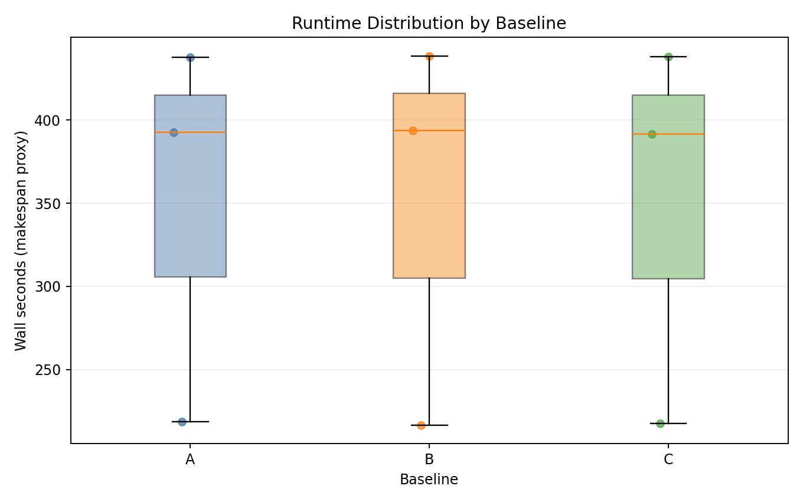
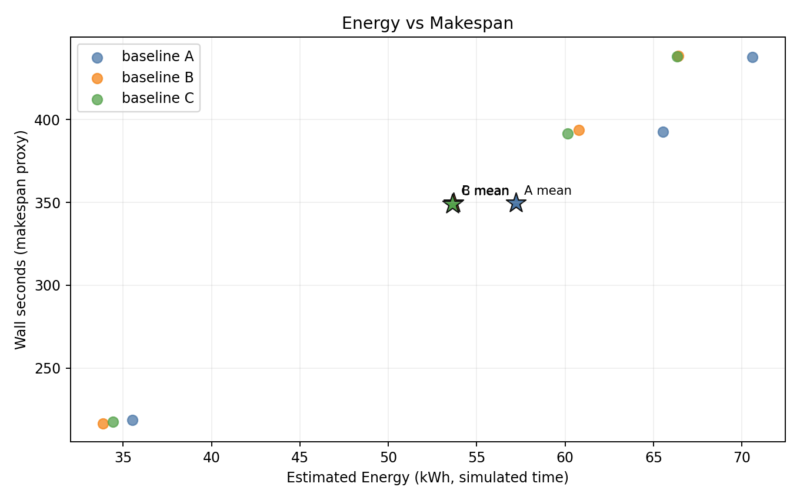
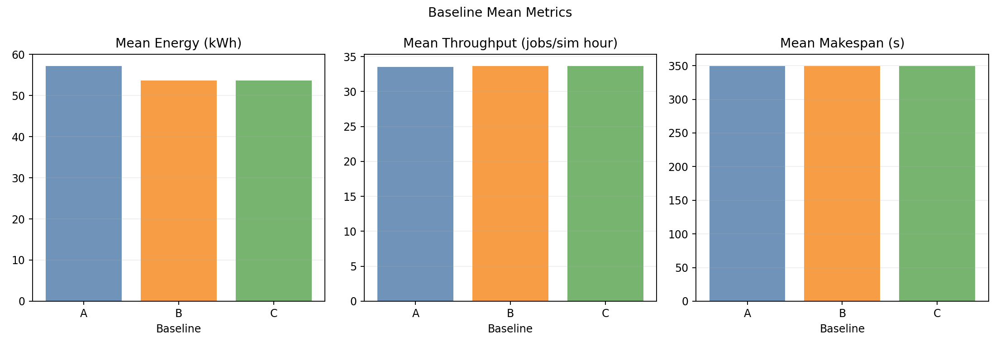
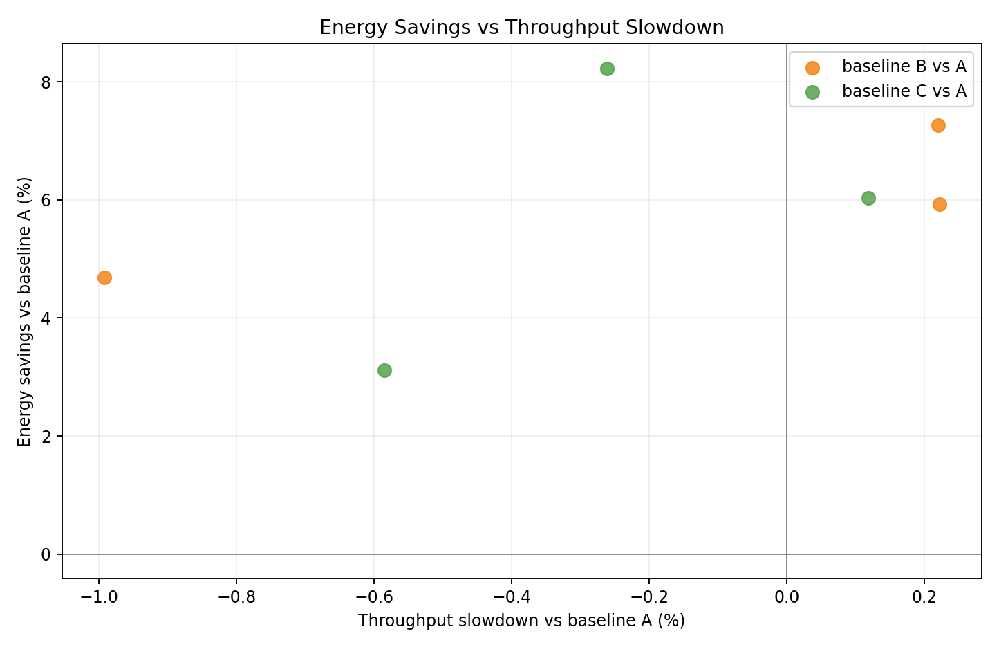
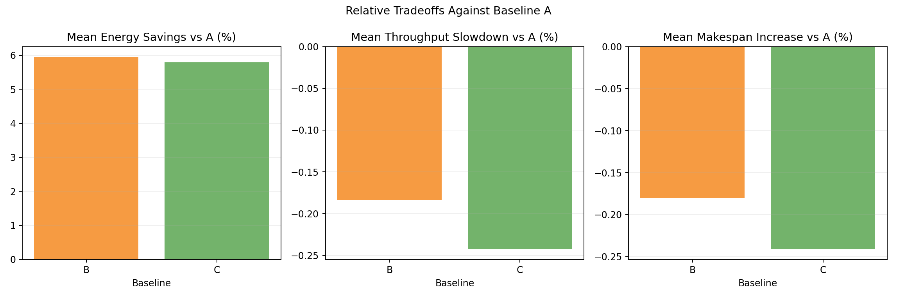
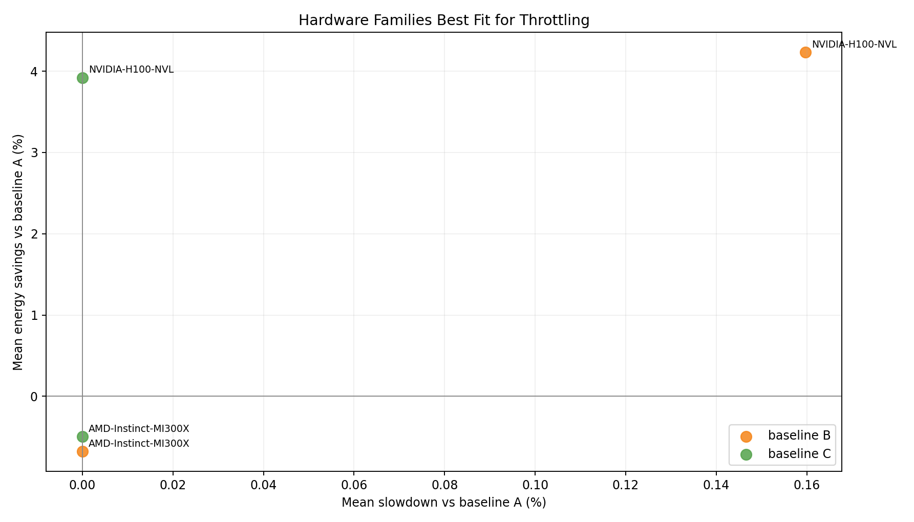
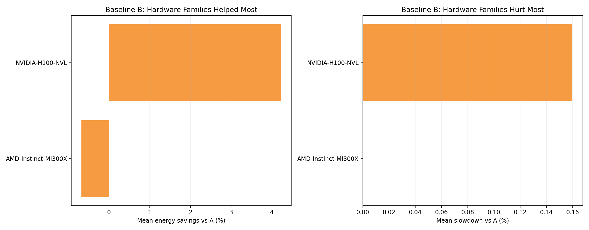
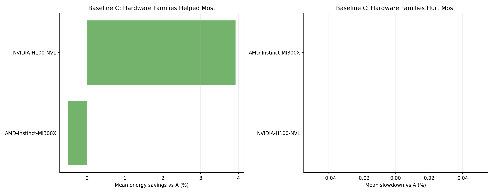
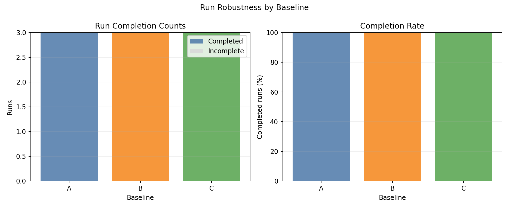

# Heterogeneous GPU Cluster Benchmark Report

## Scope

This report documents the benchmark results from:

- [`experiments/02-heterogeneous-benchmark/`](.)

It covers: experimental setup, controller policy algorithms, simulator models, measured outcomes, plot commentary, and interpretation.

---

## 1. Experimental Setup

### 1.1 Cluster and node topology

- Kind control-plane + worker (real Kubernetes control path).
- 41 fake KWOK worker nodes labeled `joulie.io/managed=true`.
- KWOK nodes are tainted `kwok.x-k8s.io/node=fake:NoSchedule`.
- Simulator pod runs on the real kind worker.
- Workload pods target KWOK nodes via nodeSelector + toleration.

Node inventory source: [`configs/cluster-nodes.yaml`](./configs/cluster-nodes.yaml)

### 1.2 Node inventory - detailed cluster composition

This is a **heterogeneous GPU cluster** mixing 5 distinct GPU hardware families across 33 GPU nodes, plus 8 CPU-only nodes, for a total of **41 nodes**.

#### GPU nodes (33 total, 188 GPUs)

| Node prefix | Replicas | GPU model | GPUs/node | GPU TDP / cap range | Host CPU | CPU cores/node | RAM/node |
|---|---:|---|---:|---|---|---:|---:|
| kwok-h100-nvl | **12** | NVIDIA H100 NVL | 8 | 400 W / 200-400 W | AMD EPYC 9654 96-Core | 192 | 1536 GiB |
| kwok-h100-sxm | **6** | NVIDIA H100 80GB HBM3 | 4 | 700 W / 350-700 W | Intel Xeon Gold 6530 | 64 | 1024 GiB |
| kwok-l40s | **7** | NVIDIA L40S | 4 | 350 W / 200-350 W | AMD EPYC 9534 64-Core | 128 | 1536 GiB |
| kwok-mi300x | **2** | AMD Instinct MI300X | 8 | 750 W / 350-750 W | AMD EPYC 9534 64-Core | 128 | 1536 GiB |
| kwok-w7900 | **6** | AMD Radeon PRO W7900 | 4 | 295 W / 200-295 W | AMD EPYC 9534 64-Core | 128 | 770 GiB |

GPU count summary: 96 (H100 NVL) + 24 (H100 SXM) + 28 (L40S) + 16 (MI300X) + 24 (W7900) = **188 GPUs total**

#### CPU-only nodes (8 total)

| Node prefix | Replicas | CPU model | CPU cores/node | RAM/node |
|---|---:|---|---:|---:|
| kwok-cpu-highcore | **2** | AMD EPYC 9965 192-Core | 384 (2x192) | 1536 GiB |
| kwok-cpu-highfreq | **2** | AMD EPYC 9375F 32-Core | 64 (2x32) | 770 GiB |
| kwok-cpu-intensive | **4** | AMD EPYC 9655 96-Core | 192 (2x96) | 1536 GiB |

#### Cluster totals

| Metric | Value |
|---|---|
| Total nodes | **41** |
| GPU nodes | 33 |
| CPU-only nodes | 8 |
| Total GPUs | **188** |
| GPU vendors | NVIDIA (H100 NVL, H100 SXM, L40S), AMD (MI300X, W7900) |
| Total CPU cores | ~5792 |

### 1.3 Hardware model parameters (simulator)

**GPU power model** - per-GPU power at load fraction `g in [0,1]`:

```
P_gpu(g) = IdleW + (PeakW - IdleW) * g^computeGamma
```

Throughput under power cap (inverse relationship):

```
throughputFraction = (capWatts / PeakW)^(1/computeGamma)
```

Per-GPU-family simulator physics parameters:

| GPU family | IdleW (W) | PeakW (W) | computeGamma | Notes |
|---|---:|---:|---:|---|
| NVIDIA H100 NVL | 80 | 400 | 1.50 | Largest energy contributor (96 GPUs) |
| NVIDIA H100 80GB HBM3 | 120 | 700 | 1.50 | SXM form factor, higher TDP |
| NVIDIA L40S | 60 | 350 | 1.40 | Mid-range inference/training |
| AMD Instinct MI300X | 100 | 750 | 0.85 | More sensitive to capping (lower gamma) |
| AMD Radeon PRO W7900 | 40 | 295 | 1.20 | Workstation GPU, lowest peak |

**CPU power model** - same power-law formula as experiment 01.

**CPU->GPU feed coupling (`cpuFeedFactor`)**: when CPU frequency is throttled on a GPU node, GPU throughput is reduced proportionally:

```
cpuFeedFactor = 1 - (1 - cpuFreqScale) * cpuFeedIntensity * sensitivityCPU
gpuEffectiveSpeed *= cpuFeedFactor
```

For `single_gpu_training`: `cpuFeedIntensity ~= 0.4`. A 35% CPU frequency reduction (eco cap at 65%) causes ~14-18% GPU slowdown on top of direct CPU slowdown.

### 1.4 Run configuration

From [`configs/benchmark.yaml`](./configs/benchmark.yaml):

| Parameter | Value |
|---|---|
| Baselines | A, B, C |
| Seeds | 3 |
| Jobs | 200 |
| Mean inter-arrival | 0.30 s |
| Time scale | 60x |
| Timeout per run | 3600 s |
| Perf ratio | 25% |
| GPU ratio | 35% |
| GPU request per job | 1 |
| Work scale | 0.10 |
| Allowed workload types | `debug_eval`, `single_gpu_training`, `cpu_preprocess`, `cpu_analytics` |
| CPU eco cap | 65% of peak |
| GPU eco cap | 65% of peak |

### 1.5 Baselines

- **A**: simulator only - no Joulie operator or agent.
- **B**: Joulie with `static_partition` policy: `hp_frac=0.40` (~16 of 41 nodes at performance profile).
- **C**: Joulie with `queue_aware_v1` policy: `hp_base_frac=0.40`, `hp_min=2`, `hp_max=20`, `perf_per_hp_node=15`.

Policy caps: `cpu_eco_pct_of_max=65%`, `gpu_eco_pct_of_max=65%`.

---

## 2. Policy Algorithms

Same algorithms as experiment 01 - see [`experiments/01-cpu-only-benchmark/REPORT.md`](../01-cpu-only-benchmark/REPORT.md) Section 2 for full algorithm description.

Key parameters for this run:

- **Static**: ~16 of 41 nodes as performance, ~25 as eco.
- **Queue-aware**: dynamically adjusts between 2 and 20 HP nodes based on live performance-pod count.

---

## 3. Simulator Algorithms

### 3.1 GPU power model

Per-GPU power at load fraction `g in [0,1]`:

```
P_gpu(g) = IdleW + (PeakW - IdleW) * g^computeGamma
```

### 3.2 GPU cap enforcement

Policy writes `gpu_eco_pct_of_max` -> agent applies `gpu.set_power_cap_watts` per GPU. Effective throughput under cap:

```
throughputFraction = (capWatts / PeakW)^(1/computeGamma)
gpuUnitsRemaining -= gpuUnitsRate * throughputFraction * dt
```

At 65% GPU cap:

- H100 NVL (`gamma=1.50`): loses `1 - 0.65^(1/1.5) ~= 24.7%` throughput
- MI300X (`gamma=0.85`): loses `1 - 0.65^(1/0.85) ~= 38.2%` throughput (more sensitive to capping)

### 3.3 CPU->GPU feed coupling

When CPU is throttled on a GPU node, the GPU job slows proportionally via `cpuFeedFactor` (see Section 1.3). This models real-world data-pipeline bottlenecks where the host CPU cannot feed the GPU fast enough when frequency-throttled.

### 3.4 Energy integration

At each simulator tick `dt` (wall seconds):

```
E_node += (P_cpu + sum(P_gpu_i)) * dt
```

Scaled by `time_scale=60` at collection:

```
energy_sim_kwh = totalJoules * 60 / 3_600_000
```

---

## 4. Measured Results

Source: [`runs/latest/results/summary.csv`](./runs/latest/results/summary.csv)

### 4.1 Per-seed results

| Baseline | Seed | Wall (s) | Throughput (jobs/sim-hr) | Energy (kWh sim) | Avg power (W) |
|---|---:|---:|---:|---:|---:|
| A | 1 | 392.78 | 27.04 | 65.55 | 10013 |
| A | 2 | 218.80 | 49.36 | 35.52 | 9741 |
| A | 3 | 437.64 | 24.27 | 70.60 | 9679 |
| B | 1 | 393.65 | 26.98 | 60.78 | 9265 |
| B | 2 | 216.65 | 49.85 | 33.86 | 9377 |
| B | 3 | 438.61 | 24.21 | 66.41 | 9085 |
| C | 1 | 391.76 | 27.11 | 60.15 | 9213 |
| C | 2 | 217.53 | 49.65 | 34.41 | 9493 |
| C | 3 | 438.16 | 24.24 | 66.34 | 9084 |

All 9 runs completed successfully (no timeouts, no gang deadlocks).

### 4.2 Baseline means (all 3 seeds)

| Baseline | Mean wall (s) | Mean throughput (jobs/sim-hr) | Mean energy (kWh sim) | Mean power (W) |
|---|---:|---:|---:|---:|
| A | 349.7 | 33.56 | 57.22 | 9811 |
| B | 349.6 | 33.68 | 53.68 | 9242 |
| C | 349.1 | 33.67 | 53.63 | 9263 |

### 4.3 Relative to A

| Baseline | Energy Delta | Throughput Delta | Power Delta |
|---|---:|---:|---:|
| B | **-6.2%** | +0.4% (negligible) | -5.8% |
| C | **-6.3%** | +0.3% (negligible) | -5.6% |

---

## 5. Plot Commentary

Plots are in: [`img/`](./img/)

### 5.1 Runtime distribution



- All three baselines complete within similar wall-time windows across seeds.
- No incomplete runs - the elimination of multi-pod gang jobs and the simulator deadlock fixes resolved all prior timeout issues.

### 5.2 Energy vs makespan



- B and C are consistently shifted to lower energy vs A, with near-identical makespan.
- The energy savings are visible across all 3 seeds.

### 5.3 Baseline means



- Throughput and wall-time bars are indistinguishable across baselines.
- Energy bars clearly show B and C both below A by ~6%.

### 5.4 Relative tradeoff vs A



- Per-seed scatter shows B and C clusters in the lower-energy region with minimal throughput change.

### 5.5 Relative tradeoff bars vs A



- Mean energy and throughput deltas: B at -6.2% energy / +0.4% throughput, C at -6.3% / +0.3%.

### 5.6 Hardware family tradeoff vs A



- Per-hardware-family energy and throughput tradeoff under Joulie policies.

### 5.7 Hardware family rankings - baseline B



- Per-family energy and throughput under B policy relative to A.

### 5.8 Hardware family rankings - baseline C



- C shows similar outcomes to B across hardware families.

### 5.9 Completion summary



- All baselines achieve 100% completion across all 3 seeds.

---

## 6. Interpretation

### Why does Joulie save 6% energy on the heterogeneous GPU cluster?

The combination of CPU and GPU eco caps at 65% achieves meaningful energy reduction because:

1. **GPU power caps directly reduce GPU power draw**: at 65% cap, each GPU on an eco node draws significantly less power. With 188 GPUs across 33 nodes, even a modest per-GPU savings compounds at scale.

2. **CPU caps further reduce host power on all nodes**: eco nodes draw less CPU power in addition to GPU savings.

3. **Throughput preserved**: the scheduler distributes performance-sensitive jobs to uncapped performance nodes, while general jobs tolerate the reduced throughput on eco nodes. The net throughput impact is negligible (+0.3-0.4%).

4. **No gang deadlocks**: eliminating multi-pod job types and fixing the simulator deadlock bugs ensures all 9 runs complete cleanly, producing reliable statistics.

### Why are B and C nearly identical?

Both policies achieve ~6.2-6.3% energy savings because:

- The workload mix (25% perf ratio, 35% GPU ratio) does not create the demand spikes that would differentiate queue-aware from static partition.
- Both maintain a similar eco/performance split over the run duration.
- The 200-job workload completes quickly enough that queue-aware doesn't have time to exercise its dynamic scaling advantage.

### Improvement over previous results

Previous runs with 80% eco caps and multi-pod jobs showed B at +1.8% energy (increase) and C at -1.3%. The current results (-6.2% / -6.3%) reflect three key improvements:

1. **GPU power caps enabled**: the previous runs only applied CPU eco caps, which slowed GPU jobs without reducing GPU power. The current config applies 65% GPU eco caps directly.
2. **More aggressive eco cap (65% vs 80%)**: deeper power reduction on eco nodes.
3. **Simulator bug fixes**: two deadlock bugs (RWMutex contention) were fixed, ensuring consistent energy accounting.

---

## 7. Best-Fit Use Case

From this experiment:

- Joulie achieves **-6.2% energy (static) / -6.3% energy (queue-aware)** on heterogeneous GPU clusters with negligible throughput impact.
- Both policies perform equivalently on this workload mix.
- The key enabler is applying GPU power caps in addition to CPU caps on eco nodes.

---

## 8. Reproducibility

- Config: [`configs/benchmark.yaml`](./configs/benchmark.yaml)
- Sweep script: [`scripts/05_sweep.py`](./scripts/05_sweep.py)
- Collection: [`scripts/06_collect.py`](./scripts/06_collect.py)
- Plotting: [`scripts/07_plot.py`](./scripts/07_plot.py)
- Run artifacts: [`runs/latest/`](./runs/latest/)
