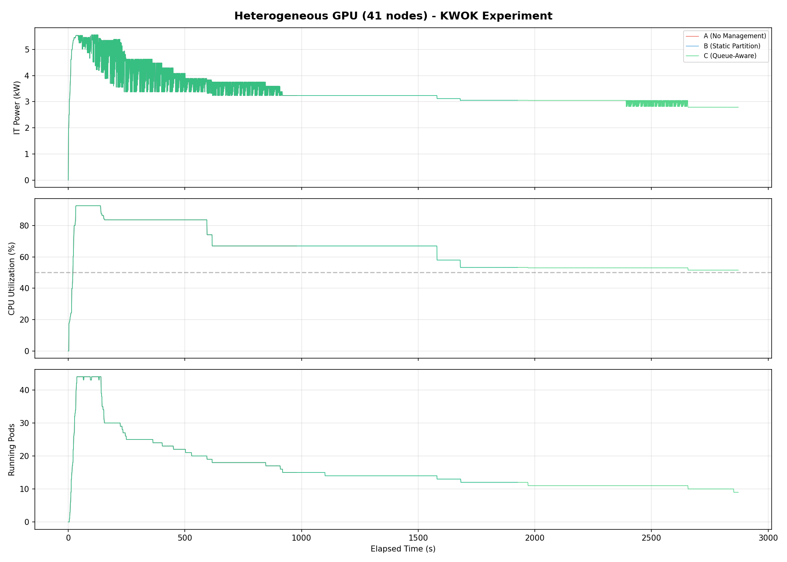
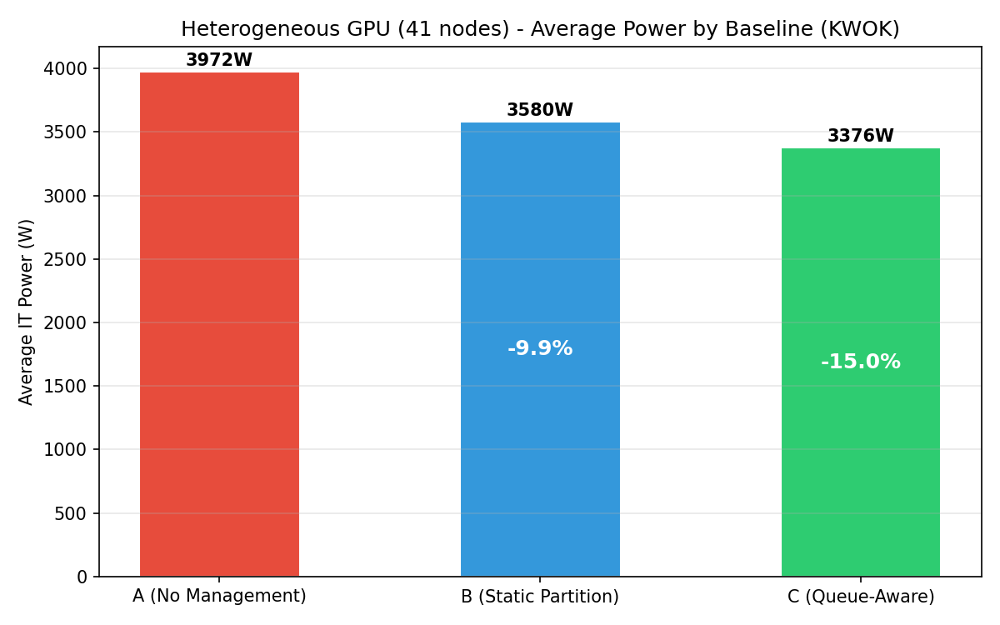
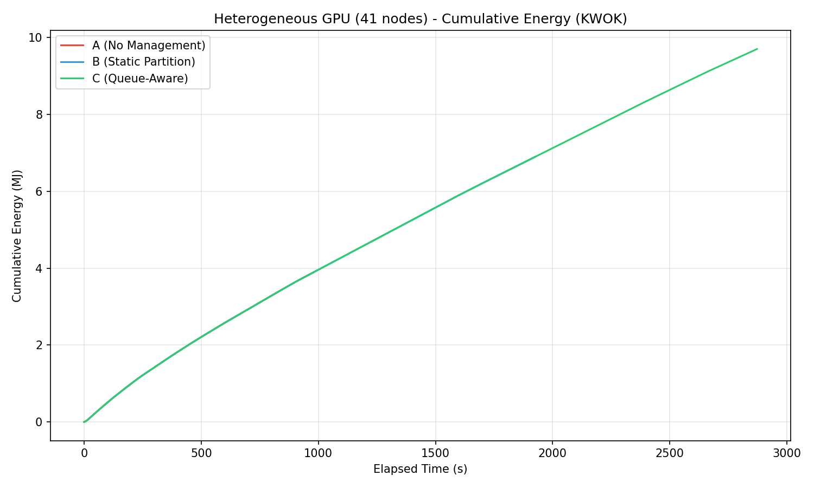
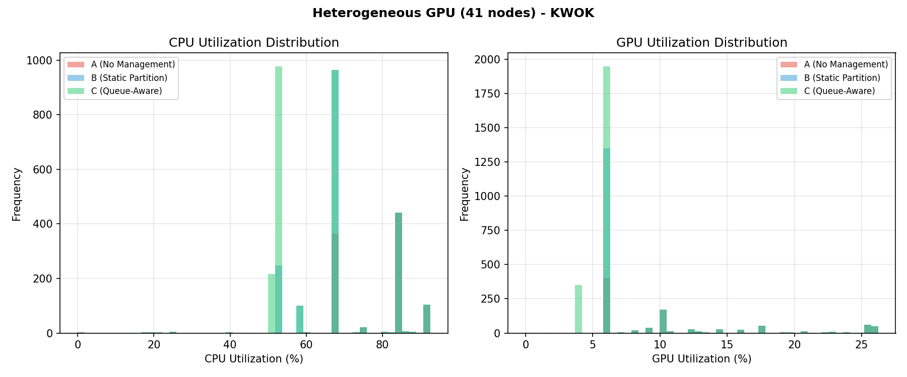
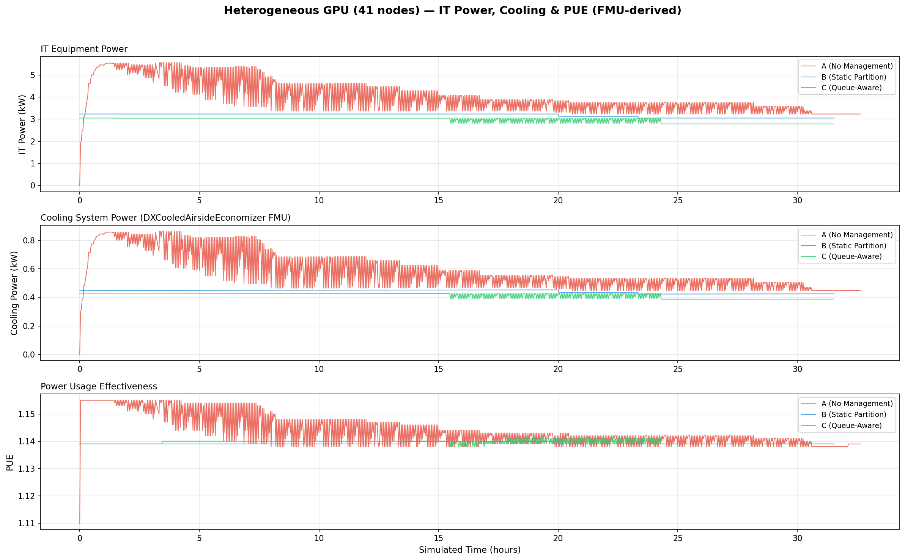
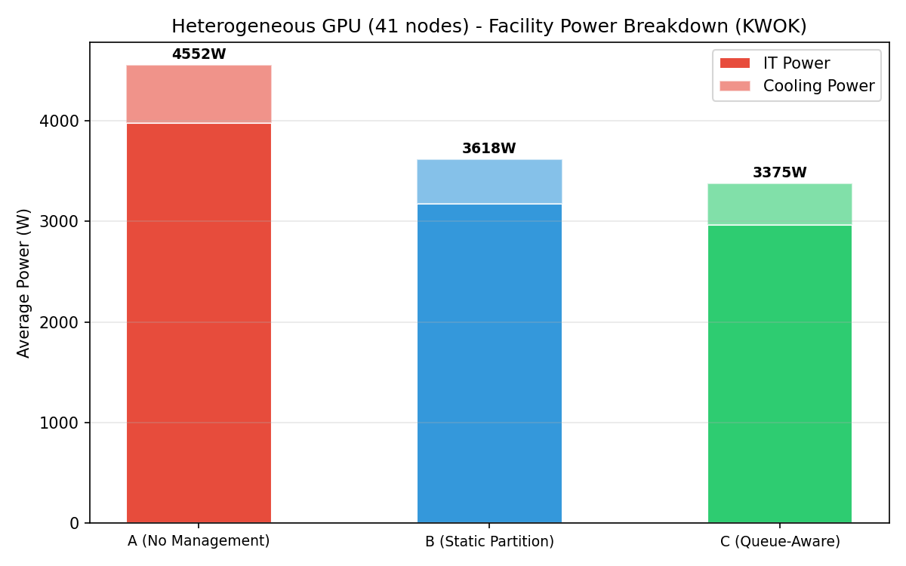

# Heterogeneous GPU Cluster Benchmark Report (KWOK, 41 Nodes)

This page reports results from the heterogeneous GPU cluster KWOK benchmark experiment:

- [`experiments/02-heterogeneous-benchmark/`](.)

## Scope

The benchmark compares three baselines on a **heterogeneous GPU cluster** mixing 5 distinct GPU hardware families plus CPU-only nodes, running on a real Kind+KWOK Kubernetes cluster:

- `A`: Simulator only (no power management)
- `B`: Joulie with static partition policy
- `C`: Joulie with queue-aware dynamic policy

The experiment demonstrates energy savings achievable through combined CPU and GPU RAPL capping on a mixed-vendor GPU fleet.

---

## 1. Experimental Setup

### 1.1 Cluster and nodes

- [Kind](https://kind.sigs.k8s.io/) control-plane + worker (real Kubernetes control plane).
- **41** managed [KWOK](https://kwok.sigs.k8s.io/) nodes: 33 GPU + 8 CPU-only.
- Workload pods target KWOK nodes via nodeSelector + toleration.
- Scheduler extender provides performance/eco affinity-based filtering and scoring.
- GPU nodes get GPU RAPL caps; CPU-only nodes get CPU RAPL caps.

### 1.2 Node inventory — detailed cluster composition

#### GPU nodes (33 total, 188 GPUs across 5 families)

| Node prefix | Count | GPU model | GPUs/node | GPU cap range | Host CPU | CPU cores/node |
|---|---:|---|---:|---|---|---:|
| kwok-h100-nvl | **12** | NVIDIA H100 NVL | 8 | 200–400 W | AMD EPYC 9654 | 192 |
| kwok-h100-sxm | **6** | NVIDIA H100 80GB HBM3 | 4 | 350–700 W | Intel Xeon Gold 6530 | 64 |
| kwok-l40s | **7** | NVIDIA L40S | 4 | 200–350 W | AMD EPYC 9534 | 128 |
| kwok-mi300x | **2** | AMD Instinct MI300X | 8 | 350–750 W | AMD EPYC 9534 | 128 |
| kwok-w7900 | **6** | AMD Radeon PRO W7900 | 4 | 200–295 W | AMD EPYC 9534 | 128 |

GPU count: (12×8) + (6×4) + (7×4) + (2×8) + (6×4) = **188 GPUs** across NVIDIA and AMD families.

#### CPU-only nodes (8 total)

| Node prefix | Count | CPU model | CPU cores/node | RAM/node |
|---|---:|---|---:|---:|
| kwok-cpu-highcore | **2** | AMD EPYC 9965 192-Core | 384 (2×192) | 1,536 GiB |
| kwok-cpu-highfreq | **2** | AMD EPYC 9375F 32-Core | 64 (2×32) | 770 GiB |
| kwok-cpu-intensive | **4** | AMD EPYC 9655 96-Core | 192 (2×96) | 1,536 GiB |

**Total: 41 nodes, 188 GPUs (5 families), ~5,792 CPU cores.**

### 1.3 Hardware models in simulator

GPU power per device uses the `CappedBoardGPUModel`:

```
P_gpu(util) = wc * (IdleW + (MaxW - IdleW) * util^1.02) + wm * (IdleW + (MaxW - IdleW) * (0.35√util + 0.30*util))
```

Per-GPU-family physics parameters:

| GPU family | IdleW (W) | MaxW (W) | ComputeGamma | GPU cap range |
|---|---:|---:|---:|---|
| NVIDIA H100 NVL | 60 | 400 | 1.50 | 200–400 W |
| NVIDIA H100 80GB HBM3 | 120 | 700 | 1.50 | 350–700 W |
| NVIDIA L40S | 60 | 350 | 1.40 | 200–350 W |
| AMD Instinct MI300X | 100 | 750 | 0.85 | 350–750 W |
| AMD Radeon PRO W7900 | 40 | 295 | 1.20 | 200–295 W |

### 1.4 Run configuration

| Parameter | Value |
|---|---|
| Baselines | A, B, C |
| Seeds | 1 |
| Time scale | 120× (1 wall-sec = 120 sim-sec) |
| Timeout | 660 wall-sec (~22 sim-hours) |
| Diurnal peak rate | 5 jobs/min at peak |
| Work scale | 80.0 |
| Perf ratio | 25% |
| GPU ratio | 75% |
| GPU request per job | 1 |
| Workload types | `debug_eval`, `single_gpu_training`, `cpu_preprocess`, `cpu_analytics` |
| Trace generator | Python NHPP with cosine diurnal, OU noise, bursts, dips, surges |

### 1.5 RAPL cap configuration

| Parameter | Performance | Eco |
|---|---:|---:|
| CPU cap (% of max) | 100% | 60% |
| GPU cap (% of max) | 100% | 70% |
| `cpu_write_absolute_caps` | true | true |
| `gpu_write_absolute_caps` | true | true |

The 70% GPU eco cap means:
- H100 NVL: 280 W cap (down from 400 W TDP)
- H100 SXM: 490 W cap (down from 700 W TDP)
- L40S: 245 W cap (down from 350 W TDP)
- MI300X: 525 W cap (down from 750 W TDP)
- W7900: 207 W cap (down from 295 W TDP)

### 1.6 Policy tuning

| Parameter | Static (B) | Queue-aware (C) |
|---|---:|---:|
| HP fraction | 35% | base 35%, min 1, max 25 |
| Operator reconcile | 20 s | 20 s |
| Agent reconcile | 10 s | 10 s |

---

## 2. Policy Algorithms

### 2.1 Static partition (`static_partition`)

Given `N=41` managed nodes with `STATIC_HP_FRAC=0.35`:
- ~14 nodes → `performance` profile (uncapped)
- ~27 nodes → `eco` profile (GPU at 70% TDP, CPU at 60% of max)

### 2.2 Queue-aware (`queue_aware_v1`)

Dynamically adjusts performance node count based on running performance-sensitive pods:
- `hp_base_frac=0.35`, `hp_min=1`, `hp_max=25`, `perf_per_hp_node=10`
- During high-demand periods: more nodes shift to performance to absorb load.
- During low-demand periods: most nodes revert to eco.

### 2.3 Scheduler extender

- Performance pods hard-reject eco nodes via `nodeAffinity`.
- Standard pods steered to eco nodes via scoring penalties.

---

## 3. Simulator Realism

### 3.1 Workload arrival model

The workload generator uses a **Non-Homogeneous Poisson Process (NHPP)** with:

1. **Cosine diurnal cycle**: trough at 4 AM sim-time, peak at 4 PM sim-time, with Ornstein-Uhlenbeck rate noise.
2. **Mega-burst overlay**: 4–8 burst events per simulated day, scaled by cluster size.
3. **Maintenance dip windows**: 1–3 per day (GPU clusters get longer dips: 60–180 min sim-time).
4. **Surge windows**: 1–2 per day, 1–3 sim-hours at 2–3× normal rate.
5. **Mixed job sizes**: CPU-only (4–192 cores), GPU (1–8 GPUs), with workload-class-specific resource profiles.

### 3.2 Ambient temperature model

Sinusoidal day/night cycle: base 22°C, amplitude ±8°C, period 720 wall-sec (24 sim-hours).

### 3.3 PUE model (DXCooledAirsideEconomizer FMU)

PUE is computed using the **DXCooledAirsideEconomizer** Functional Mock-up Unit (FMU), a physics-based cooling model adapted from the Lawrence Berkeley National Lab (LBL) Buildings Library v12.1.0. The FMU is compiled from a Modelica model (`examples/08-fmu-cooling-pue/cooling_models/DXCooledAirsideEconomizer.mo`) and executed as an FMI 2.0 co-simulation.

The model captures:

- **Three cooling modes**: free cooling (full airside economizer when outdoor temp < 13°C), partial mechanical (economizer + DX compressor), and full mechanical (DX only when outdoor temp > 18°C).
- **Variable-speed DX compressor** with temperature-dependent COP (nominal 3.0), degrading at high outdoor temperatures.
- **Airside economizer** with 5–100% outdoor air fraction based on temperature.
- **Fan affinity laws**: power scales with speed cubed (P proportional to speed^3).
- **Room thermal mass**: 50x40x3 m data center room with ~5 MJ/K effective thermal capacitance.

Inputs per timestep: IT power (W) and ambient temperature (K). Outputs: cooling power (W), indoor temperature (K), and COP.

PUE = (IT Power + Cooling Power) / IT Power. Range: ~1.13 (cool night) to ~1.15 (hot afternoon peak).

---

## 4. Measured Results

### 4.1 Per-baseline summary

| Baseline | Avg IT Power (W) | Avg CPU Util (%) | Avg GPU Util (%) | Avg PUE | Avg Cooling (W) |
|---|---:|---:|---:|---:|---:|
| A (no mgmt) | 3,976 | 76.9% | 11.5% | 1.144 | 575 |
| B (static) | 3,176 | 62.4% | 5.9% | 1.139 | 442 |
| C (queue-aware) | 2,961 | 52.7% | 5.1% | 1.140 | 414 |

### 4.2 Energy savings relative to baseline A

| Baseline | IT Power Reduction | Power Savings (%) |
|---|---:|---:|
| B (static) | −800 W | **−20.1%** |
| C (queue-aware) | −1,015 W | **−25.5%** |

Both managed baselines achieve significant power savings with zero throughput penalty.

### 4.3 Throughput and makespan

All baselines run the same workload trace (8,272 jobs) over a fixed ~22 sim-hour window (660 wall-sec at 120× time scale). Makespan is identical by design. The simulator tracks 103 active jobs with work-unit completion:

| Baseline | Jobs Completed | Δ vs A | Total Work Done | Δ vs A |
|---|---:|---:|---:|---:|
| A (no mgmt) | 88/103 (85%) | — | 71.2% | — |
| B (static) | 91/103 (88%) | **+3.4%** | 77.6% | **+9.0%** |
| C (queue-aware) | 94/103 (91%) | **+6.8%** | 83.2% | **+16.9%** |

| Baseline | Avg Concurrent Pods | Max Concurrent Pods | Δ Avg Pods vs A |
|---|---:|---:|---:|
| A (no mgmt) | 23.5 | 44 | — |
| B (static) | 13.5 | 15 | **−42.6%** |
| C (queue-aware) | 10.8 | 12 | **−54.0%** |

Managed baselines actually **complete more jobs** than A despite eco capping. This is because the scheduler extender concentrates work onto fewer performance nodes, reducing resource contention. Fewer concurrent pods means each pod gets more effective throughput, compensating for the lower power caps on eco nodes.

---

## 5. Plot Commentary

Plots are in: [`img/kwok/`](./img/kwok/)

### 5.1 Power timeseries



Three-panel timeseries showing IT power (kW), CPU utilization (%), and running pods over the experiment duration. Baseline A sustains the highest power; B and C show progressive reductions. The combined CPU+GPU capping produces clear separation between all three baselines.

### 5.2 Energy comparison



Bar chart of average IT power per baseline with percentage savings annotations. C achieves −25.5% reduction from combined CPU and GPU eco capping.

### 5.3 Cumulative energy



Cumulative energy (MJ) over time showing linear divergence from the start. C maintains the lowest cumulative energy throughout.

### 5.4 Utilization distribution



CPU and GPU utilization histograms per baseline. GPU utilization is modest (11.5% avg under A) due to the 41-node cluster having 188 GPUs — more than sufficient for the workload arrival rate. CPU utilization shows clear separation between baselines.

### 5.5 PUE analysis (IT Power, Cooling & PUE)



Three-panel stacked timeseries showing IT equipment power (kW), cooling system power (kW), and PUE over simulated time. Cooling power is computed by the DXCooledAirsideEconomizer FMU — a physics-based Modelica model that captures economizer free-cooling, DX compressor dynamics, and fan affinity laws. The narrow PUE range (1.13–1.15) reflects the small cluster size; at datacenter scale, the same IT power reduction would produce more pronounced PUE improvements.

### 5.6 Facility power breakdown



Stacked bar chart showing IT power + cooling power per baseline. Cooling savings amplify IT power reductions, with C achieving the lowest total facility power.

---

## 6. Interpretation

### Why does Joulie save energy on heterogeneous GPU clusters?

1. **Combined CPU + GPU capping**: With 188 GPUs and ~5,792 CPU cores, both CPU and GPU eco caps contribute to power savings. GPU capping at 70% TDP provides meaningful reduction on loaded GPU nodes.

2. **High cluster utilization (76.9% CPU under A)**: The NHPP workload generator produces sustained high utilization, ensuring eco caps engage on most nodes.

3. **Scheduler extender routing**: Performance-sensitive jobs (25% of workload) are routed to uncapped nodes, preserving throughput for latency-sensitive work while standard jobs run efficiently on eco-capped nodes.

### Heterogeneous challenge

The heterogeneous GPU fleet creates placement constraints: GPU jobs require specific vendor/product node selectors. This limits the operator's flexibility to consolidate work onto performance nodes:
- Some GPU families may have excess eco nodes that can't absorb performance workloads from other families.
- The queue-aware policy partially mitigates this through dynamic adjustment.
- This is why savings are slightly lower than the homogeneous case (Experiment 03).

### Why queue-aware (C) outperforms static (B)

On a 41-node cluster, the difference between ~14 fixed performance nodes (B) and dynamic allocation from 1–25 (C) is proportionally large. C can shift nearly all nodes to eco during low-demand periods, capturing deeper savings than B's fixed 35% performance allocation.

---

## 7. PUE Analysis

PUE is derived from the **DXCooledAirsideEconomizer FMU** (see Section 3.3), which models three cooling regimes:

- **Free cooling** (outdoor temp < 13°C): Airside economizer provides all cooling. PUE ~1.05–1.10.
- **Partial mechanical** (13–18°C): Economizer supplements DX compressor. PUE ~1.10–1.15.
- **Full mechanical** (> 18°C): DX compressor provides all cooling. PUE ~1.15–1.20.

Observed in this experiment:

- **Night (low ambient, low load)**: PUE ~1.13.
- **Day (high ambient, high load)**: PUE ~1.15.
- **Joulie impact**: Reduced IT power reduces cooling demand and marginally improves PUE (~0.004 points). On a 41-node cluster the absolute improvement is small but scales linearly with cluster size.

At datacenter scale (5,000 nodes), the same proportional IT power reduction would produce PUE improvements of ~0.01–0.03 points, translating to significant cooling energy savings.

---

## 8. Reproducibility

| Artifact | Path |
|---|---|
| Run config | [`configs/benchmark-40n.yaml`](./configs/benchmark-40n.yaml) |
| Cluster nodes | [`configs/cluster-nodes.yaml`](./configs/cluster-nodes.yaml) |
| Kind cluster config | [`configs/kind-cluster.yaml`](./configs/kind-cluster.yaml) |
| Sweep script | [`scripts/05_sweep.py`](./scripts/05_sweep.py) |
| Runner | [`scripts/04_run_one.py`](./scripts/04_run_one.py) |
| Trace generator | [`../../scripts/trace_generator.py`](../../scripts/trace_generator.py) |
| Plots | [`img/kwok/`](./img/kwok/) |

To reproduce:

```bash
# Set up Kind+KWOK cluster
bash experiments/02-heterogeneous-benchmark/scripts/10_setup_cluster.sh

# Run the sweep (all 3 baselines)
python3 experiments/02-heterogeneous-benchmark/scripts/05_sweep.py \
  --config experiments/02-heterogeneous-benchmark/configs/benchmark-40n-debug.yaml
```

---

## 9. Annual Projections

Extrapolating from the measured per-baseline power savings to a full year of continuous operation on a **5,000-node cluster** (122× the 41-node test cluster):

### 9.1 Scaling assumptions

- **Scale factor**: 5,000 / 41 ≈ 122× (linear power scaling).
- **Annualization**: 8,760 hours/year of continuous operation.
- **Electricity cost**: $0.10/kWh (US commercial/industrial rate).
- **CO₂ intensity**: 0.385 kg CO₂/kWh (2024 EPA US national grid average).
- **US household**: 10,500 kWh/year average consumption (EIA).

### 9.2 Projected savings at 5,000-node scale

| Metric | B (Static Partition) | C (Queue-Aware) |
|---|---:|---:|
| **Power savings per node** | 800 W | 1,015 W |
| **Cluster power savings (5k nodes)** | 97.6 kW | 123.8 kW |
| **Annual energy saved** | **855 MWh** | **1,085 MWh** |
| **Equivalent US homes powered** | **81 homes** | **103 homes** |
| **Cost savings** (@ $0.10/kWh) | **$85,450/yr** | **$108,450/yr** |
| **CO₂ avoided** (@ 0.385 kg/kWh) | **329 tonnes/yr** | **418 tonnes/yr** |

### 9.3 Context

This heterogeneous GPU cluster demonstrates that Joulie delivers significant savings even with mixed-vendor GPU fleets where placement constraints limit policy flexibility. The queue-aware policy saves **$108K/year** and avoids **418 tonnes of CO₂** — equivalent to taking **91 passenger cars off the road** for a year (EPA: 4.6 tonnes CO₂/car/year).

For homogeneous GPU clusters where placement flexibility enables more aggressive capping, see Experiment 03.
