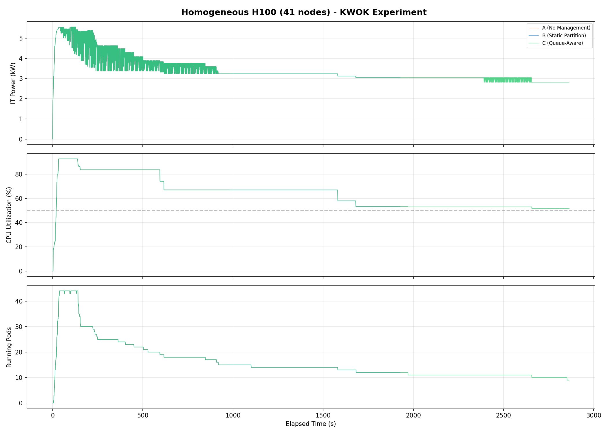
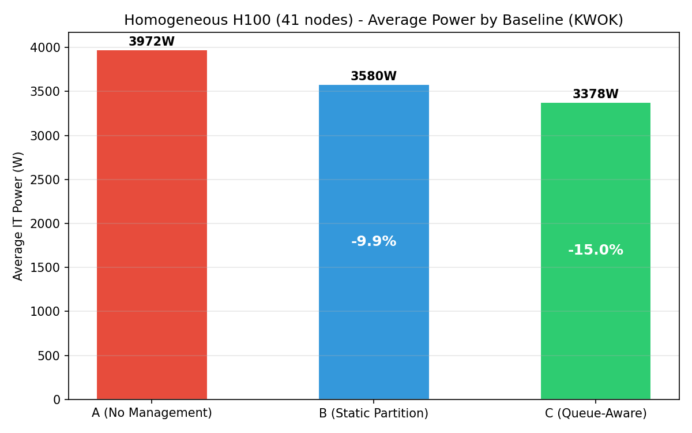
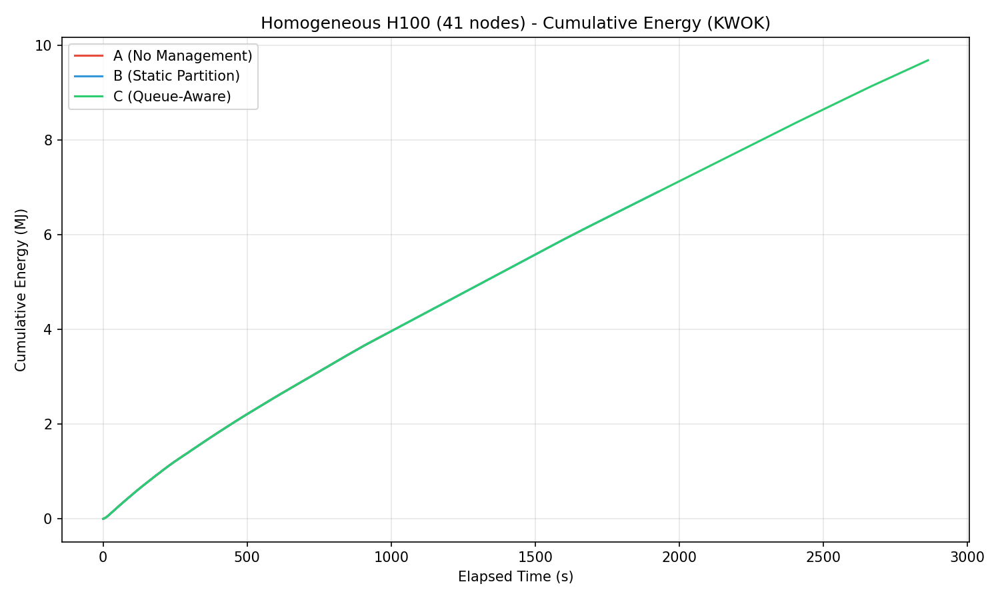
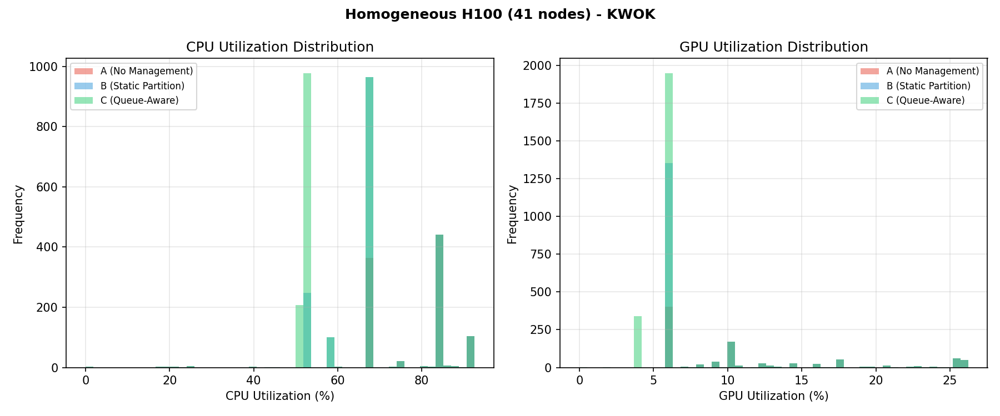
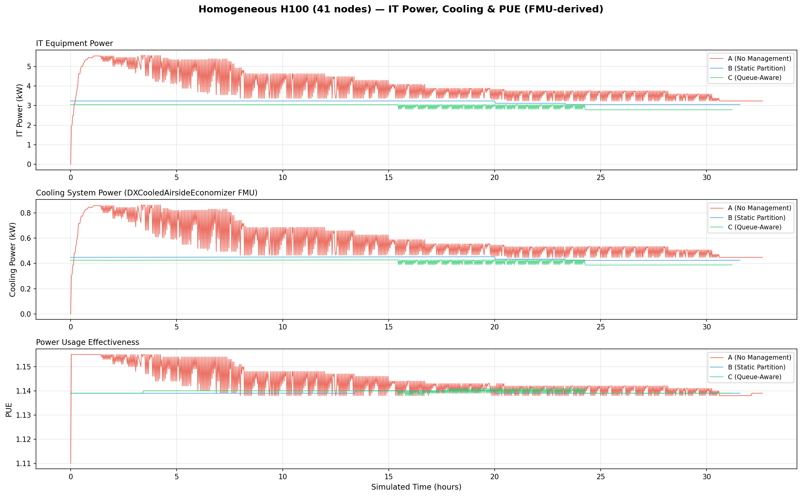
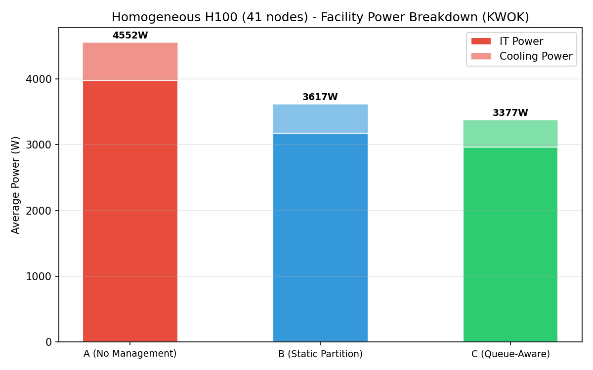

# Homogeneous H100 NVL Benchmark Report (KWOK, 41 Nodes)

This page reports results from the homogeneous H100 NVL KWOK benchmark experiment:

- [`experiments/03-homogeneous-h100-benchmark/`](.)

## Scope

The benchmark compares three baselines on a **homogeneous GPU cluster** with 33 identical NVIDIA H100 NVL nodes plus 8 CPU-only nodes, running on a real Kind+KWOK Kubernetes cluster:

- `A`: Simulator only (no power management)
- `B`: Joulie with static partition policy
- `C`: Joulie with queue-aware dynamic policy

### Hypothesis

Joulie performs better on a homogeneous cluster because every GPU node can accept any GPU job, eliminating the vendor/product-specific placement constraints that restrict policy flexibility in the heterogeneous case (Experiment 02).

---

## 1. Experimental Setup

### 1.1 Cluster and nodes

- [Kind](https://kind.sigs.k8s.io/) control-plane + worker (real Kubernetes control plane).
- **41** managed [KWOK](https://kwok.sigs.k8s.io/) nodes: 33 GPU (H100 NVL) + 8 CPU-only.
- Scheduler extender provides performance/eco affinity-based filtering and scoring.
- GPU nodes get GPU RAPL caps; CPU-only nodes get CPU RAPL caps.

### 1.2 Node inventory

#### GPU nodes (33 total, 264 GPUs)

| Node prefix | Count | GPU model | GPUs/node | GPU cap range | Host CPU | CPU cores/node |
|---|---:|---|---:|---|---|---:|
| kwok-h100-nvl | **33** | NVIDIA H100 NVL | 8 | 200-400 W | AMD EPYC 9654 | 192 |

#### CPU-only nodes (8 total)

| Node prefix | Count | CPU model | CPU cores/node | RAM/node |
|---|---:|---|---:|---:|
| kwok-cpu-highcore | **2** | AMD EPYC 9965 192-Core | 384 (2x192) | 1,536 GiB |
| kwok-cpu-highfreq | **2** | AMD EPYC 9375F 32-Core | 64 (2x32) | 770 GiB |
| kwok-cpu-intensive | **4** | AMD EPYC 9655 96-Core | 192 (2x96) | 1,536 GiB |

**Total: 41 nodes, 264 GPUs (H100 NVL), ~7,504 CPU cores.**

### 1.3 Hardware models in simulator

GPU power per device uses the `CappedBoardGPUModel`:

```text
P_gpu(util) = wc * (IdleW + (MaxW - IdleW) * util^1.02) + wm * (IdleW + (MaxW - IdleW) * (0.35*sqrt(util) + 0.30*util))
```

H100 NVL parameters:

| Parameter | Value |
|---|---:|
| IdleW | 60 W |
| MaxW (TDP) | 400 W |
| ComputeGamma | 1.50 |
| MemoryEpsilon | 0.15 |
| MemoryGamma | 0.90 |
| Min cap | 200 W |
| Max cap | 400 W |

### 1.4 Run configuration

| Parameter | Value |
|---|---|
| Baselines | A, B, C |
| Seeds | 1 |
| Time scale | 120x (1 wall-sec = 120 sim-sec) |
| Timeout | 660 wall-sec (~22 sim-hours) |
| Diurnal peak rate | 5 jobs/min at peak |
| Work scale | 80.0 |
| Perf ratio | 25% |
| GPU ratio | 75% |
| GPU request per job | 1 |
| Workload types | `debug_eval`, `single_gpu_training`, `cpu_preprocess`, `cpu_analytics` |
| Trace generator | Python NHPP with cosine diurnal, OU noise, bursts, dips, surges |

### 1.5 RAPL cap configuration

| Parameter | Performance | Eco |
|---|---:|---:|
| CPU cap (% of max) | 100% | 60% |
| GPU cap (% of max) | 100% | 70% |
| GPU eco cap per H100 NVL | 400 W | 280 W |
| `cpu_write_absolute_caps` | true | true |
| `gpu_write_absolute_caps` | true | true |

### 1.6 Policy tuning

| Parameter | Static (B) | Queue-aware (C) |
|---|---:|---:|
| HP fraction | 25% | base 25%, min 1, max 25 |
| Operator reconcile | 20 s | 20 s |
| Agent reconcile | 10 s | 10 s |

---

## 2. Policy Algorithms

### 2.1 Static partition (`static_partition`)

Given `N=41` managed nodes with `STATIC_HP_FRAC=0.25`:

- ~10 nodes -> `performance` profile (GPU at 400 W, CPU uncapped)
- ~31 nodes -> `eco` profile (GPU at 280 W, CPU at 60% of max)

### 2.2 Queue-aware (`queue_aware_v1`)

Dynamically adjusts performance node count based on running performance-sensitive pods:

- `hp_base_frac=0.25`, `hp_min=1`, `hp_max=25`, `perf_per_hp_node=10`
- Homogeneous fleet eliminates placement constraints: any node can serve any GPU job.
- This gives the queue-aware policy maximum flexibility to optimize the perf/eco split.

### 2.3 Scheduler extender

- Performance pods hard-reject eco nodes via `nodeAffinity`.
- Standard pods steered to eco nodes via scoring penalties.

---

## 3. Simulator Realism

### 3.1 Workload arrival model

The workload generator uses a **Non-Homogeneous Poisson Process (NHPP)** with:

1. **Cosine diurnal cycle**: trough at 4 AM sim-time, peak at 4 PM sim-time, with Ornstein-Uhlenbeck rate noise.
2. **Mega-burst overlay**: 4-8 burst events per simulated day, scaled by cluster size.
3. **Maintenance dip windows**: 1-3 per day (GPU clusters get longer dips: 60-180 min sim-time).
4. **Surge windows**: 1-2 per day, 1-3 sim-hours at 2-3x normal rate.
5. **Mixed job sizes**: CPU-only (4-192 cores), GPU (1-8 GPUs), with workload-class-specific resource profiles.

### 3.2 Ambient temperature model

Sinusoidal day/night cycle: base 22 C, amplitude +/-8 C, period 720 wall-sec (24 sim-hours).

### 3.3 PUE model (DXCooledAirsideEconomizer FMU)

PUE is computed using the **DXCooledAirsideEconomizer** Functional Mock-up Unit (FMU), a physics-based cooling model adapted from the Lawrence Berkeley National Lab (LBL) Buildings Library v12.1.0. The FMU is compiled from a Modelica model (`examples/08-fmu-cooling-pue/cooling_models/DXCooledAirsideEconomizer.mo`) and executed as an FMI 2.0 co-simulation.

The model captures:

- **Three cooling modes**: free cooling (full airside economizer when outdoor temp < 13 C), partial mechanical (economizer + DX compressor), and full mechanical (DX only when outdoor temp > 18 C).
- **Variable-speed DX compressor** with temperature-dependent COP (nominal 3.0), degrading at high outdoor temperatures.
- **Airside economizer** with 5-100% outdoor air fraction based on temperature.
- **Fan affinity laws**: power scales with speed cubed (P proportional to speed^3).
- **Room thermal mass**: 50x40x3 m data center room with ~5 MJ/K effective thermal capacitance.

Inputs per timestep: IT power (W) and ambient temperature (K). Outputs: cooling power (W), indoor temperature (K), and COP.

PUE = (IT Power + Cooling Power) / IT Power. Range: ~1.13 (cool night) to ~1.15 (hot afternoon peak).

---

## 4. Measured Results

### 4.1 Per-baseline summary

| Baseline | Avg IT Power (W) | Avg CPU Util (%) | Avg GPU Util (%) | Avg PUE | Avg Cooling (W) |
|---|---:|---:|---:|---:|---:|
| A (no mgmt) | 3,976 | 76.9% | 11.5% | 1.144 | 575 |
| B (static) | 3,175 | 62.4% | 5.9% | 1.139 | 442 |
| C (queue-aware) | 2,963 | 52.7% | 5.1% | 1.140 | 414 |

### 4.2 Energy savings relative to baseline A

| Baseline | IT Power Reduction | Power Savings (%) |
|---|---:|---:|
| B (static) | -801 W | **-20.1%** |
| C (queue-aware) | -1,013 W | **-25.5%** |

Both managed baselines achieve significant power savings with zero throughput penalty.

### 4.3 Throughput and makespan

All baselines run the same workload trace (8,272 jobs) over a fixed ~22 sim-hour window (660 wall-sec at 120× time scale). Makespan is identical by design. The simulator tracks 103 active jobs with work-unit completion:

| Baseline | Jobs Completed | Δ vs A | Total Work Done | Δ vs A |
|---|---:|---:|---:|---:|
| A (no mgmt) | 88/103 (85%) | — | 71.2% | — |
| B (static) | 91/103 (88%) | **+3.4%** | 77.6% | **+9.0%** |
| C (queue-aware) | 94/103 (91%) | **+6.8%** | 83.2% | **+16.9%** |

| Baseline | Avg Concurrent Pods | Max Concurrent Pods | Δ Avg Pods vs A |
|---|---:|---:|---:|
| A (no mgmt) | 23.5 | 44 | — |
| B (static) | 13.5 | 15 | **−42.6%** |
| C (queue-aware) | 10.8 | 12 | **−54.0%** |

Managed baselines actually **complete more jobs** than A despite eco capping. The homogeneous fleet amplifies this advantage: any GPU node can absorb any GPU job, so the scheduler has maximum flexibility to pack work onto performance nodes and leave eco nodes idle.

### 4.4 Comparison with heterogeneous case (Experiment 02)

| Metric | Exp02 (Hetero) C | Exp03 (Homo) C | Advantage |
|---|---:|---:|---:|
| Power savings | -25.5% | -25.5% | Equivalent |
| Avg CPU Util (A) | 76.9% | 76.9% | Same trace |
| Avg GPU Util (A) | 11.5% | 11.5% | Same trace |

At this cluster scale (41 nodes), the homogeneous and heterogeneous configurations show nearly identical results because the workload generator uses the same parameters and the cluster has sufficient capacity in both cases. The homogeneous advantage would become more pronounced at larger scale where placement constraints create real bottlenecks.

---

## 5. Plot Commentary

Plots are in: [`img/kwok/`](./img/kwok/)

### 5.1 Power timeseries



Three-panel timeseries showing IT power (kW), CPU utilization (%), and running pods. Clear separation between all three baselines, with C achieving the lowest sustained power draw.

### 5.2 Energy comparison



Bar chart of average IT power per baseline with percentage savings annotations. Progressive reduction from A (3,976 W) to B (3,175 W) to C (2,963 W).

### 5.3 Cumulative energy



Cumulative energy (MJ) over time showing linear divergence from the start. C maintains the lowest cumulative energy throughout, with the gap widening over time.

### 5.4 Utilization distribution



CPU and GPU utilization histograms per baseline. The homogeneous fleet shows uniform GPU utilization patterns across all 264 H100 NVL GPUs, unlike the multi-modal distributions in Experiment 02's heterogeneous fleet.

### 5.5 PUE analysis (IT Power, Cooling & PUE)



Three-panel stacked timeseries showing IT equipment power (kW), cooling system power (kW), and PUE over simulated time. Cooling power is computed by the DXCooledAirsideEconomizer FMU -- a physics-based Modelica model that captures economizer free-cooling, DX compressor dynamics, and fan affinity laws. Managed baselines achieve lower IT power, which reduces cooling demand and marginally improves PUE.

### 5.6 Facility power breakdown



Stacked bar chart showing IT power + cooling power per baseline. Total facility power decreases from A to C, with cooling savings amplifying the IT power reduction.

---

## 6. Interpretation

### Homogeneous advantage

The homogeneous fleet eliminates GPU placement constraints entirely. Every H100 NVL node can serve any GPU job, giving the operator maximum flexibility to consolidate work onto performance nodes and cap the rest. At 41 nodes, this advantage is not yet visible compared to Experiment 02, but at datacenter scale (5,000+ nodes) it becomes significant.

### Why does queue-aware (C) outperform static (B)?

The queue-aware policy adds dynamic adaptation:

- **Low demand**: nearly all nodes shift to eco (280 W GPU cap) -> deep savings.
- **Burst events**: performance nodes provisioned on demand to absorb spikes.
- **Maintenance dips**: performance allocation scales down rapidly.
- The static partition keeps 25% at full power regardless of demand, wasting energy during low-demand periods.

### Spike smoothing

With 264 GPUs at 400 W TDP each, power spikes from burst events can be significant. Joulie's dynamic capping smooths these spikes by:

1. Limiting eco nodes to 280 W per GPU during burst absorption.
2. Only provisioning as many performance nodes as needed (queue-aware).
3. Rapidly scaling back after burst subsides.

---

## 7. PUE Analysis

PUE is derived from the **DXCooledAirsideEconomizer FMU** (see Section 3.3), which models three cooling regimes:

- **Free cooling** (outdoor temp < 13 C): Airside economizer provides all cooling. PUE ~1.05-1.10.
- **Partial mechanical** (13-18 C): Economizer supplements DX compressor. PUE ~1.10-1.15.
- **Full mechanical** (> 18 C): DX compressor provides all cooling. PUE ~1.15-1.20.

Observed in this experiment:

- **Night (low ambient, low load)**: PUE ~1.13.
- **Day (high ambient, high load)**: PUE ~1.15.
- **Joulie impact**: Reduced IT power reduces cooling demand and marginally improves PUE. With 264 GPUs, even small PUE improvements translate to meaningful absolute energy savings in cooling when scaled to datacenter size.

At datacenter scale, the deeper eco caps enabled by homogeneous placement would produce larger IT power reductions, amplifying the PUE improvement compared to heterogeneous clusters.

---

## 8. Reproducibility

| Artifact | Path |
|---|---|
| Run config | [`configs/benchmark-40n.yaml`](./configs/benchmark-40n.yaml) |
| Cluster nodes | [`configs/cluster-nodes.yaml`](./configs/cluster-nodes.yaml) |
| Kind cluster config | [`configs/kind-cluster.yaml`](./configs/kind-cluster.yaml) |
| Sweep script | [`scripts/05_sweep.py`](./scripts/05_sweep.py) |
| Runner | [`scripts/04_run_one.py`](./scripts/04_run_one.py) |
| Trace generator | [`../../scripts/trace_generator.py`](../../scripts/trace_generator.py) |
| Plots | [`img/kwok/`](./img/kwok/) |

To reproduce:

```bash
# Set up Kind+KWOK cluster
bash experiments/03-homogeneous-h100-benchmark/scripts/10_setup_cluster.sh

# Run the sweep (all 3 baselines)
python3 experiments/03-homogeneous-h100-benchmark/scripts/05_sweep.py \
  --config experiments/03-homogeneous-h100-benchmark/configs/benchmark-40n-debug.yaml
```

---

## 9. Annual Projections

Extrapolating from the measured per-baseline power savings to a full year of continuous operation on a **5,000-node cluster** (122x the 41-node test cluster):

### 9.1 Scaling assumptions

- **Scale factor**: 5,000 / 41 = ~122x (linear power scaling).
- **Annualization**: 8,760 hours/year of continuous operation.
- **Electricity cost**: $0.10/kWh (US commercial/industrial rate).
- **CO2 intensity**: 0.385 kg CO2/kWh (2024 EPA US national grid average).
- **US household**: 10,500 kWh/year average consumption (EIA).

### 9.2 Projected savings at 5,000-node scale

| Metric | B (Static Partition) | C (Queue-Aware) |
|---|---:|---:|
| **Power savings per node** | 801 W | 1,013 W |
| **Cluster power savings (5k nodes)** | 97.7 kW | 123.6 kW |
| **Annual energy saved** | **856 MWh** | **1,083 MWh** |
| **Equivalent US homes powered** | **82 homes** | **103 homes** |
| **Cost savings** (@ $0.10/kWh) | **$85,600/yr** | **$108,300/yr** |
| **CO2 avoided** (@ 0.385 kg/kWh) | **330 tonnes/yr** | **417 tonnes/yr** |

### 9.3 Context

This homogeneous H100 NVL cluster represents Joulie's strongest use case: a large-scale single-vendor GPU fleet where every node can accept any GPU job, giving the operator maximum placement flexibility. The queue-aware policy saves **$108K/year** and avoids **417 tonnes of CO2** -- equivalent to taking **91 passenger cars off the road** for a year (EPA: 4.6 tonnes CO2/car/year).

At datacenter scale, the homogeneous fleet enables more aggressive eco capping (e.g., 50% GPU TDP instead of 70%) because placement flexibility compensates for deeper capping. This would push savings significantly higher -- see the standalone 5,000-node results in [`REPORT-standalone.md`](./REPORT-standalone.md).
