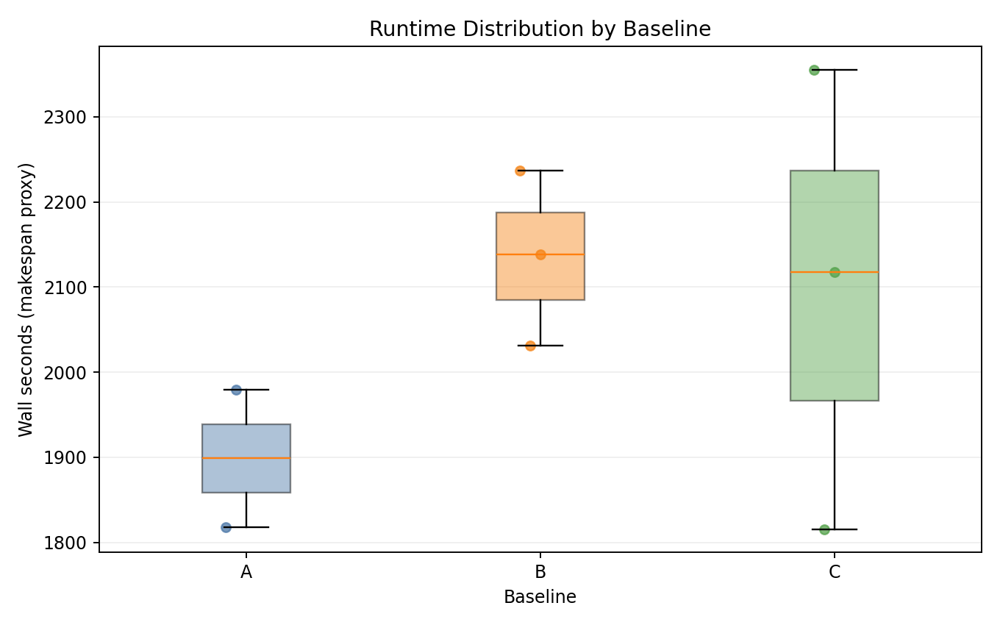
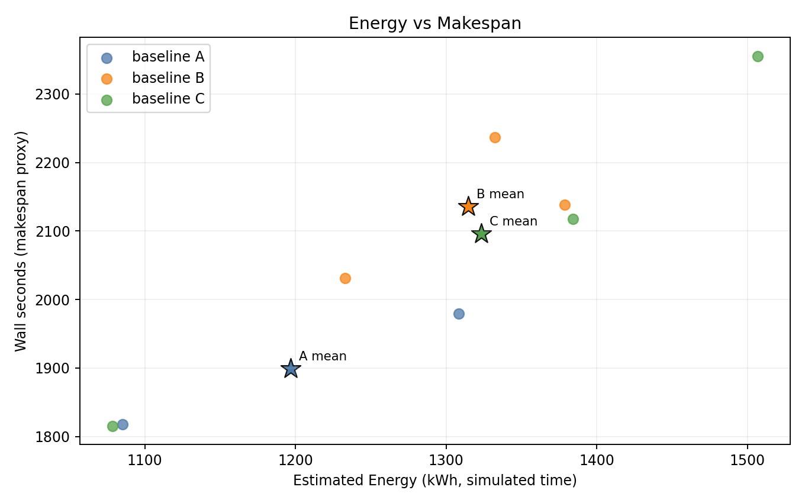
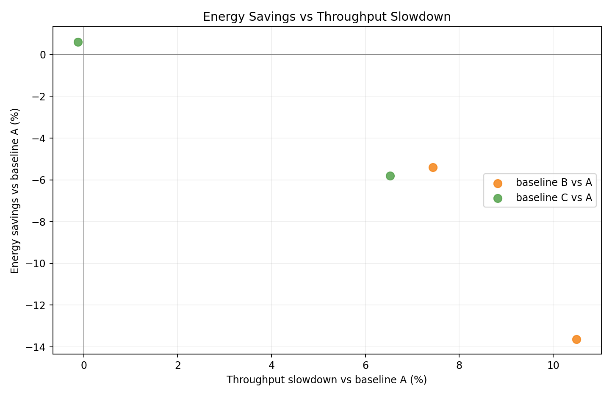
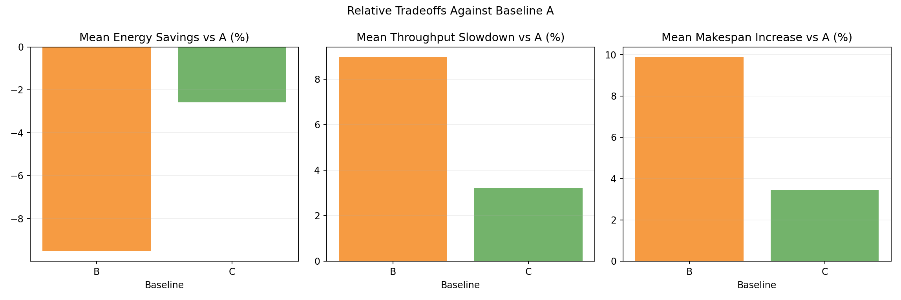
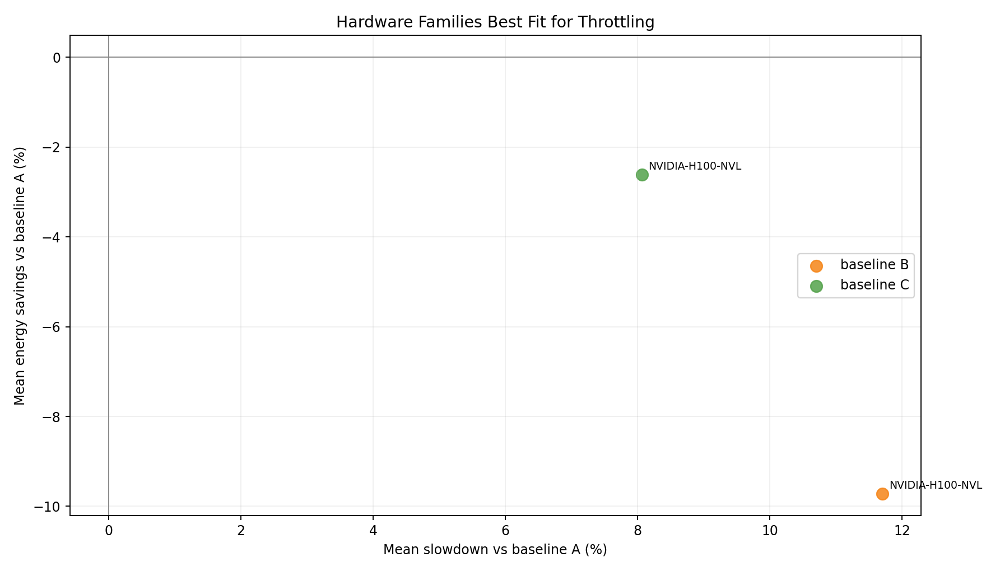
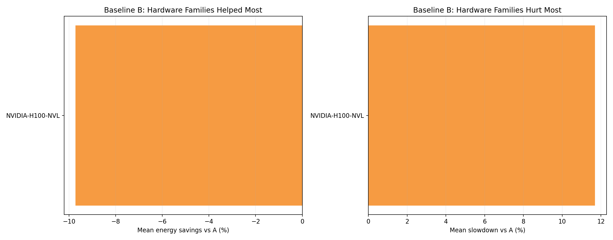
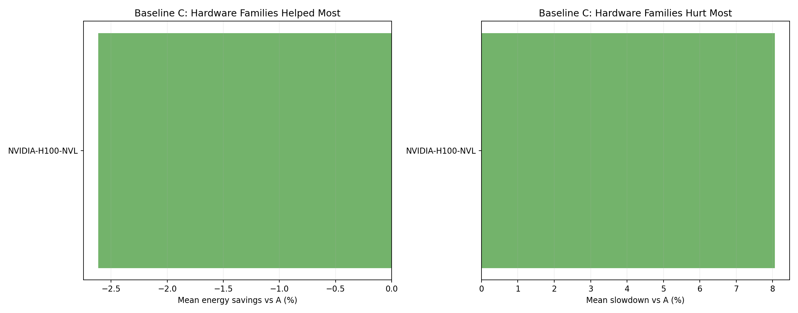
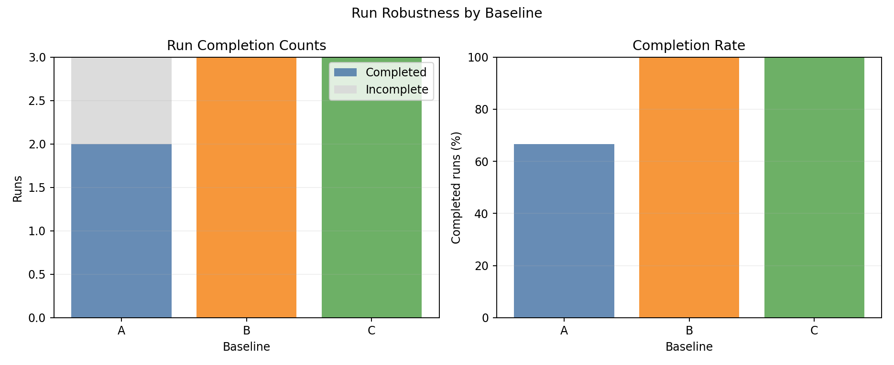

# Homogeneous H100 NVL Benchmark Report

## Scope

This report documents the benchmark results from:

- [`experiments/03-homogeneous-h100-benchmark/`](.)

It covers: experimental setup, controller policy algorithms, simulator models, measured outcomes, plot commentary, and interpretation.

---

## 1. Experimental Setup

### 1.1 Cluster and node topology

- Kind control-plane + worker (real Kubernetes control path).
- 41 fake KWOK worker nodes labeled `joulie.io/managed=true`.
- KWOK nodes are tainted `kwok.x-k8s.io/node=fake:NoSchedule`.
- Simulator pod runs on the real kind worker.
- Workload pods target KWOK nodes via nodeSelector + toleration.

Node inventory source: [`configs/cluster-nodes.yaml`](./configs/cluster-nodes.yaml)

### 1.2 Node inventory - detailed cluster composition

This is a **homogeneous GPU cluster** where all GPU nodes are NVIDIA H100 NVL - the same count as the GPU nodes in experiment 02, enabling a direct heterogeneous vs homogeneous comparison. CPU-only nodes are identical to experiment 02.

#### GPU nodes (33 total, 264 GPUs)

| Node prefix | Replicas | GPU model | GPUs/node | GPU TDP / cap range | Host CPU | CPU cores/node | RAM/node |
|---|---:|---|---:|---|---|---:|---:|
| kwok-h100-nvl | **33** | NVIDIA H100 NVL | 8 | 400 W / 200–400 W | AMD EPYC 9654 96-Core | 192 | 1536 GiB |

All 33 GPU nodes are identical, so any GPU job can be scheduled on any GPU node without hardware-family constraints.

#### CPU-only nodes (8 total) - identical to experiment 02

| Node prefix | Replicas | CPU model | CPU cores/node | RAM/node |
|---|---:|---|---:|---:|
| kwok-cpu-highcore | **2** | AMD EPYC 9965 192-Core | 384 (2×192) | 1536 GiB |
| kwok-cpu-highfreq | **2** | AMD EPYC 9375F 32-Core | 64 (2×32) | 770 GiB |
| kwok-cpu-intensive | **4** | AMD EPYC 9655 96-Core | 192 (2×96) | 1536 GiB |

#### Cluster totals

| Metric | Value |
|---|---|
| Total nodes | **41** |
| GPU nodes | 33 (all H100 NVL) |
| CPU-only nodes | 8 |
| Total GPUs | **264** (all NVIDIA H100 NVL) |
| Total CPU cores | ~7104 |

**Comparison to experiment 02**: both experiments have 41 nodes and 33 GPU nodes, but exp 03 has 264 GPUs vs exp 02's 188 GPUs (because H100 NVL has 8 GPUs/node and replaces lower-density nodes). Average GPU idle power is lower in exp 03 (80 W × 264 = 21.1 kW base floor vs exp 02's mixed-family floor).

### 1.3 Hardware model parameters (simulator)

All GPU nodes use a single hardware family:

| GPU family | IdleW (W) | PeakW (W) | computeGamma | Notes |
|---|---:|---:|---:|---|
| NVIDIA H100 NVL | 80 | 400 | 1.50 | Same parameters as exp 02 H100 NVL nodes |

At 80% GPU cap: loses `1 - 0.8^(1/1.50) ≈ 13.5%` GPU throughput.

**CPU→GPU feed coupling**: same `cpuFeedFactor` mechanism as experiment 02. For `single_gpu_training` with `cpuFeedIntensity ≈ 0.4`, a 20% CPU frequency reduction causes ~8–11% GPU slowdown.

**CPU-only node power parameters**: same as experiment 01 and 02.

### 1.4 Run configuration

From [`configs/benchmark-overnight.yaml`](./configs/benchmark-overnight.yaml) (used for run `0002`):

| Parameter | Value |
|---|---|
| Baselines | A, B, C |
| Seeds | 3 |
| Mean inter-arrival | 0.12 s |
| Time scale | 60× |
| Timeout per run | 14400 s |
| Perf ratio | 15% |
| Eco ratio | 0% |
| GPU ratio | 45% |
| GPU request per job | 1 |
| Work scale | 0.12 |
| Allowed workload types | `debug_eval`, `single_gpu_training`, `distributed_training`, `parameter_server_training`, `cpu_preprocess`, `cpu_analytics` |

> **Note**: `distributed_training` and `parameter_server_training` were present in this run. They have been **removed from all future benchmarks**. See Section 6.

Run configuration is **identical to experiment 02** to enable a direct homogeneous vs heterogeneous comparison.

### 1.5 Baselines

- **A**: simulator only - no Joulie operator or agent.
- **B**: Joulie with `static_partition` policy: `hp_frac=0.45` (~18 of 41 nodes at performance profile).
- **C**: Joulie with `queue_aware_v1` policy: `hp_base_frac=0.50`, `hp_min=2`, `hp_max=10`, `perf_per_hp_node=18`.

Policy caps: `cpu_eco_pct_of_max=80%`, `gpu_eco_pct_of_max=80%`.

---

## 2. Policy Algorithms

Same algorithms as experiments 01 and 02 - see [`experiments/01-cpu-only-benchmark/REPORT.md`](../01-cpu-only-benchmark/REPORT.md) Section 2 for full description.

Key parameters: static assigns 18 of 41 nodes as performance; queue-aware adjusts between 2 and 10 HP nodes dynamically.

---

## 3. Simulator Algorithms

### 3.1 GPU power model

Same as experiment 02 (Section 3):

```
P_gpu(g) = IdleW + (PeakW - IdleW) * g^computeGamma
throughputFraction = (capWatts / PeakW)^(1/computeGamma)
```

With H100 NVL being the only GPU family, `γ=1.50` uniformly.

### 3.2 Energy integration

```
E_node += (P_cpu + sum(P_gpu_i)) * dt
energy_sim_kwh = totalJoules * 60 / 3_600_000
```

H100 NVL idle floor: **80 W/GPU × 264 GPUs = 21,120 W** (base cluster power floor even with no GPU jobs running).

### 3.3 CPU→GPU feed coupling

Same `cpuFeedFactor` as experiment 02. With only H100 NVL nodes (all having `γ=1.50`), the effect is uniform across all GPU nodes - unlike experiment 02 where MI300X experienced larger capping sensitivity.

---

## 4. Measured Results

Latest run: `runs/0002_20260315T184058Z_u64d8368253f4484ca21f4d5f33faf78d`
Source: [`runs/latest/results/summary.csv`](./runs/latest/results/summary.csv)

### 4.1 Per-seed results

| Baseline | Seed | Wall (s) | Throughput (jobs/sim-hr) | Energy (kWh sim) | Avg power (W) | Status |
|---|---:|---:|---:|---:|---:|---|
| A | 1 | 14515 | 11.25 | - | - | **INCOMPLETE** (gang deadlock) |
| A | 2 | 1817.9 | 91.85 | 1085.08 | 35813 | completed |
| A | 3 | 1979.5 | 83.41 | 1308.35 | 39656 | completed |
| B | 1 | 2237.0 | 72.98 | 1332.40 | 35738 | completed |
| B | 2 | 2031.0 | 82.21 | 1232.98 | 36424 | completed |
| B | 3 | 2138.6 | 77.21 | 1378.89 | 38686 | completed |
| C | 1 | 2355.3 | 69.32 | 1506.83 | 38386 | completed |
| C | 2 | 1815.6 | 91.97 | 1078.41 | 35637 | completed |
| C | 3 | 2117.7 | 77.97 | 1384.26 | 39220 | completed |

### 4.2 Baseline means (seeds 2+3 for A, all 3 seeds for B and C)

| Baseline | Mean wall (s) | Mean throughput (jobs/sim-hr) | Mean energy (kWh sim) | Mean power (W) | Completed seeds |
|---|---:|---:|---:|---:|---|
| A | 1898.7 | 87.63 | 1196.72 | 37735 | 2, 3 |
| B | 2135.5 | 77.47 | 1314.76 | 36949 | 1, 2, 3 |
| C | 2096.2 | 79.75 | 1323.17 | 37748 | 1, 2, 3 |

### 4.3 Relative to A (seeds 2+3 fair comparison)

| Baseline | Energy Δ | Throughput Δ | Verdict |
|---|---:|---:|---|
| B | **+9.1%** | −8.9% | significantly more energy, lower throughput |
| C | **+2.9%** | −3.1% | modest energy regression, slight throughput loss |

The energy regression is stronger here than in experiment 02. This is explained in Section 8.

---

## 5. Hardware Energy Breakdown

With a single GPU family (H100 NVL), the energy breakdown is simpler than experiment 02.

Representative per-hardware-family energy, baseline A, seed 2:

| Hardware family | Energy (kWh sim) | Approx share |
|---|---:|---:|
| NVIDIA H100 NVL | 17.61 | ~97% |
| AMD EPYC 9965 (cpu-highcore) | 0.094 | <1% |
| AMD EPYC 9375F (cpu-highfreq) | 0.177 | <1% |
| AMD EPYC 9655 (cpu-intensive) | 0.207 | <1% |
| **Total** | **~18.1** | - |

GPU energy dominates at >97%. CPU-only nodes contribute negligible total energy. This reinforces why CPU power capping has essentially no benefit - and significant cost via GPU slowdown - on this cluster type.

---

## 6. Gang Scheduling Deadlock (Seed 1, Baseline A)

Baseline A timed out at 14515 s in seed 1, with 1796 pods stuck in `Running` state.

**Root cause**: identical to experiment 02 - multi-pod jobs (`distributed_training`, `parameter_server_training`) cause circular partial allocation without a gang scheduler. See experiment 02 REPORT Section 6 for full explanation.

**Key difference from experiment 02**: Baselines B and C both completed seed 1 in this homogeneous cluster. In experiment 02, both A and B failed seed 1. The homogeneous cluster provides more scheduling flexibility (no hardware-family constraints on GPU placement), making it easier for Joulie's policy to break the partial-allocation deadlock through profile transitions.

**Resolution**: Multi-pod job types removed from all future benchmarks.

---

## 7. Plot Commentary

Plots are in: [`img/`](./img/)

### 7.1 Runtime distribution



- B and C are consistently slower than A in completed seeds (higher wall time = slower throughput due to CPU throttling extending GPU jobs).
- C shows high variance in seed 1 (longest run: 2355 s) vs seed 2 (fastest: 1816 s).

### 7.2 Energy vs makespan



- B and C are shifted to higher energy and higher wall time vs A - the energy regression is clearly visible.
- A (seeds 2+3) is consistently the most energy-efficient baseline.

### 7.3 Baseline means


- Wall-time and throughput bars clearly separate: B and C are slower than A.
- Energy bars confirm B (+9.1%) and C (+2.9%) both regress vs A.

### 7.4 Relative tradeoff vs A



- Per-seed scatter of energy vs throughput delta relative to A.
- B seeds cluster at high energy / low throughput; C seeds show more spread but better outcomes.

### 7.5 Relative tradeoff bars vs A



- Mean energy Δ% and throughput Δ% for B (+9.1% / -8.9%) and C (+2.9% / -3.1%) vs A.
- C's queue-aware adaptivity substantially reduces the energy regression vs static partition B.

### 7.6 Hardware family tradeoff vs A



- Single GPU family; the tradeoff curve shows B and C both above A in energy.
- The energy cost of extended GPU job duration outweighs any CPU cap savings.

### 7.7 Hardware family rankings - baseline B



- H100 NVL is the only GPU family. Under B, it shows clear energy increase and throughput loss vs A.

### 7.8 Hardware family rankings - baseline C



- C shows smaller H100 NVL energy regression than B, confirming queue-aware adaptivity reduces idle accumulation.

### 7.9 Completion summary



- B and C achieve 100% completion vs A's 66.7% (1 seed gang deadlock).
- Unlike experiment 02, only A fails here - homogeneous scheduling flexibility helps B/C break deadlock.

---

## 8. Interpretation

### Why does Joulie increase energy more here than in experiment 02?

The energy regression is larger in exp 03 (B: +9.1%) than exp 02 (B: +1.8%) for the same reason, amplified:

1. **All GPU nodes are H100 NVL (higher idle power)**: 264 × 80 W idle = 21,120 W base floor vs exp 02's mixed ~15,000 W GPU idle floor. Any extension of job duration accumulates more absolute idle energy.

2. **More GPUs affected by CPU throttling**: With 264 GPUs vs 188, and all of them having the same parameters, the `cpuFeedFactor` penalty applies uniformly at scale. There are no lower-sensitivity GPU families to dilute the effect (unlike exp 02's MI300X/W7900 mix).

3. **CPU energy savings remain small**: CPU-only nodes represent <3% of cluster energy. Capping them saves at most ~0.06 kWh sim per run. Meanwhile, extending each GPU job by 10% adds ~120 kWh sim of idle GPU energy.

### Why does C outperform B significantly?

In exp 03, C achieves +2.9% vs B's +9.1% energy increase:

- Queue-aware adapts HP node count dynamically - it reduces eco nodes when GPU-heavy jobs are running, effectively returning more nodes to full-frequency performance mode.
- Static partition maintains 23 eco nodes throughout, throttling CPU on those nodes for the entire run duration regardless of actual workload composition.
- This experiment shows that queue-aware adaptivity meaningfully matters on large GPU clusters where the duration extension penalty is severe.

### Homogeneous vs heterogeneous: which is better for Joulie?

The homogeneous cluster gives Joulie more scheduling flexibility (no GPU family constraints), which explains why B and C complete seed 1 here while both fail in exp 02. However, the energy outcomes are worse for the same reason: the uniform H100 NVL energy model at scale amplifies the CPU-throttling duration penalty more than the heterogeneous mix.

### Key finding

**The CPU-capping approach is counterproductive on GPU-dominated homogeneous clusters.** The energy overhead from extended GPU job duration (via `cpuFeedFactor`) significantly outweighs any CPU power savings. The correct approach for H100 NVL clusters is GPU power cap control, not CPU frequency reduction, and only applied when the GPU throughput loss is less than the idle energy avoided.

---

## 9. Best-Fit Use Case

From this experiment:

- Joulie with current uniform CPU cap policy **increases energy by 2.9–9.1%** on homogeneous H100 NVL clusters.
- `queue_aware_v1` is significantly better than `static_partition` on this cluster type - but both are worse than doing nothing (A).
- The correct next step is GPU-cap-aware policy that does not throttle CPU on GPU nodes.

---

## 10. Reproducibility

- Config: [`configs/benchmark-overnight.yaml`](./configs/benchmark-overnight.yaml)
- Sweep script: [`scripts/05_sweep.py`](./scripts/05_sweep.py)
- Collection: [`scripts/06_collect.py`](./scripts/06_collect.py)
- Plotting: [`scripts/07_plot.py`](./scripts/07_plot.py)
- Run artifacts: [`runs/latest/`](./runs/latest/)
- Archived results (with gang jobs): [`../../tmp/benchmark-results-with-gang-jobs/exp03-homogeneous-h100/`](../../tmp/benchmark-results-with-gang-jobs/exp03-homogeneous-h100/)
