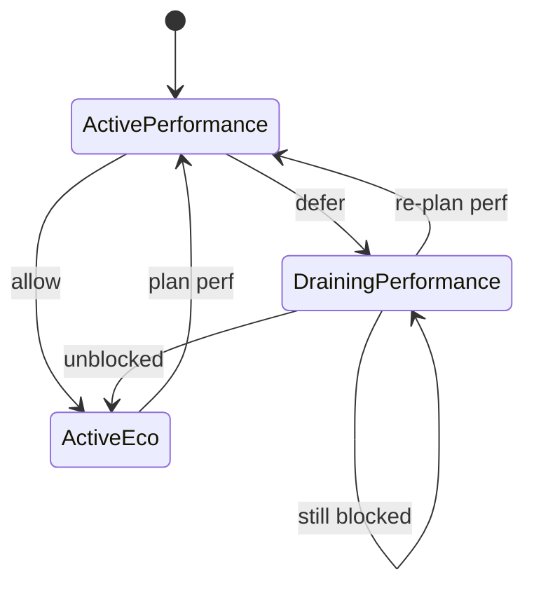

The agent is Joulie's node-side enforcement component.

It consumes desired state and applies node-local controls through configured backends.

If the operator decides "this node should now behave like eco" or "this node should stay performance",
the agent is the component that turns that intent into concrete control actions.

## Responsibilities

At each reconcile tick, the agent:

1. identifies its node scope (single node in daemonset mode, sharded set in pool mode),
2. discovers local CPU/GPU hardware and runtime control capability,
3. publishes `NodeHardware` for each owned node,
4. reads desired target (`NodeTwin.spec`) for each owned node,
5. resolves telemetry/control backend from environment variables (default: host),
6. applies controls (host or HTTP),
7. exports metrics and status.

## Inputs and outputs

Inputs:

- `NodeTwin.spec` for desired profile/cap
- environment variables for backend selection (`TELEMETRY_CPU_SOURCE`, `TELEMETRY_CPU_CONTROL`, etc.; default: host)
- node capability hints (for example NFD labels)

Outputs:

- `NodeHardware` for discovered hardware/capability publication
- control actions on host interfaces or simulator HTTP
- status updates (`NodeTwin.status.controlStatus`)
- Prometheus metrics (`/metrics`)

This makes the agent the node-side discovery and execution layer of the architecture: it does not plan global policy, but it does publish the hardware facts the operator needs to plan against.

`NodeHardware` is automatic output, not a user-authored input.
Users normally configure:

- hardware identity through node labels,
- telemetry/control backends through environment variables,
- desired targets through `NodeTwin.spec`.

## Runtime modes

- `daemonset`:
  - one pod per selected real node
  - intended for real-hardware enforcement
- `pool`:
  - one pod controls multiple logical nodes (sharded)
  - intended for KWOK/simulator scale runs

Both modes should use the same managed-node selector contract (`joulie.io/managed=true`).
In practice, pool mode enforces this through `POOL_NODE_SELECTOR`, and DaemonSet mode is restricted by default with `agent.daemonset.nodeSelector.joulie.io/managed=true`.

### K8s API client tuning

The agent and operator use elevated Kubernetes API client rate limits (QPS=50, Burst=100) to ensure timely reconciliation in large clusters. The default Go client limits (QPS=5, Burst=10) can cause the agent pool to process only a fraction of its managed nodes per reconcile cycle, preventing eco caps from being applied on time.

Detailed deployment/runtime configuration is documented in:

- [Agent Runtime Modes]()

## Enforcement behavior

The agent does not choose cluster policy.
It enforces operator intent and reports what happened:

- `applied`
- `blocked`
- `error`

This separation keeps policy logic centralized in the operator and actuator logic localized in the agent.

## CPU enforcement algorithm

The agent enforces CPU power intent with this backend order:

1. Resolve desired CPU cap:
   - use `packagePowerCapWatts` when present,
   - otherwise try to resolve `packagePowerCapPctOfMax` to watts from node-local cap range.
2. If watts are available, try RAPL first (`rapl.set_power_cap_watts` via HTTP control backend, or host RAPL files).
3. If RAPL is unavailable/fails, switch to DVFS fallback controller.
4. If percentage intent cannot be resolved to watts, apply a DVFS percent fallback path (`dvfs.set_throttle_pct`) when available.
5. If RAPL becomes available again later, restore DVFS throttle and return to RAPL mode.

Backend selection is visible in metric `joulie_backend_mode{mode=none|rapl|dvfs}`.

In short, the agent prefers direct power control when it can, and falls back to DVFS when it cannot.

### DVFS fallback control loop

When DVFS fallback is active, each reconcile tick:

1. Read observed package power (from RAPL energy deltas in host mode, or HTTP telemetry source).
2. Apply EMA smoothing:
   - `ema = alpha * observed + (1-alpha) * ema`
3. Compute hysteresis thresholds around desired cap:
   - `upper = cap + DVFS_HIGH_MARGIN_W`
   - `lower = cap - DVFS_LOW_MARGIN_W`
4. Update consecutive counters:
   - `aboveCount` if `ema > upper`
   - `belowCount` if `ema < lower`
5. Only act when counter reaches `DVFS_TRIP_COUNT`:
   - above trip -> increase throttle by `DVFS_STEP_PCT`
   - below trip -> decrease throttle by `DVFS_STEP_PCT`
6. Enforce cooldown:
   - no new action before `DVFS_COOLDOWN` since last action.

This gives both hysteresis and temporal damping, preventing oscillation.

Main tunables:

- `DVFS_EMA_ALPHA`
- `DVFS_HIGH_MARGIN_W`
- `DVFS_LOW_MARGIN_W`
- `DVFS_TRIP_COUNT`
- `DVFS_COOLDOWN`
- `DVFS_STEP_PCT`
- `DVFS_MIN_FREQ_KHZ`

### DVFS actuation details

- Host mode:
  - write cpufreq `scaling_max_freq` files.
  - a fraction of CPUs is throttled according to `throttlePct`.
- HTTP mode:
  - send `dvfs.set_throttle_pct` to simulator/backend endpoint.

Throttle state and actions are exported in:

- `joulie_dvfs_throttle_pct`
- `joulie_dvfs_above_trip_count`
- `joulie_dvfs_below_trip_count`
- `joulie_dvfs_actions_total{action=throttle_up|throttle_down}`

## GPU power cap

The agent also supports node-level GPU cap intents:

- resolves `NodeTwin.spec.gpu.powerCap`,
- computes `capWattsPerGpu` from `capPctOfMax` when needed,
- applies `gpu.set_power_cap_watts` via HTTP control backend or host backend,
- writes status in `NodeTwin.status.controlStatus.gpu` with `applied|blocked|error|none`.

Host backends are vendor-aware:

- NVIDIA path (NVIDIA tooling/NVML-compatible power limits),
- AMD path (ROCm SMI power-limit controls).

If backend support is unavailable on a node, the result is reported as `blocked`.

This keeps GPU behavior aligned with CPU behavior:

- intent is still accepted,
- enforcement is attempted through the best available backend,
- failures are reported per node instead of breaking the whole control loop.

## Performance -> eco transition and safeguards

This transition is safety-critical and is split between operator policy logic and agent enforcement.

### Who does what

- Operator:
  - decides whether a node is allowed to downgrade from performance to eco,
  - runs safeguard checks,
  - publishes desired state and scheduler-facing labels accordingly.
- Agent:
  - enforces whatever desired state is currently published for that node,
  - does not bypass safeguards on its own.

### Safeguard goal

Prevent a node from dropping to eco while it still runs workloads that require performance supply.

### Step-by-step transition flow

1. Policy plans `performance -> eco` for node `N`.
2. Operator evaluates safeguard on `N`:
   - classify active pods from workload-class annotations and `WorkloadProfile` matching,
   - detect whether performance pods are still running on `N`.
3. If performance pods are present:
   - operator keeps desired profile as `eco`,
   - operator sets `NodeTwin.status.schedulableClass` to `draining`.
4. Agent reconciles:
   - sees desired profile from `NodeTwin.spec`,
   - enforces the desired eco/performance target through configured backend.
5. On later reconcile ticks, operator re-checks safeguard.
6. When no blocking performance pods remain:
   - operator keeps profile `eco` and sets `NodeTwin.status.schedulableClass` to `eco`.
   - agent continues enforcing desired target on next reconcile.

### Transition FSM (with conditions)

Interpretation:

- `DrainingPerformance` is the operator transition state.
- In `DrainingPerformance`, operator publishes eco as desired state and sets `NodeTwin.status.schedulableClass` to `draining`.
- The scheduler extender reads the `draining` schedulable class and applies a score penalty to avoid placing new workloads on the node.
- Transition to eco occurs when safeguard condition becomes true (`performance pods == 0`).

Transition conditions:

- `defer`: policy plans eco and node still has performance pods (`count > 0`).
- `allow`: policy plans eco and node has no performance pods (`count == 0`).
- `still blocked`: periodic re-check still finds blocking pods (`count > 0`).
- `unblocked`: periodic re-check finds none (`count == 0`), so eco can be committed.
- `re-plan perf` / `plan perf`: policy decision requires performance supply.

### Why this matters

- avoids violating workload placement/intent guarantees mid-flight,
- avoids abrupt performance loss for pods that explicitly require performance nodes,
- keeps transition behavior deterministic and auditable via operator/agent metrics and logs.

Current behavior is defer-until-safe (no forced eviction in this path).

The practical takeaway is that the agent stays simple on purpose:
it continuously enforces the latest published target, while the operator owns the logic for when a target is safe to publish.

For policy-side details, see:

1. [Joulie Operator]()
2. [Policy Algorithms]()

## Next steps

1. [Policy Algorithms]()
2. [Input Telemetry and Actuation Interfaces]()
