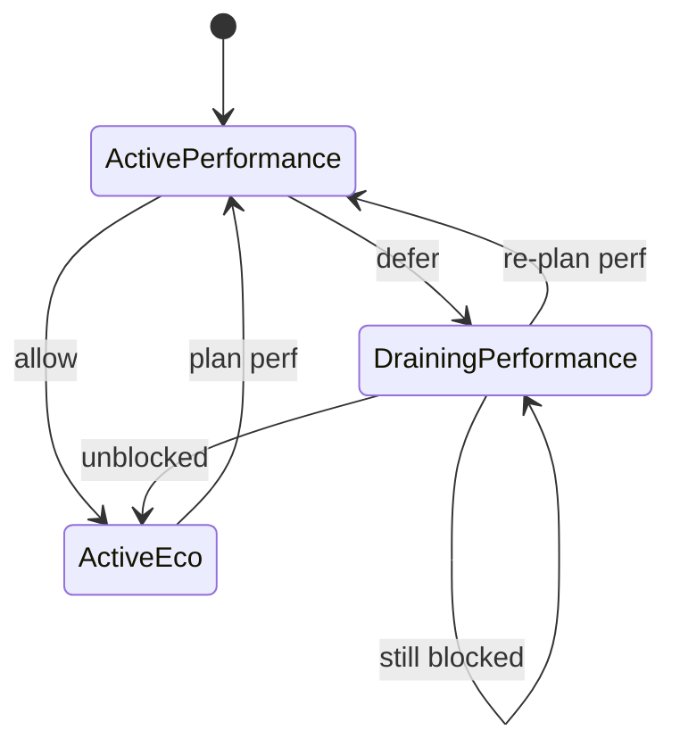

The agent is Joulie's node-side enforcement component.

It consumes desired state and applies node-local controls through configured backends.

## Responsibilities

At each reconcile tick, the agent:

1. identifies its node scope (single node in daemonset mode, sharded set in pool mode),
2. reads desired target (`NodePowerProfile`) for each owned node,
3. reads telemetry/control routing (`TelemetryProfile`),
4. applies controls (host or HTTP),
5. exports metrics and status.

## Inputs and outputs

Inputs:

- `NodePowerProfile` for desired profile/cap
- `TelemetryProfile` for source/control backend selection
- node capability hints (for example NFD labels)

Outputs:

- control actions on host interfaces or simulator HTTP
- status updates (`TelemetryProfile.status.control`)
- Prometheus metrics (`/metrics`)

## Runtime modes

- `daemonset`:
  - one pod per selected real node
  - intended for real-hardware enforcement
- `pool`:
  - one pod controls multiple logical nodes (sharded)
  - intended for KWOK/simulator scale runs

Both modes should use the same managed-node selector contract (`joulie.io/managed=true`).
In practice, pool mode enforces this through `POOL_NODE_SELECTOR`; DaemonSet mode requires explicit `nodeSelector` if you want strict alignment.

Detailed deployment/runtime configuration is documented in:

- [Agent Runtime Modes]()

## Enforcement behavior

The agent does not choose cluster policy.
It enforces operator intent and reports what happened:

- `applied`
- `blocked`
- `error`

This separation keeps policy logic centralized in the operator and actuator logic localized in the agent.

## CPU enforcement algorithm (current)

The agent enforces CPU power intent with this backend order:

1. Try RAPL package cap first (`rapl.set_power_cap_watts` via HTTP control backend, or host RAPL files).
2. If RAPL is unavailable/fails, switch to DVFS fallback controller.
3. If RAPL becomes available again later, restore DVFS throttle and return to RAPL mode.

Backend selection is visible in metric `joulie_backend_mode{mode=none|rapl|dvfs}`.

## DVFS fallback control loop

When DVFS fallback is active, each reconcile tick:

1. Read observed package power (from RAPL energy deltas in host mode, or HTTP telemetry source).
2. Apply EMA smoothing:
   - `ema = alpha * observed + (1-alpha) * ema`
3. Compute hysteresis thresholds around desired cap:
   - `upper = cap + DVFS_HIGH_MARGIN_W`
   - `lower = cap - DVFS_LOW_MARGIN_W`
4. Update consecutive counters:
   - `aboveCount` if `ema > upper`
   - `belowCount` if `ema < lower`
5. Only act when counter reaches `DVFS_TRIP_COUNT`:
   - above trip -> increase throttle by `DVFS_STEP_PCT`
   - below trip -> decrease throttle by `DVFS_STEP_PCT`
6. Enforce cooldown:
   - no new action before `DVFS_COOLDOWN` since last action.

This gives both hysteresis and temporal damping, preventing oscillation.

Main tunables:

- `DVFS_EMA_ALPHA`
- `DVFS_HIGH_MARGIN_W`
- `DVFS_LOW_MARGIN_W`
- `DVFS_TRIP_COUNT`
- `DVFS_COOLDOWN`
- `DVFS_STEP_PCT`
- `DVFS_MIN_FREQ_KHZ`

## DVFS actuation details

- Host mode:
  - write cpufreq `scaling_max_freq` files.
  - a fraction of CPUs is throttled according to `throttlePct`.
- HTTP mode:
  - send `dvfs.set_throttle_pct` to simulator/backend endpoint.

Throttle state and actions are exported in:

- `joulie_dvfs_throttle_pct`
- `joulie_dvfs_above_trip_count`
- `joulie_dvfs_below_trip_count`
- `joulie_dvfs_actions_total{action=throttle_up|throttle_down}`

## Performance -> eco transition and safeguards

This transition is safety-critical and is split between operator policy logic and agent enforcement.

### Who does what

- Operator:
  - decides whether a node is allowed to downgrade from performance to eco,
  - runs safeguard checks,
  - keeps/changes published desired state accordingly.
- Agent:
  - enforces whatever desired state is currently published for that node,
  - does not bypass safeguards on its own.

### Safeguard goal

Prevent a node from dropping to eco while it still runs workloads that require performance supply.

### Step-by-step transition flow

1. Policy plans `performance -> eco` for node `N`.
2. Operator evaluates safeguard on `N`:
   - classify active pods from scheduling constraints (`joulie.io/power-profile` affinity/selector),
   - detect whether performance-constrained pods are still running on `N`.
3. If performance-constrained pods are present:
   - transition is deferred (internal operator FSM drain/defer phase),
   - operator keeps node target/supply effectively performance-facing.
4. Agent reconciles:
   - sees performance-facing desired target,
   - keeps enforcing performance cap/control backend behavior.
5. On later reconcile ticks, operator re-checks safeguard.
6. When no blocking performance-constrained pods remain:
   - operator commits eco target for `N`,
   - agent enforces eco cap/control on next reconcile.

### Transition FSM (with conditions)

Interpretation:

- `DrainingPerformance` is the operator transition state.
- In `DrainingPerformance`, agent keeps enforcing performance-facing target.
- In `DrainingPerformance`, operator sets a temporary node label: `joulie.io/power-profile=draining-performance`.
- This temporary label is intentional: it is neither `performance` nor `eco`, so it prevents new strict `performance` and strict `eco` pods from matching that node during transition.
- Goal: let blocking performance-sensitive pods drain without admitting new strict placements that would prolong or break the transition.
- Transition to `ActiveEco` only occurs when safeguard condition becomes true (`perf-constrained pods == 0`).

Transition conditions:

- `defer`: policy plans eco and node still has performance-constrained pods (`count > 0`).
- `allow`: policy plans eco and node has no performance-constrained pods (`count == 0`).
- `still blocked`: periodic re-check still finds blocking pods (`count > 0`).
- `unblocked`: periodic re-check finds none (`count == 0`), so eco can be committed.
- `re-plan perf` / `plan perf`: policy decision requires performance supply.

### Why this matters

- avoids violating workload placement/intent guarantees mid-flight,
- avoids abrupt performance loss for pods that explicitly require performance nodes,
- keeps transition behavior deterministic and auditable via operator/agent metrics and logs.

Current behavior is defer-until-safe (no forced eviction in this path).

For policy-side details, see:

1. [Joulie Operator]()
2. [Policy Algorithms]()

## GPU path and DCGM (future)

Current implementation detects GPU vendor hints (NFD labels) and logs capabilities, but does not apply GPU caps yet.

Planned extension:

- add GPU control backend(s) (for example NVML/DCGM path),
- keep same desired-state/enforcement contract style (`applied|blocked|error`),
- expose GPU control/telemetry metrics similarly to CPU.

## Next step

1. [Policy Algorithms]()
2. [Input Telemetry and Actuation Interfaces]()
